# TaskFlow - Complete Architecture Diagrams

> Generated Mermaid.js diagrams documenting the entire TaskFlow system architecture

## Overview

This document contains three comprehensive Mermaid diagrams that illustrate the TaskFlow application architecture:

1. **Complete Architecture Diagram** - High-level system overview with all layers and components
2. **Standard Request Flow** - How data flows through the system from client to database and back
3. **Domain & Data System** - Entity relationships and data processing pipelines

---

## 1. Complete Architecture Diagram

Shows all core layers: Client, API Gateway, Routes, Services, Database, Queue System, Workers, Real-time Collaboration, Authentication, External Integrations, and Shared Packages.

```mermaid
graph TB
    subgraph Client["🖥️ CLIENT LAYER"]
        WEB["Next.js Web App"]
        COMP["React Components"]
        RQ["React Query"]
        WS["WebSocket Client"]
    end

    subgraph Gateway["🚪 API GATEWAY & MIDDLEWARE"]
        FASTIFY["Fastify Server:4000"]
        CORS_M["CORS Handler"]
        AUTH_M["Auth Middleware"]
        RATE_M["Rate Limiter"]
        HELMET_M["Helmet Security"]
        RB["Raw Body Parser"]
    end

    subgraph Routes["🛣️ API ROUTES LAYER"]
        AUTH_R["Authentication Routes<br/>/api/auth/*"]
        USER_R["User Routes<br/>/api/users/*"]
        TASK_R["Task Routes<br/>/api/tasks/*"]
        WS_R["Workspace Routes<br/>/api/workspaces/*"]
        PROJECT_R["Project Routes<br/>/api/projects/*"]
        CHAT_R["Chat Routes<br/>/api/chat/*"]
        AI_R["AI Routes<br/>/api/ai/*"]
        CANVAS_R["Canvas Routes<br/>/api/canvas/*"]
        DOC_R["Document Routes<br/>/api/documents/*"]
        SEARCH_R["Search Routes<br/>/api/search/*"]
        BILLING_R["Billing Routes<br/>/api/billing/*"]
        NOTIF_R["Notification Routes<br/>/api/notifications/*"]
        CALL_R["Calls Routes<br/>/api/calls/*"]
    end

    subgraph Services["⚙️ SERVICE LAYER"]
        USER_S["User Service"]
        TASK_S["Task Service"]
        WS_S["Workspace Service"]
        PROJECT_S["Project Service"]
        EMAIL_S["Email Service"]
        ANALYTICS_S["Analytics Service"]
        ONBOARDING_S["Onboarding Service"]
        TAG_S["Tag Service"]
        SLACK_S["Slack Integration"]
    end

    subgraph DataAccess["📦 DATA ACCESS LAYER"]
        PRISMA["Prisma ORM"]
        SCHEMA["Database Schema"]
    end

    subgraph Database["🗄️ DATABASE LAYER"]
        POSTGRES["PostgreSQL<br/>Neon Serverless"]
        TABLES["Users | Workspaces | Projects<br/>Tasks | Documents | Chats<br/>Notifications | Analytics"]
    end

    subgraph Queue["⏳ ASYNC JOB QUEUE"]
        REDIS["Redis<br/>Connection Pool"]
        BULL["Bull Queue Manager"]
        EMAIL_Q["Email Queue"]
        NOTIF_Q["Notification Queue"]
        CANVAS_Q["Canvas Queue"]
        CLEANUP_Q["Cleanup Queue"]
    end

    subgraph Workers["👷 BACKGROUND WORKERS"]
        EMAIL_WORKER["Email Worker<br/>emailWorker.ts"]
        NOTIF_WORKER["Notification Worker<br/>notificationWorker.ts"]
        CANVAS_WORKER["Canvas Worker<br/>canvasWorker.ts"]
        CLEANUP_WORKER["Cleanup Worker<br/>cleanupWorker.ts"]
    end

    subgraph RealTime["🔄 REAL-TIME & COLLABORATION"]
        HOCUSPOCUS["Hocuspocus Server"]
        YJS["Yjs - Collaborative Editing"]
        WS_SERVER["WebSocket Server"]
        DOC_PERSISTENCE["Document Persistence<br/>in DB"]
    end

    subgraph Auth["🔐 AUTHENTICATION"]
        BETTER_AUTH["Better Auth"]
        AUTH_DB["Auth Sessions & Users"]
    end

    subgraph External["🔗 EXTERNAL INTEGRATIONS"]
        OPENAI["OpenAI API<br/>@ai-sdk/openai"]
        GROQ["Groq API<br/>@langchain/groq"]
        STRIPE["Stripe<br/>Billing & Webhooks"]
        SLACK["Slack API<br/>Workspace Integration"]
        LIVEKIT["LiveKit Server<br/>Video/Voice Calls"]
        UPLOADTHING["UploadThing<br/>File Storage"]
        NODEMAILER["Nodemailer<br/>SMTP Service"]
        LIVEBLOCKS["Liveblocks<br/>Collaboration"]
        TELEMETRY["OpenTelemetry<br/>Observability"]
        GRAFANA["Grafana Loki<br/>Logging"]
    end

    subgraph Shared["📚 SHARED PACKAGES"]
        DB_LIB["@repo/database<br/>Prisma client"]
        AUTH_LIB["auth<br/>Better Auth config"]
        UI_LIB["@repo/ui<br/>UI Components"]
        VALIDATORS["@repo/validators<br/>Zod schemas"]
    end

    %% CLIENT CONNECTIONS
    WEB --> COMP
    COMP --> RQ
    COMP --> WS
    RQ --> FASTIFY
    WS --> FASTIFY

    %% FASTIFY MIDDLEWARE CHAIN
    FASTIFY --> CORS_M
    FASTIFY --> AUTH_M
    FASTIFY --> RATE_M
    FASTIFY --> HELMET_M
    FASTIFY --> RB

    CORS_M --> Routes
    AUTH_M --> Routes
    RATE_M --> Routes
    HELMET_M --> Routes
    RB --> Routes

    %% ROUTES TO SERVICES
    USER_R --> USER_S
    TASK_R --> TASK_S
    WS_R --> WS_S
    PROJECT_R --> PROJECT_S
    CHAT_R --> TASK_S
    AI_R --> EMAIL_S
    CANVAS_R --> PROJECT_S
    DOC_R --> DOC_PERSISTENCE
    SEARCH_R --> PRISMA
    BILLING_R --> STRIPE
    NOTIF_R --> EMAIL_S
    CALL_R --> LIVEKIT
    AUTH_R --> BETTER_AUTH
    SLACK_S --> SLACK

    %% SERVICES TO DATA ACCESS
    USER_S --> PRISMA
    TASK_S --> PRISMA
    WS_S --> PRISMA
    PROJECT_S --> PRISMA
    EMAIL_S --> REDIS
    ANALYTICS_S --> PRISMA
    TAG_S --> PRISMA

    %% BETTER AUTH INTEGRATION
    BETTER_AUTH --> AUTH_DB
    AUTH_DB --> POSTGRES

    %% PRISMA TO DATABASE
    PRISMA --> POSTGRES
    SCHEMA -.-> POSTGRES
    POSTGRES --> TABLES

    %% QUEUE SYSTEM
    EMAIL_S --> REDIS
    ANALYTICS_S --> REDIS
    ONBOARDING_S --> REDIS

    REDIS --> BULL
    BULL --> EMAIL_Q
    BULL --> NOTIF_Q
    BULL --> CANVAS_Q
    BULL --> CLEANUP_Q

    EMAIL_Q --> EMAIL_WORKER
    NOTIF_Q --> NOTIF_WORKER
    CANVAS_Q --> CANVAS_WORKER
    CLEANUP_Q --> CLEANUP_WORKER

    %% WORKERS SEND EMAILS/NOTIFICATIONS
    EMAIL_WORKER --> NODEMAILER
    NOTIF_WORKER --> REDIS
    CANVAS_WORKER --> PRISMA

    %% REAL-TIME COLLABORATION
    FASTIFY --> HOCUSPOCUS
    HOCUSPOCUS --> YJS
    YJS --> DOC_PERSISTENCE
    DOC_PERSISTENCE --> POSTGRES

    %% EXTERNAL INTEGRATIONS
    AI_R --> OPENAI
    AI_R --> GROQ
    BILLING_R --> STRIPE
    SLACK_S --> SLACK
    CALL_R --> LIVEKIT
    USER_R --> UPLOADTHING
    EMAIL_WORKER --> NODEMAILER
    RQ --> LIVEBLOCKS
    FASTIFY --> TELEMETRY
    TELEMETRY --> GRAFANA

    %% SHARED PACKAGES
    PRISMA -.-> DB_LIB
    USER_S -.-> VALIDATORS
    TASK_S -.-> VALIDATORS
    COMP -.-> UI_LIB

    style Client fill:#e1f5ff
    style Gateway fill:#fff3e0
    style Routes fill:#fce4ec
    style Services fill:#f3e5f5
    style DataAccess fill:#e8f5e9
    style Database fill:#c8e6c9
    style Queue fill:#ffe0b2
    style Workers fill:#ffccbc
    style RealTime fill:#e0f2f1
    style Auth fill:#f1f8e9
    style External fill:#ffd54f
    style Shared fill:#b3e5fc
```



---

## 2. Standard Request Flow

Visualizes how a typical request flows through the system from user action to database and back to UI refresh.

```mermaid
graph LR
    subgraph "1. Client Initiates Request"
        A["User Action<br/>Click/Type/Form Submit"]
        B["React Component"]
        C["React Query<br/>queryClient.queryKey"]
    end

    subgraph "2. Request Leaves Client"
        D["HTTP Request<br/>or WebSocket"]
        E["Content-Type:<br/>application/json<br/>Headers + Cookies"]
    end

    subgraph "3. Fastify Gateway Layer"
        F["Fastify Server<br/>Port 4000"]
        F1["Helmet<br/>Security Headers"]
        F2["CORS Handler<br/>Validate Origin"]
        F3["Rate Limiter<br/>150 req/min"]
        F4["Raw Body Parser<br/>for Webhooks"]
    end

    subgraph "4. Route Matching & Auth"
        G["Request Router<br/>Match /api/path"]
        G1["Auth Middleware<br/>Verify Session"]
        G2["Role-Based<br/>Access Control"]
        G3["Query Validation<br/>Zod Schemas"]
    end

    subgraph "5. Service Layer"
        H["Service Method<br/>e.g., UserService.updateProfile"]
        H1["Business Logic<br/>Data Validation"]
        H2["Authorization Check<br/>require-plan, require-role"]
    end

    subgraph "6. Data Access"
        I["Prisma Client"]
        I1["SQL Query Builder"]
        I2["Schema Validation"]
    end

    subgraph "7. Database"
        J["PostgreSQL<br/>Neon Serverless"]
        J1["Execute Query"]
        J2["Return Data"]
    end

    subgraph "8. Async Operations"
        K["Async Job<br/>Required?"]
        K1["Queue to Redis<br/>Bull Queue"]
        K2["Background Worker<br/>Processes Later"]
    end

    subgraph "9. Response Building"
        L["Format Response<br/>JSON/Stream"]
        L1["Add Headers<br/>Content-Type, etc"]
    end

    subgraph "10. Return to Client"
        M["HTTP Response<br/>200/400/500"]
        N["Client Receives<br/>Data"]
        O["React Query Cache<br/>Update"]
        P["UI Re-renders<br/>with New Data"]
    end

    A --> B
    B --> C
    C --> D
    D --> E
    E --> F

    F --> F1
    F --> F2
    F --> F3
    F --> F4
    F1 --> G
    F2 --> G
    F3 --> G
    F4 --> G

    G --> G1
    G1 --> G2
    G2 --> G3
    G3 --> H

    H --> H1
    H1 --> H2
    H2 --> I

    I --> I1
    I1 --> I2
    I2 --> J

    J --> J1
    J1 --> J2

    J2 --> K
    K -->|Yes| K1
    K1 --> K2
    K -->|No| L

    K2 --> L
    L --> L1
    L1 --> M

    M --> N
    N --> O
    O --> P

    style "1. Client Initiates Request" fill:#e1f5ff
    style "2. Request Leaves Client" fill:#e1f5ff
    style "3. Fastify Gateway Layer" fill:#fff3e0
    style "4. Route Matching & Auth" fill:#fce4ec
    style "5. Service Layer" fill:#f3e5f5
    style "6. Data Access" fill:#e8f5e9
    style "7. Database" fill:#c8e6c9
    style "8. Async Operations" fill:#ffe0b2
    style "9. Response Building" fill:#ffccbc
    style "10. Return to Client" fill:#e0f2f1
```

---

## 3. Domain & Data System

Shows entity relationships, service-to-domain mapping, data operations, and security checks.

```mermaid
graph TB
    subgraph DomainLayer["📊 DOMAIN ENTITIES & RELATIONSHIPS"]
        USER["👤 User<br/>Email, Profile, Settings<br/>Authentication"]
        WORKSPACE["🏢 Workspace<br/>Teams & Orgs<br/>Members & Roles"]
        PROJECT["📋 Project<br/>Project Details<br/>Configuration"]
        TASK["✅ Task<br/>Title, Description<br/>Status, Priority, Assignees"]
        DOCUMENT["📄 Document<br/>Collaborative Editing<br/>Version History"]
        CHAT["💬 Chat<br/>Messages<br/>Channels"]
        NOTIFICATION["🔔 Notification<br/>Events<br/>User Preferences"]
        ANALYTICS["📈 Analytics<br/>Metrics<br/>Tracking"]
        AVATAR["🖼️ File/Avatar<br/>Upload Storage<br/>Metadata"]
    end

    subgraph ServiceMapping["⚙️ SERVICE TO DOMAIN MAPPING"]
        US["UserService"]
        TS["TaskService"]
        WS["WorkspaceService"]
        PS["ProjectService"]
        ES["EmailService"]
        AS["AnalyticsService"]
        SS["SlackService"]
        TS_S["TagService"]
    end

    subgraph DataFlow["🔄 DATA OPERATIONS FLOW"]
        CREATE["CREATE Operations<br/>Form Submission"]
        READ["READ Operations<br/>Page Load/Query"]
        UPDATE["UPDATE Operations<br/>Edit/Modify"]
        DELETE["DELETE Operations<br/>Archive/Remove"]
        SYNC["SYNC Operations<br/>Real-time Collab<br/>WebSocket"]
    end

    subgraph PersistenceLayer["💾 PERSISTENCE MECHANISMS"]
        RELATIONAL["Relational Data<br/>PostgreSQL<br/>Structured Entities"]
        DOCUMENT["Document State<br/>Yjs CRDT<br/>Collaborative Edits"]
        SESSIONS["Session Store<br/>Auth Sessions<br/>User Sessions"]
        CACHE["Cache Layer<br/>Redis<br/>Temporary Data"]
    end

    subgraph Security["🔐 SECURITY & VALIDATION"]
        AUTH_CHECK["Authentication<br/>Session Verification"]
        RBAC_CHECK["RBAC Middleware<br/>Role-based Access<br/>require-role, require-plan"]
        SCHEMA_VAL["Schema Validation<br/>Zod Validators<br/>Type Safety"]
        RATE_LIMIT["Rate Limiting<br/>150 req/min<br/>Per-endpoint limits"]
    end

    subgraph ExternalFlow["🔗 EXTERNAL PROCESSORS"]
        EMAIL_PROC["Email Processing<br/>emailWorker<br/>Send via Nodemailer"]
        NOTIF_PROC["Notification Processing<br/>notificationWorker<br/>Send Alerts"]
        CANVAS_PROC["Canvas Processing<br/>canvasWorker<br/>Export/PDF"]
        CLEANUP_PROC["Cleanup Processing<br/>cleanupWorker<br/>Maintenance Tasks"]
        AI_PROC["AI Processing<br/>OpenAI/Groq<br/>ML Features"]
        STRIPE_PROC["Stripe Processing<br/>Billing Webhooks<br/>Payment Events"]
    end

    %% Domain relationships
    USER -->|owns| WORKSPACE
    WORKSPACE -->|contains| PROJECT
    PROJECT -->|contains| TASK
    PROJECT -->|contains| DOCUMENT
    WORKSPACE -->|owns| CHAT
    USER -->|receives| NOTIFICATION
    TASK -->|tracked by| ANALYTICS
    USER -->|owns| AVATAR

    %% Service to domain
    US -.->|manages| USER
    TS -.->|manages| TASK
    WS -.->|manages| WORKSPACE
    PS -.->|manages| PROJECT
    ES -.->|manages| NOTIFICATION
    AS -.->|tracks| ANALYTICS
    SS -.->|posts to| CHAT
    TS_S -.->|tags| TASK

    %% Data flow
    CREATE -->|INSERT| RELATIONAL
    READ -->|SELECT| RELATIONAL
    UPDATE -->|UPDATE| RELATIONAL
    DELETE -->|DELETE| RELATIONAL
    SYNC -->|MERGE| DOCUMENT

    %% Persistence 
    RELATIONAL -->|Stores| USER
    RELATIONAL -->|Stores| WORKSPACE
    RELATIONAL -->|Stores| PROJECT
    RELATIONAL -->|Stores| TASK
    DOCUMENT -->|Stores| DOCUMENT
    SESSIONS -->|Stores Auth| USER
    CACHE -->|Temp Cache| NOTIFICATION

    %% Security checks
    CREATE -->|Check| AUTH_CHECK
    UPDATE -->|Check| RBAC_CHECK
    READ -->|Validate| SCHEMA_VAL
    CREATE -->|Throttle| RATE_LIMIT

    %% External processors
    NOTIFICATION -->|Process| EMAIL_PROC
    NOTIFICATION -->|Process| NOTIF_PROC
    DOCUMENT -->|Process| CANVAS_PROC
    WORKSPACE -->|Schedule| CLEANUP_PROC
    TASK -->|Enhance| AI_PROC
    USER -->|Process| STRIPE_PROC

    style DomainLayer fill:#e3f2fd
    style ServiceMapping fill:#f3e5f5
    style DataFlow fill:#fff3e0
    style PersistenceLayer fill:#c8e6c9
    style Security fill:#ffebee
    style ExternalFlow fill:#ffd54f
```



---

## Architecture Summary

### Core Layers

| Layer | Technology | Purpose |
|-------|-----------|---------|
| **Client** | Next.js, React, React Query | User interface and client-side state |
| **Gateway** | Fastify + Middleware | Request validation, security, rate limiting |
| **Routes** | Fastify Routers | API endpoint definitions |
| **Services** | TypeScript Classes | Business logic and domain operations |
| **Data Access** | Prisma ORM | Database abstraction and queries |
| **Database** | PostgreSQL (Neon) | Data persistence |
| **Queue** | Redis + Bull | Asynchronous job processing |
| **Workers** | Node.js Processes | Background task execution |

### Request Flow Summary

1. **Client initiates** → React component via user action
2. **Network transmission** → HTTP/WebSocket to Fastify server
3. **Gateway processing** → Security headers, CORS, rate limits, auth
4. **Route matching** → Router finds appropriate handler
5. **Middleware chain** → Authentication, authorization, validation
6. **Service execution** → Business logic and domain operations
7. **Data access** → Prisma builds and executes SQL
8. **Database query** → PostgreSQL executes and returns data
9. **Async handling** → Queue jobs to Redis for background processing
10. **Response** → Format, send back to client
11. **Client update** → React Query cache update, UI re-render

### Key Technologies

- **Framework**: Fastify (performance-focused)
- **Database**: PostgreSQL (Neon serverless)
- **ORM**: Prisma (type-safe database access)
- **Authentication**: Better Auth (flexible, role-based)
- **Real-time**: Hocuspocus + Yjs (collaborative editing)
- **Async Jobs**: Bull + Redis (queue management)
- **AI/ML**: OpenAI, Groq (language models)
- **Billing**: Stripe (payments & webhooks)
- **Observability**: OpenTelemetry, Grafana Loki
- **Uploads**: UploadThing (file storage)
- **Video**: LiveKit (real-time communication)

### Security Measures

- Helmet security headers
- CORS validation
- Rate limiting (150 req/min)
- Session-based authentication
- Role-based access control (RBAC)
- Zod schema validation
- Raw body parser for webhook verification

---

## File Structure Reference

```
taskflow/
├── apps/
│   ├── api/          # Fastify backend
│   │   ├── src/
│   │   │   ├── routes/        # API endpoints
│   │   │   ├── services/      # Business logic
│   │   │   ├── middleware/    # Auth, RBAC, validation
│   │   │   ├── workers/       # Background jobs
│   │   │   ├── lib/           # Utilities & integrations
│   │   │   ├── server.ts      # Fastify setup
│   │   │   └── index.ts       # Entry point
│   │   └── package.json
│   └── web/          # Next.js frontend
│       ├── app/              # App routes & layouts
│       ├── components/       # React components
│       ├── hooks/            # React hooks
│       └── package.json
├── packages/
│   ├── database/     # Prisma client & schema
│   ├── auth/         # Better Auth configuration
│   ├── ui/           # Shared UI components
│   └── validators/   # Zod schemas
└── docs/             # Architecture documentation
```
