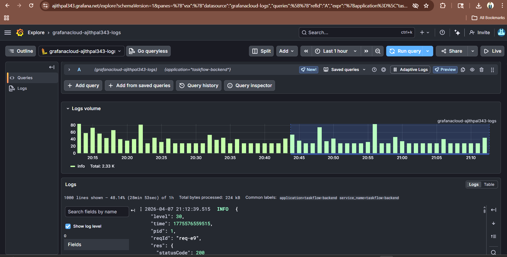
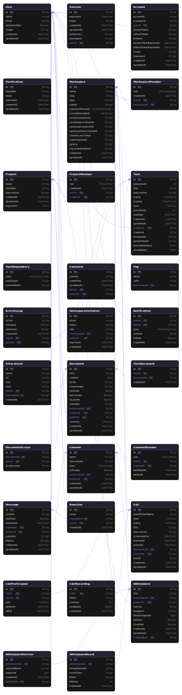

# TaskFlow

**🚀 A highly scalable, real-time task management and collaboration platform built with a distributed architecture.**


**[Live Demo](https://task-flow-web-seven.vercel.app)** | **[API Documentation](https://taskflow-8047ebcf.mintlify.app/)** | **[Report a Bug](https://github.com/Ajithpal2007/TaskFlow/issues)**

---

## ✨ Overview

**TaskFlow** is a modern, production-grade SaaS platform for teams that need **realtime collaboration**, structured workflows, AI assistance, and enterprise-level security in one unified workspace.

Built as a **pnpm monorepo** with clear separation of concerns:
- `apps/api` — Fastify + TypeScript backend (deployed on Render / PaaS)
- `apps/web` — Next.js 15 (App Router) frontend (deployed on Vercel Edge)
- Shared packages under `packages/*` for Prisma, UI primitives, validators, and tooling

The architecture is intentionally distributed: edge-deployed frontend + stateful, fully-monitored backend with production-grade observability.

Demo Video of TaskFlow

<p align="center">
  <video src="https://ba16nmh63n.ufs.sh/f/eMd9rUYt0HxnWwCcjKglqDuN6hvVxekJFXoBaZKQUlm8Ls3c" autoplay loop muted playsinline width="100%"></video>
</p>

---

## 🏗 System Architecture

**High-level architecture showing separation between the edge frontend and the monitored backend infrastructure.**


**Detailed architecture documentation** (PDFs) is available in the `/docs` folder.

---

## 🧠 Engineering Highlights & Technical Challenges

Building TaskFlow required solving real enterprise distributed-system problems.

### 1. Cross-Domain Authentication & Session Management
Frontend (Vercel Edge) and backend (Render PaaS) run on completely different domains. Modern browser privacy policies (Chrome, Safari) aggressively block third-party cookies.

**Solution**:  
- Dynamic CORS pipeline in Fastify that mirrors the request `Origin`  
- `better-auth` configured with `SameSite="none"` + secure cookies  
- Custom header adapter to let auth middleware correctly decrypt cross-origin payloads  
- Full proxy trust configuration for load balancers

### 2. Distributed Observability (The LGTM Stack)
No console logging in production. Full telemetry pipeline for logs, traces, and metrics.

- **Logs**: Pino + Grafana Loki (structured, batched, async)  
- **Traces**: OpenTelemetry auto-instrumentation + Grafana Tempo (waterfall tracing across Fastify, Prisma, Redis)  
- **Metrics**: Prometheus `/metrics` endpoint with custom business counters (workspace creation, AI calls, etc.)

**Observability Proof** — Live Grafana dashboard showing real logs, traces, and metrics in production:  


### 3. Real-Time Collaboration & WebSockets
- **Engine**: Yjs (CRDTs) + `@hocuspocus/server` on a dedicated Fastify WebSocket route  
- **Persistence**: Custom Prisma extension that serializes binary Yjs state directly into PostgreSQL  
- Zero data loss even with concurrent multi-user editing

Real-Time Collaboration in Action — Multiple users editing documents and canvases simultaneously: 

<p align="center">
  <video src="https://github.com/user-attachments/assets/c20f3de3-6451-4256-9502-5fbb429c3d3a" autoplay loop muted playsinline width="100%"></video>
</p>


---

## 🚀 Key Features

| Category                  | Features |
|---------------------------|----------|
| **Workspaces & Teams**    | Role-based access (OWNER, ADMIN, MEMBER, GUEST), invitations, activity logs |
| **Projects & Tasks**      | Auto sequence IDs, assignees, subtasks, tags, priorities, status tracking |
| **Realtime Collaboration**| Documents (Yjs), Canvas whiteboards (Liveblocks), Chat with reactions, Video calling with caht |
| **AI Integration**        | Task generation, summaries & insights (LangChain + OpenAI) |
| **File Management**       | Secure uploads via UploadThing |
| **Billing**               | Stripe + Razorpay, Pro & Enterprise plans |
| **Notifications**         | In-app + email via BullMQ workers |
| **Onboarding**            | Automatic first-workspace seeding with demo data |

---

## 🛠 Tech Stack

### Frontend (Client)
- Next.js 15 (App Router) + React 19
- TanStack Query (React Query) + Zustand
- Tailwind CSS + shadcn/ui + custom `@repo/ui` primitives

### Backend (API)
- Node.js + Fastify + TypeScript
- Prisma ORM + PostgreSQL
- BullMQ + Redis / Upstash
- Better Auth (authentication)
- Zod (validation)
- Hocuspocus + Yjs (realtime)

### DevOps & Observability
- **Hosting**: Vercel (Frontend) + Render (Backend)
- **Telemetry**: OpenTelemetry, Grafana Cloud (Loki, Tempo, Mimir), Pino
- **Bundler**: tsup (API)
- **Monorepo**: pnpm workspaces + Turborepo

---

## 📐 Domain & Data System


### Prisma Schema


---

## 🛠 Installation & Local Development

### Prerequisites
- Node.js **20+**
- pnpm **9+**
- PostgreSQL (local or Neon/Supabase)
- Redis (local or Upstash)

### Quick Start

```bash
# 1. Clone the repository
git clone https://github.com/yourusername/taskflow.git
cd taskflow

# 2. Install dependencies
pnpm install

# 3. Set up environment variables
cp .env.example .env
# ← Fill in your DATABASE_URL, Redis, Better Auth secrets, Stripe keys, etc.

# 4. Database setup
pnpm --filter @repo/database prisma generate
pnpm --filter @repo/database prisma migrate dev

# 5. Run development servers
pnpm dev