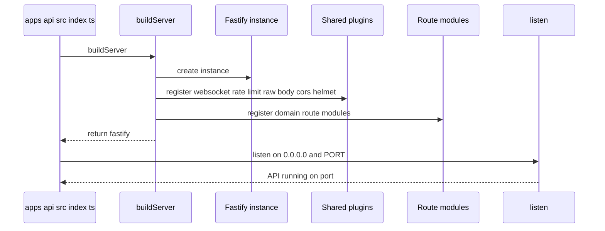
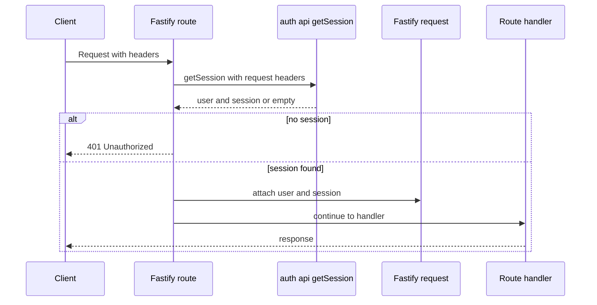
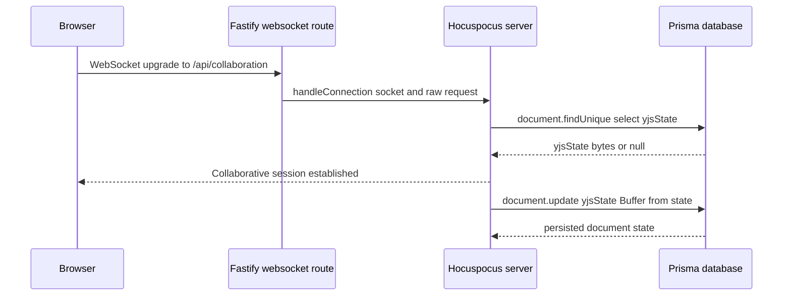
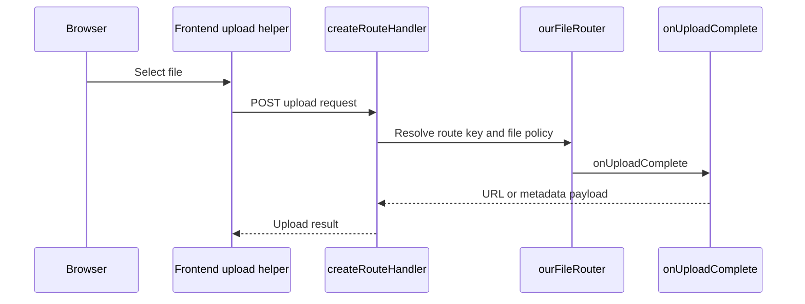

# API Platform, Runtime, and Shared Infrastructure

## Overview

TaskFlow’s API runtime is built around a single Fastify instance that is assembled in `apps/api/src/server.ts`, started in `apps/api/src/index.ts`, and configured by the environment bootstrap files in `apps/api/src/config.ts` and `apps/api/src/env.ts`. The server exposes a small set of platform endpoints directly, then composes the product surface by mounting domain route modules under stable prefixes such as `/api/workspaces`, `/api/projects`, `/api/tasks`, `/api/notifications`, `/api/ai`, and more.

This layer also owns the cross-cutting HTTP concerns that every feature depends on: CORS for browser session sharing, Helmet for security headers, global request rate limiting backed by Redis, raw-body handling for webhook verification, and websocket support for collaboration. It is the boundary where authentication state is attached to requests, where the frontend is redirected back into the web app, and where shared infrastructure such as UploadThing, Stripe webhooks, Hocuspocus collaboration transport, and telemetry-friendly trace headers are wired into the service.

## Architecture Overview

```mermaid
flowchart TB
    subgraph RuntimeBootstrap[Runtime Bootstrap]
        IndexFile[apps api src index ts]
        ServerFile[apps api src server ts]
        ConfigFile[apps api src config ts]
        EnvFile[apps api src env ts]
    end

    subgraph HTTPPlatform[HTTP Platform Layer]
        FastifyInstance[Fastify instance]
        CorsPlugin[CORS]
        HelmetPlugin[Helmet]
        RateLimitPlugin[Rate limit]
        RawBodyPlugin[Raw body]
        WebsocketPlugin[Websocket]
        HealthRoute[health route]
        RootRoute[root redirect]
    end

    subgraph RouteBoundary[Route Boundary Map]
        AuthRoutes[users index ts]
        WorkspacesRoutes[workspaces index ts]
        ProjectsRoutes[projects index ts]
        TasksRoutes[task index ts]
        NotificationRoutes[notification index ts]
        AiRoutes[ai index ts]
        DocumentsRoutes[documents index ts]
        SearchRoutes[search index ts]
        ChatRoutes[chat index ts]
        CallsRoutes[calls index ts]
        CanvasRoutes[canvas index ts]
        BillingRoutes[billing index ts]
        SlackRoutes[integrations slack ts]
        ZapierRoutes[api zapier ts]
    end

    subgraph SharedInfrastructure[Shared Infrastructure]
        RedisConnection[redisConnection]
        UploadThingHandler[createRouteHandler]
        OurFileRouter[ourFileRouter]
        HocuspocusServer[Hocuspocus server]
        StripeWebhook[Stripe webhook]
        PrismaDB[Prisma database]
    end

    IndexFile --> ServerFile
    ConfigFile --> ServerFile
    EnvFile --> ServerFile
    ServerFile --> FastifyInstance

    FastifyInstance --> WebsocketPlugin
    FastifyInstance --> RateLimitPlugin
    FastifyInstance --> RawBodyPlugin
    FastifyInstance --> CorsPlugin
    FastifyInstance --> HelmetPlugin
    FastifyInstance --> HealthRoute
    FastifyInstance --> RootRoute

    FastifyInstance --> AuthRoutes
    FastifyInstance --> WorkspacesRoutes
    FastifyInstance --> ProjectsRoutes
    FastifyInstance --> TasksRoutes
    FastifyInstance --> NotificationRoutes
    FastifyInstance --> AiRoutes
    FastifyInstance --> DocumentsRoutes
    FastifyInstance --> SearchRoutes
    FastifyInstance --> ChatRoutes
    FastifyInstance --> CallsRoutes
    FastifyInstance --> CanvasRoutes
    FastifyInstance --> BillingRoutes
    FastifyInstance --> SlackRoutes
    FastifyInstance --> ZapierRoutes

    FastifyInstance --> UploadThingHandler
    UploadThingHandler --> OurFileRouter
    FastifyInstance --> HocuspocusServer
    HocuspocusServer --> PrismaDB
    FastifyInstance --> StripeWebhook
    RateLimitPlugin --> RedisConnection
    FastifyInstance --> RedisConnection
```



## Fastify Bootstrap and Runtime Entry

### `buildServer`
*apps/api/src/server.ts*

| Method | Description |
|---|---|
| `buildServer` | Creates the Fastify instance, registers websocket support, global rate limiting, raw-body parsing, CORS, Helmet, the health and redirect endpoints, UploadThing, the Stripe webhook mount, the collaboration websocket endpoint, and the domain route modules. Returns the configured server. |

The bootstrap order is important in this file because shared plugins are registered before the domain routes. That means the route modules inherit the request context, CORS policy, rate limiting, and raw-body handling that the platform layer establishes up front.

#### Bootstrap sequence

| Step | Code path | Effect |
|---|---|---|
| 1 | `Fastify({ logger: ... })` | Enables `pino-pretty` transport in non-production and plain logger output in production. |
| 2 | `fastify.register(websocket)` | Enables websocket routes before any websocket handlers are mounted. |
| 3 | `fastify.register(fastifyRateLimit, { global: true, redis: redisConnection, ... })` | Applies shared request throttling with a Redis backend and a custom JSON error message. |
| 4 | `fastify.register(fastifyRawBody, { field: "rawBody", global: false, encoding: "utf8" })` | Adds `request.rawBody` only to routes that opt in through route config. |
| 5 | `fastify.get("/ws-test", { websocket: true }, ...)` | Adds a diagnostic websocket route that accepts messages and logs them. |
| 6 | `new Hocuspocus({ extensions: [new Database(...)] })` | Creates the collaborative document server with Prisma persistence for Yjs state. |
| 7 | `fastify.get("/api/collaboration", { websocket: true }, ...)` | Hands websocket upgrades to Hocuspocus. |
| 8 | `fastify.register(cors, ...)` and `fastify.register(helmet, ...)` | Locks in browser policy and security headers for the rest of the API surface. |
| 9 | Health, redirect, UploadThing, Stripe, and domain route registration | Finalizes the HTTP surface that the frontend and integrations consume. |
| 10 | `return fastify` | Returns the composed instance to the entrypoint. |

#### Runtime concerns captured here

- CORS origin is set from `process.env.FRONTEND_URL` with `http://localhost:3000` as the fallback.
- `credentials: true` is enabled so browser sessions can flow across the frontend and API origins.
- The allowed header list includes UploadThing transport headers and tracing headers:
  - `traceparent`
  - `tracestate`
  - `b3`
  - `x-b3-traceid`
  - `x-b3-spanid`
  - `x-b3-sampled`
- Helmet is enabled with `contentSecurityPolicy: false`.
- The root redirect target is built dynamically from `FRONTEND_URL` at request time.

### `start`
*apps/api/src/index.ts*

| Method | Description |
|---|---|
| `start` | Builds the server, listens on `0.0.0.0`, and uses `PORT` from `process.env.PORT`, `process.env.API_PORT`, or `4000`. Logs startup success and exits with code `1` if bootstrap fails. |

The entrypoint keeps the binding concern separate from the route assembly concern. That makes `buildServer()` reusable in other runtime contexts while `start()` remains the single place that actually opens the port.



## Environment Bootstrap Surface

*apps/api/src/config.ts, apps/api/src/env.ts*

| File | Visible role |
|---|---|
| `config.ts` | Resolves the repository-root `.env` path, loads it with `dotenv`, and logs whether `DATABASE_URL` and `GOOGLE_CLIENT_ID` were loaded. |
| `env.ts` | Companion bootstrap module in the runtime surface that imports `dotenv`, `path`, and `url` helpers for environment resolution. |

### `config.ts` runtime values

| Value | Type | Purpose |
|---|---|---|
| `__dirname` | `string` | Current module directory derived from `import.meta.url`. |
| `envPath` | `string` | Absolute path to the root `.env` file. |

The logging in `config.ts` is intentionally diagnostic: it prints the resolved `.env` path and the loaded status of selected variables so runtime configuration problems are visible before the server starts listening.

## Route Registration and Service Boundary Map

### Route prefixes registered by the Fastify bootstrap

| Mount | Module | Boundary role |
|---|---|---|
| `/api/auth/*` | `apps/api/src/routes/users/index.ts` | Better Auth gateway and user identity routes. |
| `/api/workspaces` | `apps/api/src/routes/workspaces/index.ts` | Workspace management surface. |
| `/api/projects` | `apps/api/src/routes/projects/index.ts` | Project management surface. |
| `/api/tasks` | `apps/api/src/routes/task/index.ts` | Task lifecycle surface. |
| `/api/notifications` | `apps/api/src/routes/notification/index.ts` | Notification inbox surface. |
| `/api/ai` | `apps/api/src/routes/ai/index.ts` | AI generation surface. |
| `/api` | `apps/api/src/routes/documents/index.ts` | Document tree, editor, and trash surface. |
| `/api/search` | `apps/api/src/routes/search/index.ts` | Workspace search surface. |
| `/api/chat` | `apps/api/src/routes/chat/index.ts` | Chat websocket and message surface. |
| `/api/calls` | `apps/api/src/routes/calls/index.ts` | LiveKit call join surface. |
| `/api/canvas` | `apps/api/src/routes/canvas/index.ts` | Whiteboard and Liveblocks surface. |
| `/api` | `apps/api/src/routes/billing/index.ts` | Billing and checkout surface. |
| `/api/integrations/slack` | `apps/api/src/routes/integrations/slack.ts` | Slack OAuth and workspace token surface. |
| `/api/external/zapier` | `apps/api/src/routes/api/zapier.ts` | Zapier task ingestion surface. |
| `createRouteHandler` mount | `apps/api/src/lib/uploadthing.ts` | UploadThing file transfer boundary. |
| `/api/collaboration` | `apps/api/src/server.ts` | Collaboration websocket boundary. |

> [!NOTE]
> The `/api` prefix is shared by both the documents route module and the billing route module. Their internal paths keep the boundaries distinct: documents use `/workspaces/:workspaceId/docs...` while billing uses `/workspaces/:workspaceId/checkout...`.

## HTTP Platform Concerns

### CORS

The API uses `@fastify/cors` with a browser-oriented policy:

- `origin` is `process.env.FRONTEND_URL || "http://localhost:3000"`
- `credentials` is `true`
- `methods` includes `GET`, `POST`, `PUT`, `DELETE`, `OPTIONS`, and `PATCH`
- `allowedHeaders` explicitly includes:
  - `Origin`
  - `Accept`
  - `Content-Type`
  - `Authorization`
  - `Cookie`
  - `x-requested-with`
  - `x-uploadthing-package`
  - `x-uploadthing-version`
  - tracing headers for distributed request correlation

The auth gateway route adds its own headers per request before delegating to Better Auth, so the auth surface has a dedicated browser handshake path.

### Helmet

`@fastify/helmet` is registered with `contentSecurityPolicy: false`. That choice keeps the API response headers lightweight while avoiding CSP enforcement on this service boundary.

### Global rate limiting

`@fastify/rate-limit` is registered globally with:

- `max: 150`
- `timeWindow: "1 minute"`
- `redis: redisConnection`

The custom error payload is:

```json
{
  "success": false,
  "message": "Whoa there! You're moving too fast. Please wait <after>."
}
```

### Raw body handling

`fastify-raw-body` is registered with:

- `field: "rawBody"`
- `global: false`
- `encoding: "utf8"`

That means webhook routes must opt in with route config if they need the raw payload for signature verification. The Stripe webhook mount does exactly that.

### Logging and telemetry

The Fastify logger is configured in the server constructor:

- development: `transport.target = "pino-pretty"`
- production: `true`

The API surface also allows trace headers through CORS so external tracing systems can propagate context through browser requests.

## HTTP Endpoint Reference

### Health Check
*apps/api/src/server.ts*

```api
{
  "title": "Health Check",
  "description": "Returns a simple liveness payload for API monitoring and deployment checks.",
  "method": "GET",
  "baseUrl": "<ApiBaseUrl>",
  "endpoint": "/health",
  "headers": [],
  "queryParams": [],
  "pathParams": [],
  "bodyType": "none",
  "requestBody": "",
  "formData": [],
  "rawBody": "",
  "responses": {
    "200": {
      "description": "Service is alive",
      "body": {
        "status": "ok",
        "timestamp": "2026-04-05T12:00:00.000Z"
      }
    }
  }
}
```

The handler returns a JSON object with the fixed status string and an ISO timestamp from `new Date().toISOString()`.

### Root Redirect
*apps/api/src/server.ts*

```api
{
  "title": "Root Redirect",
  "description": "Redirects the API root to the frontend dashboard using FRONTEND_URL or the local fallback.",
  "method": "GET",
  "baseUrl": "<ApiBaseUrl>",
  "endpoint": "/",
  "headers": [],
  "queryParams": [],
  "pathParams": [],
  "bodyType": "none",
  "requestBody": "",
  "formData": [],
  "rawBody": "",
  "responses": {
    "302": {
      "description": "Redirects to the frontend dashboard",
      "body": ""
    }
  }
}
```

The redirect target is assembled at request time from `process.env.FRONTEND_URL || "http://localhost:3000"` and then appended with `/dashboard`.

### Better Auth Gateway
*apps/api/src/routes/users/index.ts*

```api
{
  "title": "Better Auth Gateway",
  "description": "Forwards /api/auth requests to Better Auth after setting explicit CORS headers and short-circuiting OPTIONS preflight requests.",
  "method": "ALL",
  "baseUrl": "<ApiBaseUrl>",
  "endpoint": "/api/auth/*",
  "headers": [
    {
      "key": "Content-Type",
      "value": "application/json",
      "required": false
    },
    {
      "key": "Authorization",
      "value": "Bearer <token>",
      "required": false
    },
    {
      "key": "Cookie",
      "value": "session=<value>",
      "required": false
    }
  ],
  "queryParams": [],
  "pathParams": [],
  "bodyType": "forwarded",
  "requestBody": "",
  "formData": [],
  "rawBody": "",
  "responses": {
    "204": {
      "description": "OPTIONS preflight ends immediately before delegating to Better Auth",
      "body": ""
    }
  }
}
```

The route sets `Access-Control-Allow-Origin`, `Access-Control-Allow-Credentials`, `Access-Control-Allow-Methods`, and `Access-Control-Allow-Headers` directly on the raw reply object before forwarding non-OPTIONS requests to `toNodeHandler(auth)`.

### Stripe Webhook Verification
*apps/api/src/routes/webhooks/stripe.ts*

```api
{
  "title": "Stripe Webhook Verification",
  "description": "Verifies the Stripe signature using request.rawBody and processes checkout.session.completed events for workspace billing updates.",
  "method": "POST",
  "baseUrl": "<ApiBaseUrl>",
  "endpoint": "/api/webhooks/stripe",
  "headers": [
    {
      "key": "Stripe-Signature",
      "value": "t=1700000000,v1=<signature>",
      "required": true
    },
    {
      "key": "Content-Type",
      "value": "application/json",
      "required": true
    }
  ],
  "queryParams": [],
  "pathParams": [],
  "bodyType": "json",
  "requestBody": {
    "id": "evt_1N2XyZ3Example",
    "object": "event",
    "api_version": "2023-10-16",
    "created": 1700000000,
    "data": {
      "object": {
        "id": "cs_test_123456789",
        "object": "checkout.session",
        "client_reference_id": "workspace_123",
        "customer": "cus_123456789",
        "mode": "subscription",
        "payment_status": "paid"
      }
    },
    "livemode": false,
    "pending_webhooks": 1,
    "request": {
      "id": "req_123456789",
      "idempotency_key": "ik_123456789"
    },
    "type": "checkout.session.completed"
  },
  "formData": [],
  "rawBody": "",
  "responses": {
    "400": {
      "description": "Signature verification failed or the payload was invalid",
      "body": "Webhook Error: <message>"
    }
  }
}
```

The route uses `request.rawBody` rather than the parsed body so Stripe signature verification can succeed. When the event type is `checkout.session.completed`, the handler reads the `client_reference_id` as the workspace identifier and updates the workspace billing record.

> [!NOTE]
> The webhook route is mounted with the prefix `/api/webhooks` and the internal route path `/stripe`, so the effective endpoint is `/api/webhooks/stripe`.

## Authentication Hand-off and Request Augmentation

### `requireAuth`
*apps/api/src/middleware/require-auth.ts*

| Method | Description |
|---|---|
| `requireAuth` | Calls `auth.api.getSession({ headers: req.headers as any })`, returns `401` when no session exists, and attaches `user` and `session` onto the Fastify request object when authentication succeeds. |

This middleware is the shared hand-off between Better Auth and Fastify route handlers. Routes such as `/api/users/me`, `/api/workspaces`, `/api/tasks`, `/api/notifications`, and `/api/canvas` rely on the injected request properties that `requireAuth` populates.



### Fastify request augmentation
*apps/api/src/types/fastify.d.ts*

| Property | Type | Description |
|---|---|---|
| `user` | `any` | Added to `FastifyRequest` after authentication succeeds. |
| `session` | `any` | Added to `FastifyRequest` after authentication succeeds. |

The augmentation file makes the runtime assignment from `requireAuth` visible to TypeScript, which is why route handlers can safely read `request.user` and `request.session` after the middleware runs.

## WebSocket and Collaboration Infrastructure

### `WSSharedDoc`
*apps/api/src/types/y-websocket.d.ts*

| Property | Type | Description |
|---|---|---|
| `name` | `string` | Yjs document name used by the websocket collaboration layer. |
| `conns` | `Map<any, Set<number>>` | Connection tracking map exposed by the y-websocket shared document type. |
| `awareness` | `any` | Awareness state container used by the collaboration runtime. |

| Constructor | Description |
|---|---|
| `constructor(name: string)` | Creates a websocket-shared Yjs document with the given document name. |

The ambient declarations for `@y/protocols/sync`, `@y/protocols/awareness`, `lib0/encoding`, and `lib0/decoding` support the collaboration runtime so the server can compile against the websocket/Yjs toolchain.

### Collaboration websocket endpoint
*apps/api/src/server.ts*

The collaboration transport is mounted as a websocket route at `/api/collaboration`. Fastify receives the websocket upgrade and passes the socket plus `request.raw` into `hocuspocusServer.handleConnection(...)`.

#### Collaboration flow



#### Persistence behavior

The `Database` extension inside the Hocuspocus server uses Prisma in two directions:

- `fetch` reads `prisma.document.findUnique({ where: { id: documentName }, select: { yjsState: true } })`
- `store` writes `prisma.document.update({ where: { id: documentName }, data: { yjsState: Buffer.from(state), updatedAt: new Date() } })`

That makes the websocket transport stateful at the document level while still keeping PostgreSQL as the source of truth.

### Diagnostic websocket route
*apps/api/src/server.ts*

The bootstrap also exposes a websocket diagnostics route at `/ws-test`. It sends a greeting message immediately and logs every inbound message. This is useful for validating websocket wiring independently of the collaboration stack.

## UploadThing File Router

*apps/api/src/lib/uploadthing.ts*

| Route key | File types | Limits | Completion behavior |
|---|---|---|---|
| `imageUploader` | `image` | `maxFileSize: "4MB"`, `maxFileCount: 1` | Logs the uploaded URL and returns `{ url: file.url }`. |
| `attachmentUploader` | `image`, `pdf`, `text` | `image: 4MB x 4`, `pdf: 8MB x 2`, `text: 2MB x 1` | Logs the uploaded URL and returns `{ url: file.url }`. |
| `avatarUploader` | `image` | `maxFileSize: "4MB"`, `maxFileCount: 1` | Logs the metadata and file URL. |
| `messageAttachment` | `image`, `pdf` | `image: 8MB x 4`, `pdf: 8MB` | Adds middleware metadata `{ userId: "user_id_here" }` and returns `{ uploadedBy: metadata.userId }`. |

The backend exposes this file router through `createRouteHandler`, and the frontend helper is pointed at `/api/uploadthing`. The router definition is the shared contract between the API and the web client’s upload helpers.



## Redis Connection and Rate Limiting

### Redis-backed request throttling

The Fastify instance receives `redisConnection` from `apps/api/src/lib/queue` and passes it into `@fastify/rate-limit`. That makes the rate limiter and the async worker layer share the same Redis-backed transport.

#### Rate limit behavior

| Setting | Value |
|---|---|
| Global mode | `true` |
| Limit | `150` requests |
| Window | `1 minute` |
| Backend | `redisConnection` |
| Error response | Custom JSON with a friendly retry message |

### Shared Redis use across the API runtime

The same Redis connection object is also imported in the route and worker surface so asynchronous jobs and realtime guardrails can share infrastructure. In the websocket chat route, the message throttling key is built from the user identity as `ratelimit:ws_messages:${userId}`.

## Error Handling

The platform layer uses a small set of explicit response patterns:

| Condition | Code path | Response |
|---|---|---|
| Missing auth session | `requireAuth` | `401` with `{ message: "Unauthorized" }` |
| Health endpoint | `/health` | `200` with `{ status: "ok", timestamp }` |
| Root redirect | `/` | `302` redirect to the frontend dashboard |
| Stripe signature failure | `/api/webhooks/stripe` | `400` with `Webhook Error: <message>` |
| Bootstrap failure | `start` catch block | Logs the error and exits with code `1` |

The runtime entrypoint does not attempt to recover from bootstrap errors. It fails fast so deployment problems surface immediately.

## Dependencies

### Runtime and platform packages

- `fastify`
- `@fastify/cors`
- `@fastify/helmet`
- `@fastify/rate-limit`
- `@fastify/websocket`
- `fastify-raw-body`
- `uploadthing`
- `@hocuspocus/server`
- `@hocuspocus/extension-database`
- `stripe`
- `bullmq`
- `ioredis`
- `@repo/database`
- `auth`

### Shared infrastructure services

- Redis-backed rate limiting via `redisConnection`
- PostgreSQL via Prisma
- UploadThing file storage transport
- Stripe webhook verification and checkout processing
- Hocuspocus collaboration transport
- Fastify logging with environment-specific formatting

## Testing Considerations

| Scenario | What to verify |
|---|---|
| Server startup | `buildServer()` returns a configured Fastify instance and `start()` binds the configured port. |
| Health check | `GET /health` returns `status: ok` and an ISO timestamp. |
| Redirect | `GET /` redirects to `FRONTEND_URL/dashboard` or the localhost fallback. |
| Auth gateway | `OPTIONS /api/auth/*` returns `204` and non-OPTIONS requests are forwarded with manual CORS headers. |
| Stripe webhook | `POST /api/webhooks/stripe` rejects invalid signatures before processing. |
| Collaboration websocket | `/api/collaboration` upgrades successfully and hands the socket to Hocuspocus. |
| UploadThing | The backend router accepts the declared file types and size/count limits. |
| Rate limiting | Global request throttling respects the Redis-backed 150-per-minute policy. |
| Request augmentation | Authenticated handlers can read `request.user` and `request.session`. |

## Key Classes Reference

| Class | Responsibility |
|---|---|
| `server.ts` | Composes the Fastify runtime, registers plugins, mounts routes, and wires collaboration and webhook infrastructure. |
| `index.ts` | Starts the API process and binds the listening socket. |
| `config.ts` | Loads repository-level environment variables and logs bootstrap diagnostics. |
| `env.ts` | Companion environment bootstrap module for dotenv and path resolution. |
| `fastify.d.ts` | Extends `FastifyRequest` with authenticated `user` and `session` fields. |
| `y-websocket.d.ts` | Declares Yjs websocket typing for shared document collaboration. |
| `lib/uploadthing.ts` | Defines the UploadThing file router and its file policies. |