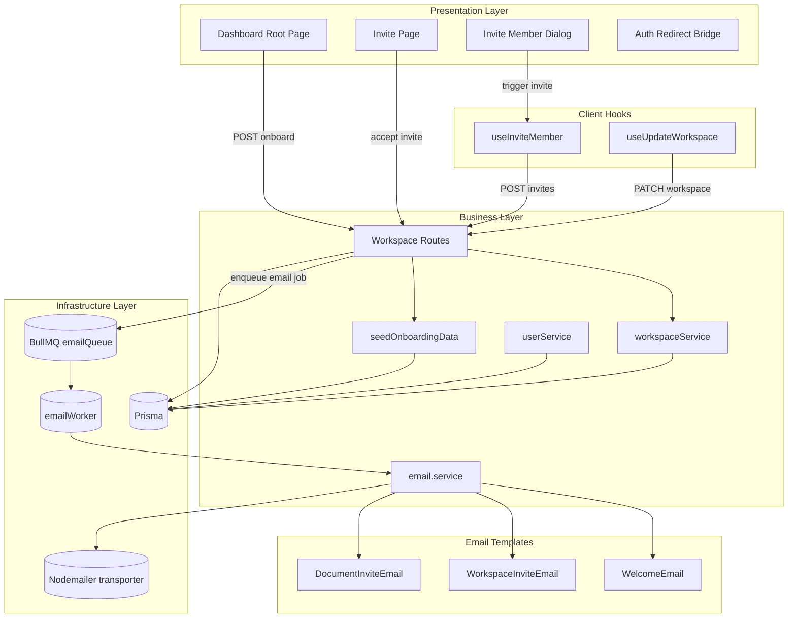
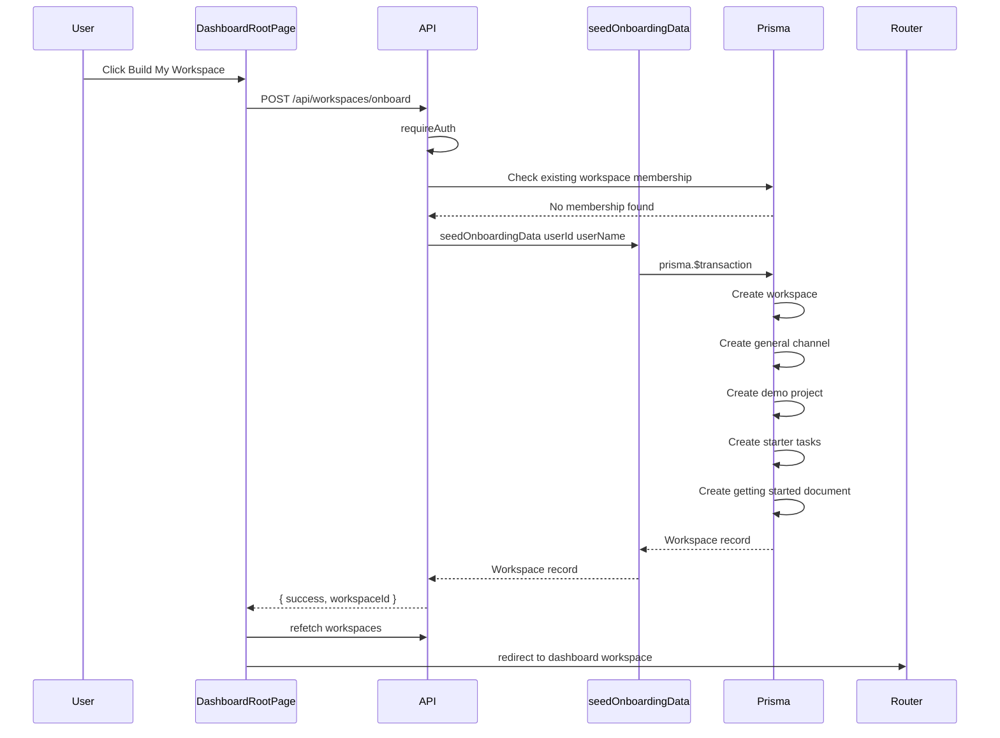
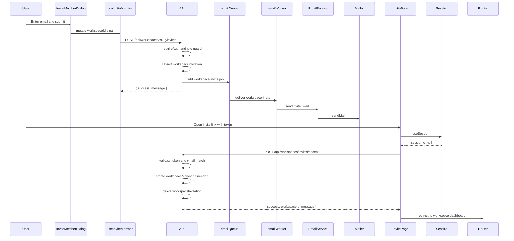
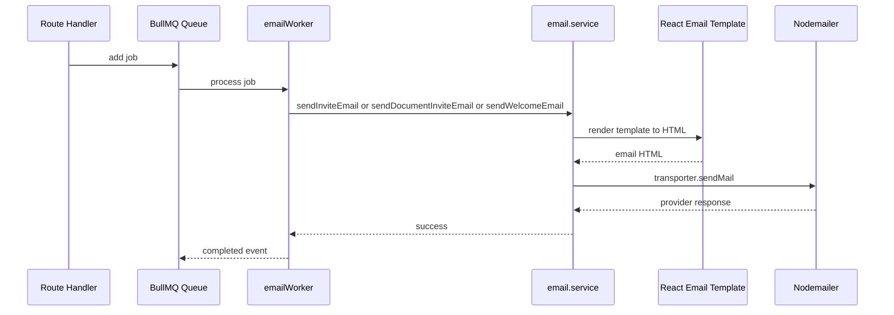
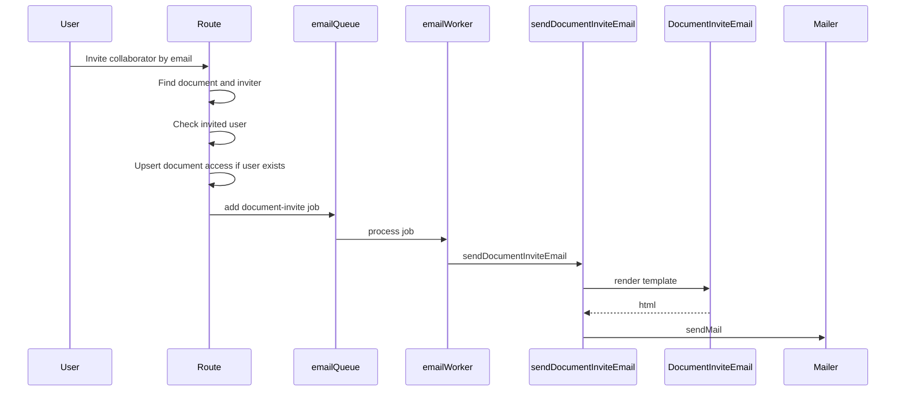

# Authentication and User Management - Invites, User Bootstrap, and Transactional Account Onboarding

## Overview

This feature covers the full user entry path in TaskFlow: a new user lands on the dashboard, gets a first workspace automatically seeded if they have none, and then uses workspace or document invites to bring other people into the system. The invite flows are split into two models: token-based invitations that travel through email and an internal member-creation path that adds an existing user directly to a workspace.

The implementation is designed to keep request handlers fast. Workspace and document invite routes persist the invitation and queue an email job immediately, while a BullMQ worker performs the actual SMTP send in the background. That same pattern is used for onboarding, where the app builds a complete demo workspace transactionally so the user sees a ready-to-use project, tasks, chat channel, and starter document on first login.

## Architecture Overview



## Component Structure

### 1. Presentation Layer

#### Dashboard Root Page
*`apps/web/app/dashboard/page.tsx`*

This page is the onboarding entry point. It checks whether the current user already has workspaces, and if not, it offers the “Build My Workspace” action that starts the first-workspace bootstrap flow.

| State / Input | Type | Description |
|---|---:|---|
| `isInitializing` | `boolean` | Tracks whether onboarding is currently running. |
| `loadingText` | `string` | Cycles through user-facing progress messages during workspace creation. |
| `workspaces` | `array` | Workspace list returned by `useWorkspaces`. |
| `activeWorkspaceId` | `string \| null` | Used to prefer a previously selected workspace on redirect. |

**Behavior**
- Calls `apiClient.post("/workspaces/onboard")` when the user clicks the onboarding button.
- Animates the loading copy through:
  - `Preparing your workspace...`
  - `Creating demo tasks...`
  - `Setting up real-time chat...`
  - `Ready! Taking you there...`
- Calls `refetch()` after onboarding so the workspace list is refreshed before redirect.
- Redirects to `/dashboard/{workspaceId}` when a workspace exists.

#### Invite Page
*`apps/web/app/invite/page.tsx`*

This page accepts a workspace invitation token from the query string and resolves the token into a workspace membership. It also handles the authentication handoff when the user is not signed in yet.

| State / Input | Type | Description |
|---|---:|---|
| `token` | `string \| null` | Secure invite token read from `searchParams`. |
| `session` | `session \| null` | Current auth session from `authClient.useSession()`. |
| `isSessionLoading` | `boolean` | Indicates the session check is still in progress. |
| `isAccepting` | `boolean` | Mutation state while the invitation is being accepted. |
| `setActiveWorkspaceId` | function | Stores the accepted workspace in the workspace store. |

**Behavior**
- Invalid or missing token renders the “Invalid Link” state.
- If the user is not signed in, the page redirects to:
  - `/sign-in?callbackUrl=/invite?token={token}`
- If the user is signed in, the page posts the token to the backend invitation acceptance endpoint.
- On success it:
  - invalidates the local React Query client,
  - stores the returned workspace ID,
  - shows a success toast,
  - redirects to `/dashboard/{workspaceId}`.

> [!NOTE]
> `InviteContent` creates a new `QueryClient` inside the component and calls `invalidateQueries()` on that isolated instance. That invalidation does not target the shared app-level React Query cache, so the cache refresh in this handler does not propagate to the rest of the app.

#### Invite Member Dialog
*`apps/web/components/workspace/invite-member-dialog.tsx`*

This dialog is the workspace-facing invite UI for sending invite emails to teammates. It collects the invitee email and exposes role options in the UI.

| Prop | Type | Description |
|---|---:|---|
| `workspaceId` | `string` | Workspace identifier passed to the invite mutation. |
| `isOpen` | `boolean` | Controls dialog visibility. |
| `onClose` | `() => void` | Closes the dialog after success or cancel. |

| Local State | Type | Description |
|---|---:|---|
| `email` | `string` | Invitee email address. |
| `role` | `string` | Selected role shown in the dropdown. |
| `isPending` | `boolean` | Mutation state from `useInviteMember()`. |

**Behavior**
- Submits `email.trim()` and `workspaceId` to the invite mutation.
- Clears the email, resets the role, and closes the dialog on success.
- Shows four role choices in the UI:
  - `ADMIN`
  - `MEMBER`
  - `VIEWER`
  - `GUEST`

> [!NOTE]
> The role picker in `InviteMemberDialog` is not forwarded into the invite mutation. The hook posts `role: "MEMBER"` unconditionally, so the selected `ADMIN`, `VIEWER`, or `GUEST` value is ignored by this path.

#### Workspace Invite Hook
*`apps/web/hooks/api/use-workspace.ts`*

This hook wraps the workspace invite request in a React Query mutation. It is the client-side bridge between the invite dialog and the backend invite route.

| Hook / Method | Description |
|---|---|
| `useInviteMember` | Sends `email` and `workspaceId` to the workspace invite endpoint and logs success or error output. |
| `useUpdateWorkspace` | Sends workspace rename changes and invalidates the workspace caches used by the settings UI. |

### 2. Business Layer

#### Workspace Service
*`apps/api/src/services/workspace.service.ts`*

This service owns workspace-level data access and the direct membership mutation path.

| Method | Description |
|---|---|
| `createWorkspace` | Creates a workspace and immediately adds the creating user as `OWNER`. |
| `getWorkspaceBySlug` | Finds a workspace by `slug` or `id`, but only when the current user is already a member, and injects the user’s workspace role into the returned object. |
| `getUserWorkspaces` | Returns all workspaces for a user, sorted by newest first, and injects the user’s role into each result. |
| `updateWorkspace` | Updates the workspace `name`. |
| `inviteMember` | Looks up a user by email, rejects duplicate membership, and creates a `workspaceMember` row with role `MEMBER`. |

**Direct membership path**
- Checks `prisma.user.findUnique({ where: { email } })`.
- Throws `"User with this email does not exist."` if the user is missing.
- Throws `"User is already a member of this workspace."` if the membership already exists.
- Creates `workspaceMember` with:
  - `workspaceId`
  - `userId`
  - `role: "MEMBER"`

#### Transactional Onboarding Service
*`apps/api/src/services/onboarding.service.ts`*

This service seeds a complete demo workspace for a new user inside a single Prisma transaction. It is the backend core of the first-workspace bootstrap flow.

| Method | Description |
|---|---|
| `seedOnboardingData` | Builds a workspace, channel, demo project, three starter tasks, and a starter document in one transaction, then returns the created workspace. |

**Created demo data**
| Entity | Created Values |
|---|---|
| Workspace | `name: "${userName}'s Workspace"`, unique slug, owner membership |
| Channel | `name: "general"`, `description: "General discussion and announcements."`, `type: "GROUP"` |
| Project | `name: "Welcome to TaskFlow"`, `identifier: "DEMO"`, `description: "A sandbox project to help you learn the ropes."` |
| Task 1 | `title: "👋 Welcome to TaskFlow! Click me."`, `status: "TODO"`, `priority: "HIGH"`, `sequenceId: 1` |
| Task 2 | `title: "Drag this task to 'In Progress'"`, `status: "TODO"`, `priority: "MEDIUM"`, `sequenceId: 2` |
| Task 3 | `title: "Invite a teammate to collaborate"`, `status: "IN_PROGRESS"`, `priority: "LOW"`, `sequenceId: 3` |
| Document | `title: "🚀 Getting Started"`, `emoji: "🚀"`, `visibility: "PUBLIC"` |

**Onboarding details**
- Builds a unique slug from the user name:
  - lowercase
  - non-alphanumeric characters replaced with `-`
  - appends `-workspace-` plus two random bytes in hex
- Uses `prisma.$transaction(...)` so the entire setup succeeds or fails as one unit.
- Seeds the starter document with BlockNote-compatible JSON content.

#### User Service
*`apps/api/src/services/user.service.ts`*

This service provides the user profile update primitive used elsewhere in the app.

| Method | Description |
|---|---|
| `updateUser` | Updates a user’s `name` and `image` fields when provided. |

#### Email Service
*`apps/api/src/services/email.service.ts`*

This service renders React Email templates into HTML and sends them through a shared Nodemailer transporter.

| Method | Description |
|---|---|
| `sendInviteEmail` | Renders `WorkspaceInviteEmail` and sends the workspace invite message with a token link. |
| `sendDocumentInviteEmail` | Renders `DocumentInviteEmail` and sends a document access email that branches on `isNewUser`. |
| `sendWelcomeEmail` | Renders `WelcomeEmail` and sends the onboarding welcome message. |

**Transporter configuration**
| Setting | Source | Purpose |
|---|---|---|
| `host` | `SMTP_HOST` or `smtp.gmail.com` | SMTP server host |
| `port` | `SMTP_PORT` or `587` | SMTP port |
| `secure` | `false` | Uses non-TLS SMTP mode in this configuration |
| `auth.user` | `SMTP_USER` | SMTP username and sender address |
| `auth.pass` | `SMTP_PASS` | SMTP password or app password |
| `tls.rejectUnauthorized` | `false` | Allows the configured TLS behavior used by the transporter |

**Email rendering flow**
1. Build the destination link from `FRONTEND_URL` or `http://localhost:3000`.
2. Render the React component with `@react-email/render`.
3. Build the `mailOptions` object.
4. Call `transporter.sendMail(mailOptions)`.

#### Welcome Email
*`apps/api/src/emails/WelcomeEmail.tsx`*

This React Email component renders the welcome message for newly onboarded users.

| Prop | Type | Description |
|---|---:|---|
| `userName` | `string` | Display name used in the greeting. |
| `dashboardLink` | `string` | CTA target for the dashboard button. |

**Render details**
- Preview text: `Welcome to TaskFlow! Your unified workspace is ready.`
- CTA label: `Go to Dashboard`
- Default `dashboardLink`: `${baseUrl}/dashboard`

#### Workspace Invite Email
*`apps/api/src/emails/WorkspaceInvite.tsx`*

This template renders the workspace invitation email that points recipients to the invite token landing page.

| Prop | Type | Description |
|---|---:|---|
| `inviterName` | `string` | Name shown as the person who sent the invite. |
| `workspaceName` | `string` | Workspace title shown in the email body and subject. |
| `inviteLink` | `string` | CTA target that contains the secure token. |

**Render details**
- Preview text: `Join {workspaceName} on TaskFlow`
- CTA label: `Accept Invitation`
- Default `inviteLink`: `${baseUrl}/invite?token=demo`
- Footer text says the invitation expires in 7 days.

#### Document Invite Email
*`apps/api/src/emails/DocumentInvite.tsx`*

This template renders the document-sharing email and changes both the CTA and the body copy depending on whether the recipient is a new user.

| Prop | Type | Description |
|---|---:|---|
| `inviterName` | `string` | Name shown as the sender. |
| `documentTitle` | `string` | Shared document title. |
| `accessLevel` | `string` | Access label shown in the body. |
| `isNewUser` | `boolean` | Switches between signup-first and direct-open behavior. |
| `actionLink` | `string` | CTA target for the button. |

**Render details**
- Preview text changes with `isNewUser`:
  - new user: `X invited you to join TaskFlow`
  - existing user: `X shared a document with you`
- CTA label changes with `isNewUser`:
  - new user: `Create an Account`
  - existing user: `Open Document`
- Default `actionLink`: `${baseUrl}/signup`
- The body lowers `accessLevel` before rendering.

### 3. Infrastructure Services

#### BullMQ Email Worker
*`apps/api/src/workers/emailWorker.ts`*

This worker consumes asynchronous email jobs from the `emails` queue and runs the expensive SMTP send outside the request path.

| Dependency | Description |
|---|---|
| `redisConnection` | BullMQ connection used by the worker instance. |
| `sendInviteEmail` | Sends workspace invite email jobs. |
| `sendDocumentInviteEmail` | Sends document invite email jobs. |
| `sendWelcomeEmail` | Sends welcome email jobs. |

**Supported job names**
| Job Name | Handler |
|---|---|
| `workspace-invite` | Calls `sendInviteEmail` |
| `document-invite` | Calls `sendDocumentInviteEmail` |
| `welcome-email` | Calls `sendWelcomeEmail` |

**Lifecycle**
- Created once with `new Worker('emails', ...)`.
- Logs each job as it starts.
- Throws on send failure so BullMQ retry behavior can run.
- Registers:
  - `completed` listener
  - `failed` listener

**Queue behavior**
- Invite-producing routes enqueue jobs with:
  - `attempts: 3`
  - exponential backoff
  - `removeOnComplete: true`

## API Integration

#### Initialize First Workspace Onboarding
```api
{
  "title": "Initialize First Workspace Onboarding",
  "description": "Creates the user's first demo workspace when they have no existing memberships. The handler is protected by requireAuth and returns 400 if a membership already exists.",
  "method": "POST",
  "baseUrl": "<TaskFlowApiBaseUrl>",
  "endpoint": "/api/workspaces/onboard",
  "headers": [
    {
      "key": "Content-Type",
      "value": "application/json",
      "required": true
    }
  ],
  "queryParams": [],
  "pathParams": [],
  "bodyType": "json",
  "requestBody": {},
  "formData": [],
  "rawBody": "",
  "responses": {
    "200": {
      "description": "Workspace initialized",
      "body": {
        "success": true,
        "workspaceId": "ws_01JABCDEF1234567890"
      }
    },
    "400": {
      "description": "User already belongs to a workspace",
      "body": {
        "message": "You already belong to a workspace."
      }
    },
    "500": {
      "description": "Initialization failed",
      "body": {
        "message": "Failed to initialize workspace."
      }
    }
  }
}
```

#### Create Workspace Invitation
```api
{
  "title": "Create Workspace Invitation",
  "description": "Creates or updates a tokenized workspace invitation, stores it with a 7 day expiry, and queues the background email job. The path parameter is named slug in the route, but the handler uses it as the workspace identifier.",
  "method": "POST",
  "baseUrl": "<TaskFlowApiBaseUrl>",
  "endpoint": "/api/workspaces/:slug/invites",
  "headers": [
    {
      "key": "Content-Type",
      "value": "application/json",
      "required": true
    }
  ],
  "queryParams": [],
  "pathParams": [
    {
      "key": "slug",
      "value": "workspace_01JABCDEF1234567890",
      "required": true
    }
  ],
  "bodyType": "json",
  "requestBody": {
    "email": "teammate@example.com",
    "role": "MEMBER"
  },
  "formData": [],
  "rawBody": "",
  "responses": {
    "200": {
      "description": "Invitation queued",
      "body": {
        "success": true,
        "message": "Invitation queued successfully!"
      }
    },
    "400": {
      "description": "Invite validation or service failure",
      "body": {
        "message": "Failed to invite member"
      }
    },
    "403": {
      "description": "Insufficient permission to invite",
      "body": {
        "success": false,
        "message": "Forbidden: You do not have permission to invite members."
      }
    },
    "404": {
      "description": "Workspace or inviter not found",
      "body": {
        "success": false,
        "message": "Workspace or User not found"
      }
    },
    "500": {
      "description": "Server error",
      "body": {
        "success": false,
        "message": "Internal Server Error"
      }
    }
  }
}
```

#### Accept Workspace Invitation
```api
{
  "title": "Accept Workspace Invitation",
  "description": "Accepts a workspace invite token for the authenticated user, validates expiry and email ownership, creates membership if needed, and deletes the invite after use.",
  "method": "POST",
  "baseUrl": "<TaskFlowApiBaseUrl>",
  "endpoint": "/api/workspaces/invites/accept",
  "headers": [
    {
      "key": "Content-Type",
      "value": "application/json",
      "required": true
    }
  ],
  "queryParams": [],
  "pathParams": [],
  "bodyType": "json",
  "requestBody": {
    "token": "e7f8d9c0a1b2c3d4e5f6a7b8c9d0e1f2"
  },
  "formData": [],
  "rawBody": "",
  "responses": {
    "200": {
      "description": "Invitation accepted",
      "body": {
        "success": true,
        "workspaceId": "ws_01JABCDEF1234567890",
        "message": "Welcome to the workspace!"
      }
    },
    "400": {
      "description": "Invitation expired",
      "body": {
        "success": false,
        "message": "This invitation has expired."
      }
    },
    "403": {
      "description": "Invite email does not match the signed-in user",
      "body": {
        "success": false,
        "message": "This invite was sent to teammate@example.com. Please log in with that account."
      }
    },
    "404": {
      "description": "Invalid or expired token",
      "body": {
        "success": false,
        "message": "Invalid or expired invitation."
      }
    },
    "500": {
      "description": "Server error",
      "body": {
        "success": false,
        "message": "Internal Server Error"
      }
    }
  }
}
```

#### Add Workspace Member
```api
{
  "title": "Add Workspace Member",
  "description": "Adds an existing user to a workspace by email. This path is guarded by requireAuth and requireWorkspaceRole for OWNER and ADMIN, then the service confirms the user exists and is not already a member.",
  "method": "POST",
  "baseUrl": "<TaskFlowApiBaseUrl>",
  "endpoint": "/api/workspaces/:workspaceId/members",
  "headers": [
    {
      "key": "Content-Type",
      "value": "application/json",
      "required": true
    }
  ],
  "queryParams": [],
  "pathParams": [
    {
      "key": "workspaceId",
      "value": "ws_01JABCDEF1234567890",
      "required": true
    }
  ],
  "bodyType": "json",
  "requestBody": {
    "email": "teammate@example.com"
  },
  "formData": [],
  "rawBody": "",
  "responses": {
    "201": {
      "description": "Member created",
      "body": {
        "data": {
          "workspaceId": "ws_01JABCDEF1234567890",
          "userId": "usr_01JABCDEF1234567890",
          "role": "MEMBER"
        }
      }
    },
    "400": {
      "description": "Invite failed",
      "body": {
        "message": "User with this email does not exist."
      }
    }
  }
}
```

#### Update Workspace Member Role
```api
{
  "title": "Update Workspace Member Role",
  "description": "Updates a member role inside a workspace. The handler blocks attempts to change the Workspace Owner role.",
  "method": "PATCH",
  "baseUrl": "<TaskFlowApiBaseUrl>",
  "endpoint": "/api/workspaces/:workspaceId/members/:memberId",
  "headers": [
    {
      "key": "Content-Type",
      "value": "application/json",
      "required": true
    }
  ],
  "queryParams": [],
  "pathParams": [
    {
      "key": "workspaceId",
      "value": "ws_01JABCDEF1234567890",
      "required": true
    },
    {
      "key": "memberId",
      "value": "wm_01JABCDEF1234567890",
      "required": true
    }
  ],
  "bodyType": "json",
  "requestBody": {
    "role": "ADMIN"
  },
  "formData": [],
  "rawBody": "",
  "responses": {
    "200": {
      "description": "Member updated",
      "body": {
        "data": {
          "workspaceId": "ws_01JABCDEF1234567890",
          "userId": "usr_01JABCDEF1234567890",
          "role": "ADMIN"
        }
      }
    },
    "403": {
      "description": "Owner role is protected",
      "body": {
        "error": "Cannot change the role of the Workspace Owner."
      }
    }
  }
}
```

#### Remove Workspace Member
```api
{
  "title": "Remove Workspace Member",
  "description": "Removes a member from a workspace. The handler blocks removing the Workspace Owner.",
  "method": "DELETE",
  "baseUrl": "<TaskFlowApiBaseUrl>",
  "endpoint": "/api/workspaces/:workspaceId/members/:memberId",
  "headers": [],
  "queryParams": [],
  "pathParams": [
    {
      "key": "workspaceId",
      "value": "ws_01JABCDEF1234567890",
      "required": true
    },
    {
      "key": "memberId",
      "value": "wm_01JABCDEF1234567890",
      "required": true
    }
  ],
  "bodyType": "none",
  "requestBody": "",
  "formData": [],
  "rawBody": "",
  "responses": {
    "200": {
      "description": "Member removed",
      "body": {
        "success": true
      }
    },
    "403": {
      "description": "Owner removal is blocked",
      "body": {
        "error": "Cannot remove the Workspace Owner."
      }
    }
  }
}
```

#### List Workspace Users
```api
{
  "title": "List Workspace Users",
  "description": "Returns the user records for all workspace members. The route is protected by requireAuth, and it maps each membership to its nested user object before returning the response.",
  "method": "GET",
  "baseUrl": "<TaskFlowApiBaseUrl>",
  "endpoint": "/api/workspaces/:workspaceId/users",
  "headers": [],
  "queryParams": [],
  "pathParams": [
    {
      "key": "workspaceId",
      "value": "ws_01JABCDEF1234567890",
      "required": true
    }
  ],
  "bodyType": "none",
  "requestBody": "",
  "formData": [],
  "rawBody": "",
  "responses": {
    "200": {
      "description": "Users returned",
      "body": {
        "data": [
          {
            "id": "usr_01JABCDEF1234567890",
            "name": "Asha",
            "email": "asha@example.com",
            "image": "https://cdn.example.com/avatar.png"
          }
        ]
      }
    },
    "500": {
      "description": "Failed to fetch workspace users",
      "body": {
        "message": "Failed to fetch workspace users"
      }
    }
  }
}
```

#### Invite Document Collaborator
```api
{
  "title": "Invite Document Collaborator",
  "description": "Shares a document with a user. If the email already belongs to a user, the access row is upserted immediately; otherwise the backend queues a document invite email. The 200 response message depends on whether the recipient is new.",
  "method": "POST",
  "baseUrl": "<TaskFlowApiBaseUrl>",
  "endpoint": "/api/workspaces/:workspaceId/docs/:docId/invite",
  "headers": [
    {
      "key": "Content-Type",
      "value": "application/json",
      "required": true
    }
  ],
  "queryParams": [],
  "pathParams": [
    {
      "key": "workspaceId",
      "value": "ws_01JABCDEF1234567890",
      "required": true
    },
    {
      "key": "docId",
      "value": "doc_01JABCDEF1234567890",
      "required": true
    }
  ],
  "bodyType": "json",
  "requestBody": {
    "email": "teammate@example.com",
    "accessLevel": "EDITOR"
  },
  "formData": [],
  "rawBody": "",
  "responses": {
    "200": {
      "description": "Invite processed",
      "body": {
        "message": "Access granted and email queued!"
      }
    },
    "404": {
      "description": "Document or inviter not found",
      "body": {
        "message": "Document or User not found"
      }
    },
    "500": {
      "description": "Invite processing failed",
      "body": {
        "message": "Failed to process invite"
      }
    }
  }
}
```

## Feature Flows

### First Workspace Creation and Demo Seeding



**Execution details**
- The client starts from an empty-workspace state.
- The backend rejects the request if the user already belongs to a workspace.
- All demo entities are created inside one transaction.
- The UI refetches workspace data and immediately routes to the new workspace.

### Workspace Invite Token Delivery and Acceptance



**Execution details**
- The invite route uses `workspaceInvitation.upsert`, so a repeat invite updates the token and expiration instead of creating duplicates.
- The acceptance route deletes the invite after use so the same token cannot be reused.
- The invite page forces an auth check before accepting the token.

### Background Email Dispatch



**Dispatch behavior**
- Request handlers return immediately after enqueuing.
- Email send failures are thrown from the worker so BullMQ retry logic can retry the job.
- The invite routes use exponential backoff with three attempts and remove completed jobs from Redis.

### Document Invite Delivery



## State Management

### Dashboard Bootstrap State
- `isInitializing` gates the onboarding button and loading spinner.
- `loadingText` rotates to present progress while the transaction runs.
- The dashboard refetches workspaces after onboarding succeeds.
- The final redirect is based on the refreshed workspace list and the current `activeWorkspaceId`.

### Invite Acceptance State
- Missing token renders the invalid-link state.
- `isSessionLoading` keeps the button disabled while the auth session is being resolved.
- `isAccepting` keeps the accept button disabled while the mutation is in flight.
- A successful response stores the returned workspace ID and redirects into the workspace.

### Invite Dialog State
- `email` is the only field that actually feeds the invite mutation.
- `role` is displayed in the UI and reset on success.
- `isPending` disables the form and swaps the button label to `Sending...`.

### Email Worker State
- Job processing is fully stateless across requests.
- `completed` and `failed` listeners only emit logs.
- Any thrown error from the worker bubbles into BullMQ retry logic.

## Error Handling

- **Missing invite token**
  - The invite page shows the invalid-link card when `token` is absent.
- **Unauthenticated invite acceptance**
  - The invite page routes the user through `/sign-in?callbackUrl=/invite?token=...`.
- **Expired workspace invite**
  - The accept route deletes the expired record and returns `400`.
- **Invite sent to the wrong account**
  - The accept route compares the logged-in user email to the invite email and returns `403` if they differ.
- **Duplicate membership**
  - The accept route checks for an existing member before creating one.
  - `workspaceService.inviteMember` throws `"User is already a member of this workspace."`
- **Invite target user missing**
  - `workspaceService.inviteMember` throws `"User with this email does not exist."`
- **SMTP failure**
  - The worker logs the error, rethrows it, and BullMQ handles retries.
- **Onboarding failure**
  - `/api/workspaces/onboard` returns `500` and the dashboard page resets its loading state and alerts the user.
- **Workspace owner protection**
  - Member role updates and removals block actions that target the owner.

## Dependencies

| Dependency | Usage |
|---|---|
| `@repo/database` | Prisma client and shared enums such as `WorkspaceRole`. |
| `better-auth` / `authClient.useSession()` | Session gating for invite acceptance and workspace access. |
| `Fastify` | Route registration and `preHandler` guards. |
| `BullMQ` | Queue and worker pipeline for asynchronous email sending. |
| `ioredis` connection | Backing connection for the BullMQ worker. |
| `nodemailer` | SMTP delivery transport. |
| `@react-email/components` | Email template composition. |
| `@react-email/render` | Converts templates to HTML strings. |
| `React` | Template rendering via `React.createElement`. |
| `Prisma transaction API` | Atomic onboarding workspace seeding. |
| `Next.js router and search params` | Invite acceptance and onboarding redirects. |
| `React Query` | Mutation state and cache refresh on the client. |

## Testing Considerations

- Onboarding should reject users who already belong to a workspace.
- The onboarding transaction should create the workspace, channel, project, tasks, and document together.
- Invite creation should upsert the same email and workspace combination instead of creating duplicates.
- Invite acceptance should reject expired tokens and email mismatches.
- Workspace member role changes should block the owner role.
- Removing a workspace member should block owner removal.
- Email worker jobs should retry on transient SMTP failures.
- The invite page should redirect unauthenticated users to sign-in with the callback URL preserved.
- Document invites should produce different response messages for new and existing users.

## Key Classes Reference

| Class | Location | Responsibility |
|---|---|---|
| `DashboardRootPage` | `page.tsx` | Triggers first-workspace onboarding from the empty dashboard state. |
| `InviteContent` | `page.tsx` | Accepts invite tokens and routes users through sign-in when needed. |
| `InviteMemberDialog` | `invite-member-dialog.tsx` | Collects teammate email addresses for workspace invite delivery. |
| `useInviteMember` | `use-workspace.ts` | Wraps the workspace invite HTTP mutation for the dialog. |
| `workspaceService` | `workspace.service.ts` | Owns workspace reads and membership mutations. |
| `seedOnboardingData` | `onboarding.service.ts` | Builds the starter demo workspace transactionally. |
| `userService` | `user.service.ts` | Updates user profile fields. |
| `sendInviteEmail` | `email.service.ts` | Renders and sends the workspace invite email. |
| `sendDocumentInviteEmail` | `email.service.ts` | Renders and sends the document invite email. |
| `sendWelcomeEmail` | `email.service.ts` | Renders and sends the onboarding welcome email. |
| `WelcomeEmail` | `WelcomeEmail.tsx` | React Email template for new-user onboarding. |
| `WorkspaceInviteEmail` | `WorkspaceInvite.tsx` | React Email template for workspace invitations. |
| `DocumentInviteEmail` | `DocumentInvite.tsx` | React Email template for document-sharing invitations. |
| `emailWorker` | `emailWorker.ts` | Processes queued email jobs in the background. |
| `workspaceRoutes` | `index.ts` | Hosts onboarding, invite creation, invite acceptance, and membership management endpoints. |