# Authentication and User Management - Role and plan authorization model across user-facing actions

## Overview

TaskFlow uses a layered authorization model to decide who can see, edit, invite, bill, and collaborate. The API combines session authentication, workspace membership checks, project membership checks, and plan validation, while the web app mirrors the same rules in settings pages and management controls.

The result is a role-aware product surface: workspace owners and admins can manage members and billing, project managers can change project settings, workspace members can use AI, documents, and canvases when their role and plan allow it, and guests are restricted to the narrower access paths that the backend and Liveblocks session logic permit.

## Authorization model at a glance

| Guard or policy | Values used in code | What it controls | Main consumers |
|---|---|---|---|
| `WorkspaceRole` | `OWNER`, `ADMIN`, `MEMBER`, `GUEST` | Workspace membership, document access, AI access, billing access, canvas access | `requireWorkspaceRole`, `canManageWorkspace`, `canEditDocuments`, workspace settings pages |
| Project role | `MANAGER`, `CONTRIBUTOR`, `VIEWER` | Project settings access and board-level edit permissions | `requireProjectRole`, canvas Liveblocks auth, project settings page |
| Plan | `PRO`, `ENTERPRISE` | AI generation and new whiteboard creation | `requirePlan`, AI routes, canvas create board route |
| Session | Better Auth user session | All authenticated actions | `requireAuth`, dashboard shell, user profile and logout flow |

## Architecture Overview

```mermaid
flowchart TB
    subgraph PresentationLayer [Presentation Layer]
        WorkspaceLayout[WorkspaceLayout]
        SidebarLeft[SidebarLeft]
        WorkspaceSettingsPage[WorkspaceSettingsPage]
        BillingPage[BillingPage]
        ProjectSettingsPage[ProjectSettingsPage]
        InviteMemberDialog[InviteMemberDialog]
        Whiteboard[Whiteboard]
    end

    subgraph PolicyLayer [Authorization Layer]
        requireAuth[requireAuth]
        requireWorkspaceRole[requireWorkspaceRole]
        requireProjectRole[requireProjectRole]
        requirePlan[requirePlan]
        rbac[rbac.ts helpers]
    end

    subgraph BackendRoutes [Backend Routes]
        workspaceRoutes[workspaceRoutes]
        projectRoutes[projectRoutes]
        aiRoutes[aiRoutes]
        documentRoutes[documentRoutes]
        billingRoutes[billingRoutes]
        canvasRoutes[canvasRoutes]
    end

    subgraph ServicesAndData [Services and Data]
        workspaceService[workspaceService]
        projectService[projectService]
        prisma[prisma]
        stripe[Stripe]
        liveblocks[Liveblocks]
        emailQueue[emailQueue]
        redisConnection[redisConnection]
    end

    WorkspaceLayout --> workspaceRoutes
    SidebarLeft --> workspaceRoutes
    WorkspaceSettingsPage --> workspaceRoutes
    BillingPage --> workspaceRoutes
    ProjectSettingsPage --> projectRoutes
    InviteMemberDialog --> workspaceRoutes
    Whiteboard --> canvasRoutes

    workspaceRoutes --> requireAuth
    workspaceRoutes --> requireWorkspaceRole
    workspaceRoutes --> workspaceService
    projectRoutes --> requireAuth
    projectRoutes --> requireProjectRole
    projectRoutes --> projectService
    aiRoutes --> requireAuth
    aiRoutes --> requireWorkspaceRole
    aiRoutes --> requirePlan
    documentRoutes --> requireAuth
    documentRoutes --> requireWorkspaceRole
    billingRoutes --> requireAuth
    billingRoutes --> requireWorkspaceRole
    canvasRoutes --> requireAuth
    canvasRoutes --> requireWorkspaceRole
    canvasRoutes --> requirePlan

    requireWorkspaceRole --> prisma
    requireProjectRole --> prisma
    requirePlan --> prisma
    workspaceService --> prisma
    projectService --> prisma
    billingRoutes --> stripe
    canvasRoutes --> liveblocks
    workspaceRoutes --> emailQueue
    workspaceRoutes --> redisConnection
```



## Route Guards and Policy Helpers

### `requireAuth`
*`apps/api/src/middleware/require-auth.ts`*

`requireAuth` is the base gate for every authenticated action in this section. It resolves the Better Auth session from request headers, returns `401` when no session exists, and attaches `request.user` and `request.session` for downstream guards and handlers.

| Field or side effect | Type | Description |
|---|---|---|
| `request.user` | `any` | Set to `data.user` from Better Auth |
| `request.session` | `any` | Set to `data.session` from Better Auth |
| `401` response | HTTP status | Returned when no session is found |

### `requireWorkspaceRole`
*`apps/api/src/middleware/require-role.ts`*

`requireWorkspaceRole` is a higher-order middleware that enforces workspace membership and role membership against the `workspaceId` route param. It reads the logged-in user from `request.user.id`, loads the matching `workspaceMember`, returns `400` when `workspaceId` is missing, `403` when the membership is missing or the role is not allowed, and `500` on unexpected failures.

| Type | Description |
|---|---|
| `prisma` | Reads `workspaceMember` rows by `workspaceId` and `userId` |
| `WorkspaceRole[]` | Allowed roles passed by the route |
| `request.userRole` | Side effect that stores the resolved workspace role on the request |

### `requireProjectRole`
*`apps/api/src/middleware/require-role.ts`*

`requireProjectRole` resolves the parent workspace first, then applies a two-step permission check. Workspace `OWNER` and `ADMIN` short-circuit the check, and only non-admin users fall through to the project membership lookup.

| Type | Description |
|---|---|
| `prisma` | Loads the project, workspace membership, and project membership |
| `ProjectRole[]` | Allowed project roles passed by the route |
| `workspaceId` | Derived from the project row before checking project membership |

### `requirePlan`
*`apps/api/src/middleware/require-plan.ts`*

`requirePlan` is the payment gate for plan-restricted actions. It reads `workspaceId` from either `request.params` or `request.body`, loads `planId` and `currentPeriodEnd`, and returns `402` when the plan is not in the allowed list or the subscription window has expired.

| Type | Description |
|---|---|
| `prisma` | Reads `workspace.planId` and `workspace.currentPeriodEnd` |
| `string[]` | Allowed plan IDs such as `PRO` and `ENTERPRISE` |
| `workspaceId` | Accepted from route params or request body |

### `rbac.ts`
*`apps/api/src/utils/rbac.ts`*

`rbac.ts` centralizes reusable workspace permission predicates that mirror the route guards and UI affordances.

| Symbol | Type | Description |
|---|---|---|
| `WorkspaceRole` | type alias | `OWNER`, `ADMIN`, `MEMBER`, `GUEST` |
| `canManageWorkspace` | function | Returns `true` for `OWNER` and `ADMIN` |
| `canEditDocuments` | function | Returns `true` for `OWNER`, `ADMIN`, and `MEMBER` |

## Business Layer

### `workspaceService`
*`apps/api/src/services/workspace.service.ts`*

`workspaceService` is the main workspace-facing facade that supports role-aware UI hydration and membership changes. It injects the caller’s role into workspace payloads so the frontend can render role-aware controls without recomputing membership on the client.

| Method | Description |
|---|---|
| `createWorkspace` | Creates a workspace and seeds the creator as `OWNER` |
| `getWorkspaceBySlug` | Resolves a workspace only for members and adds top-level `role` to the returned object |
| `getUserWorkspaces` | Returns every workspace the user belongs to and adds top-level `role` to each result |
| `updateWorkspace` | Updates the workspace name |
| `inviteMember` | Looks up a user by email, prevents duplicate membership, and creates a `MEMBER` membership |

### `projectService`
*`apps/api/src/services/project.service.ts`*

`projectService` is the project facade used by project creation and project listing screens. The create path seeds the creator as `MANAGER`, which lines up with `requireProjectRole` and the project settings page.

| Method | Description |
|---|---|
| `createProject` | Creates a project and seeds the creator as `MANAGER` |
| `getWorkspaceProjects` | Returns the workspace projects ordered by `updatedAt` |

## Role-Aware Backend Features

### Workspace management and membership

Workspace management uses a mix of middleware guards and handler-level checks. The strongest workspace restrictions are used for member management and billing, while some settings routes rely on authentication plus client-side gating.

#### Get Workspace by Slug or Id

```api
{
  "title": "Get Workspace by Slug or Id",
  "description": "Returns a workspace that the authenticated user already belongs to, with the current role injected at the top level",
  "method": "GET",
  "baseUrl": "<ApiBaseUrl>",
  "endpoint": "/api/workspaces/:slug",
  "headers": [
    { "key": "Cookie", "value": "<session cookie>", "required": true }
  ],
  "queryParams": [],
  "pathParams": [
    { "key": "slug", "value": "acme-ops", "required": true }
  ],
  "bodyType": "none",
  "requestBody": "",
  "formData": [],
  "rawBody": "",
  "responses": {
    "200": {
      "description": "Workspace found",
      "body": {
        "data": {
          "id": "ws_123",
          "name": "Acme Ops",
          "slug": "acme-ops",
          "planId": "PRO",
          "currentPeriodEnd": "2026-05-05T00:00:00.000Z",
          "role": "ADMIN",
          "members": [
            {
              "id": "wm_1",
              "workspaceId": "ws_123",
              "userId": "usr_1",
              "role": "OWNER",
              "user": {
                "id": "usr_1",
                "name": "Ava Chen",
                "email": "ava@acme.com",
                "image": "https://example.com/avatar.png"
              }
            }
          ],
          "_count": {
            "projects": 3
          }
        }
      }
    },
    "404": {
      "description": "Workspace not found or user is not a member",
      "body": {
        "message": "Workspace not found"
      }
    }
  }
}
```

#### Update Workspace Name

```api
{
  "title": "Update Workspace Name",
  "description": "Updates the workspace name after authentication only; the route itself does not apply a role guard",
  "method": "PATCH",
  "baseUrl": "<ApiBaseUrl>",
  "endpoint": "/api/workspaces/:workspaceId",
  "headers": [
    { "key": "Cookie", "value": "<session cookie>", "required": true },
    { "key": "Content-Type", "value": "application/json", "required": true }
  ],
  "queryParams": [],
  "pathParams": [
    { "key": "workspaceId", "value": "ws_123", "required": true }
  ],
  "bodyType": "json",
  "requestBody": {
    "name": "Customer Success Ops"
  },
  "formData": [],
  "rawBody": "",
  "responses": {
    "200": {
      "description": "Workspace updated",
      "body": {
        "data": {
          "id": "ws_123",
          "name": "Customer Success Ops"
        }
      }
    }
  }
}
```

> **Note:** `WorkspaceSettingsPage` disables the rename input for non-admins, but `PATCH /api/workspaces/:workspaceId` only uses `requireAuth`. The browser UI and the server-side enforcement do not match for this action.

#### Add Workspace Member

```api
{
  "title": "Add Workspace Member",
  "description": "Adds a user to a workspace after workspace OWNER or ADMIN authorization succeeds",
  "method": "POST",
  "baseUrl": "<ApiBaseUrl>",
  "endpoint": "/api/workspaces/:workspaceId/members",
  "headers": [
    { "key": "Cookie", "value": "<session cookie>", "required": true },
    { "key": "Content-Type", "value": "application/json", "required": true }
  ],
  "queryParams": [],
  "pathParams": [
    { "key": "workspaceId", "value": "ws_123", "required": true }
  ],
  "bodyType": "json",
  "requestBody": {
    "email": "colleague@acme.com"
  },
  "formData": [],
  "rawBody": "",
  "responses": {
    "201": {
      "description": "Member added",
      "body": {
        "data": {
          "id": "wm_200",
          "workspaceId": "ws_123",
          "userId": "usr_456",
          "role": "MEMBER"
        }
      }
    },
    "400": {
      "description": "Validation or service error",
      "body": {
        "message": "Email is required"
      }
    },
    "403": {
      "description": "Caller does not have workspace permission",
      "body": {
        "error": "Forbidden",
        "message": "You do not have permission to perform this action."
      }
    }
  }
}
```

#### Change Workspace Member Role

```api
{
  "title": "Change Workspace Member Role",
  "description": "Updates a workspace membership role after OWNER or ADMIN authorization and owner protection checks",
  "method": "PATCH",
  "baseUrl": "<ApiBaseUrl>",
  "endpoint": "/api/workspaces/:workspaceId/members/:memberId",
  "headers": [
    { "key": "Cookie", "value": "<session cookie>", "required": true },
    { "key": "Content-Type", "value": "application/json", "required": true }
  ],
  "queryParams": [],
  "pathParams": [
    { "key": "workspaceId", "value": "ws_123", "required": true },
    { "key": "memberId", "value": "wm_200", "required": true }
  ],
  "bodyType": "json",
  "requestBody": {
    "role": "ADMIN"
  },
  "formData": [],
  "rawBody": "",
  "responses": {
    "200": {
      "description": "Role updated",
      "body": {
        "data": {
          "id": "wm_200",
          "workspaceId": "ws_123",
          "userId": "usr_456",
          "role": "ADMIN"
        }
      }
    },
    "403": {
      "description": "Target member is the workspace owner or caller lacks permission",
      "body": {
        "error": "Cannot change the role of the Workspace Owner."
      }
    }
  }
}
```

#### Remove Workspace Member

```api
{
  "title": "Remove Workspace Member",
  "description": "Deletes a workspace membership after OWNER or ADMIN authorization and owner protection checks",
  "method": "DELETE",
  "baseUrl": "<ApiBaseUrl>",
  "endpoint": "/api/workspaces/:workspaceId/members/:memberId",
  "headers": [
    { "key": "Cookie", "value": "<session cookie>", "required": true }
  ],
  "queryParams": [],
  "pathParams": [
    { "key": "workspaceId", "value": "ws_123", "required": true },
    { "key": "memberId", "value": "wm_200", "required": true }
  ],
  "bodyType": "none",
  "requestBody": "",
  "formData": [],
  "rawBody": "",
  "responses": {
    "200": {
      "description": "Member removed",
      "body": {
        "success": true
      }
    },
    "403": {
      "description": "Owner protection blocked the delete",
      "body": {
        "error": "Cannot remove the Workspace Owner."
      }
    }
  }
}
```

#### Delete Workspace

```api
{
  "title": "Delete Workspace",
  "description": "Deletes the workspace after OWNER or ADMIN authorization succeeds",
  "method": "DELETE",
  "baseUrl": "<ApiBaseUrl>",
  "endpoint": "/api/workspaces/:workspaceId",
  "headers": [
    { "key": "Cookie", "value": "<session cookie>", "required": true }
  ],
  "queryParams": [],
  "pathParams": [
    { "key": "workspaceId", "value": "ws_123", "required": true }
  ],
  "bodyType": "none",
  "requestBody": "",
  "formData": [],
  "rawBody": "",
  "responses": {
    "200": {
      "description": "Workspace removed",
      "body": {
        "message": "Workspace deleted successfully",
        "deletedWorkspaceId": "ws_123"
      }
    }
  }
}
```

#### List Workspace Users

```api
{
  "title": "List Workspace Users",
  "description": "Returns the user records for every workspace member after authentication",
  "method": "GET",
  "baseUrl": "<ApiBaseUrl>",
  "endpoint": "/api/workspaces/:workspaceId/users",
  "headers": [
    { "key": "Cookie", "value": "<session cookie>", "required": true }
  ],
  "queryParams": [],
  "pathParams": [
    { "key": "workspaceId", "value": "ws_123", "required": true }
  ],
  "bodyType": "none",
  "requestBody": "",
  "formData": [],
  "rawBody": "",
  "responses": {
    "200": {
      "description": "Users returned",
      "body": {
        "data": [
          {
            "id": "usr_1",
            "name": "Ava Chen",
            "email": "ava@acme.com",
            "image": "https://example.com/avatar.png"
          }
        ]
      }
    }
  }
}
```

#### Workspace Invite Flow

The invite route accepts an email and optional role, verifies the inviter’s membership in the workspace, and then creates or updates a `workspaceInvitation`. If the inviter is not `OWNER` or `ADMIN`, the handler returns `403` before any email job is queued.

The invite UI exposes `ADMIN`, `MEMBER`, `VIEWER`, and `GUEST`. The backend workspace membership model stores `GUEST` rather than `VIEWER` when an invitation is accepted, so the UI label and persisted role are not the same string.

### Project role enforcement

Project permissions are stricter than workspace membership for settings changes, but project boards allow a broader edit set in the Liveblocks auth flow. The project settings page also treats workspace `OWNER` and `ADMIN` as global overrides.

#### Update Project Settings

```api
{
  "title": "Update Project Settings",
  "description": "Updates project fields after project-manager or workspace-admin authorization",
  "method": "PATCH",
  "baseUrl": "<ApiBaseUrl>",
  "endpoint": "/api/projects/:projectId",
  "headers": [
    { "key": "Cookie", "value": "<session cookie>", "required": true },
    { "key": "Content-Type", "value": "application/json", "required": true }
  ],
  "queryParams": [],
  "pathParams": [
    { "key": "projectId", "value": "proj_123", "required": true }
  ],
  "bodyType": "json",
  "requestBody": {
    "name": "Platform Revamp",
    "wipLimits": {
      "TODO": 4,
      "IN_PROGRESS": 3,
      "IN_REVIEW": 2
    }
  },
  "formData": [],
  "rawBody": "",
  "responses": {
    "200": {
      "description": "Project updated",
      "body": {
        "data": {
          "id": "proj_123",
          "name": "Platform Revamp",
          "identifier": "PLAT",
          "workspaceId": "ws_123",
          "wipLimits": {
            "TODO": 4,
            "IN_PROGRESS": 3,
            "IN_REVIEW": 2
          }
        }
      }
    }
  }
}
```

`requireProjectRole([ProjectRole.MANAGER])` first checks the parent workspace. If the caller is `OWNER` or `ADMIN`, the middleware exits early and the project membership check is skipped. If not, the caller must have a matching `projectMember` role.

### Payment gated actions

`requirePlan` is consumed by AI routes and the canvas whiteboard creation route. It checks both the plan ID and the active billing window, so a matching plan ID alone is not enough if `currentPeriodEnd` has passed.

#### Create Checkout Session

```api
{
  "title": "Create Checkout Session",
  "description": "Creates a Stripe subscription checkout session for workspace OWNER or ADMIN users",
  "method": "POST",
  "baseUrl": "<ApiBaseUrl>",
  "endpoint": "/api/workspaces/:workspaceId/checkout",
  "headers": [
    { "key": "Cookie", "value": "<session cookie>", "required": true }
  ],
  "queryParams": [],
  "pathParams": [
    { "key": "workspaceId", "value": "ws_123", "required": true }
  ],
  "bodyType": "none",
  "requestBody": "",
  "formData": [],
  "rawBody": "",
  "responses": {
    "200": {
      "description": "Checkout URL generated",
      "body": {
        "url": "https://checkout.stripe.com/c/pay/cs_test_123"
      }
    },
    "404": {
      "description": "Workspace not found",
      "body": {
        "message": "Workspace not found"
      }
    }
  }
}
```

#### Open Billing Portal

```api
{
  "title": "Open Billing Portal",
  "description": "Returns a Stripe customer portal URL for workspace OWNER or ADMIN users who already have billing history",
  "method": "GET",
  "baseUrl": "<ApiBaseUrl>",
  "endpoint": "/api/workspaces/:workspaceId/portal",
  "headers": [
    { "key": "Cookie", "value": "<session cookie>", "required": true }
  ],
  "queryParams": [],
  "pathParams": [
    { "key": "workspaceId", "value": "ws_123", "required": true }
  ],
  "bodyType": "none",
  "requestBody": "",
  "formData": [],
  "rawBody": "",
  "responses": {
    "200": {
      "description": "Portal URL generated",
      "body": {
        "url": "https://billing.stripe.com/p/session_123"
      }
    },
    "400": {
      "description": "Workspace has no billing history",
      "body": {
        "message": "This workspace has no billing history. Please upgrade to Pro first."
      }
    }
  }
}
```

### AI actions

The AI routes are role-gated and plan-gated together. Both routes require workspace membership, both require `PRO` or `ENTERPRISE`, and both are rate-limited before the handler is allowed to call the model provider.

- `POST /api/ai/:workspaceId/generate-task` uses `requireWorkspaceRole(["OWNER", "ADMIN", "MEMBER"])` and `requirePlan(["PRO", "ENTERPRISE"])`.
- `POST /api/ai/:workspaceId/editor-assist` uses the same guards and a higher rate limit.
- The `generate-task` handler streams HTML text back to the client through `streamText` instead of building a JSON wrapper.

### Document access

Document access uses the same workspace membership rule as other collaborative content. The list route only checks authentication, while the single-document route and the editor save path require `OWNER`, `ADMIN`, or `MEMBER`, which matches `canEditDocuments`.

#### List Workspace Documents

```api
{
  "title": "List Workspace Documents",
  "description": "Returns a lightweight document list for the workspace",
  "method": "GET",
  "baseUrl": "<ApiBaseUrl>",
  "endpoint": "/api/workspaces/:workspaceId/docs",
  "headers": [
    { "key": "Cookie", "value": "<session cookie>", "required": true }
  ],
  "queryParams": [],
  "pathParams": [
    { "key": "workspaceId", "value": "ws_123", "required": true }
  ],
  "bodyType": "none",
  "requestBody": "",
  "formData": [],
  "rawBody": "",
  "responses": {
    "200": {
      "description": "Documents returned",
      "body": {
        "data": [
          {
            "id": "doc_1",
            "title": "Getting Started",
            "updatedAt": "2026-04-05T12:30:00.000Z"
          }
        ]
      }
    }
  }
}
```

#### Open a Document

```api
{
  "title": "Open a Document",
  "description": "Loads a document and includes author name and image for the editor surface",
  "method": "GET",
  "baseUrl": "<ApiBaseUrl>",
  "endpoint": "/api/workspaces/:workspaceId/docs/:docId",
  "headers": [
    { "key": "Cookie", "value": "<session cookie>", "required": true }
  ],
  "queryParams": [],
  "pathParams": [
    { "key": "workspaceId", "value": "ws_123", "required": true },
    { "key": "docId", "value": "doc_1", "required": true }
  ],
  "bodyType": "none",
  "requestBody": "",
  "formData": [],
  "rawBody": "",
  "responses": {
    "200": {
      "description": "Document returned",
      "body": {
        "data": {
          "id": "doc_1",
          "title": "Getting Started",
          "content": [
            {
              "type": "heading",
              "props": { "level": 1 },
              "content": [
                {
                  "type": "text",
                  "text": "🚀 Getting Started",
                  "styles": {}
                }
              ]
            },
            {
              "type": "paragraph",
              "content": [
                {
                  "type": "text",
                  "text": "Welcome to your first document! You can type '/ ' to see formatting options.",
                  "styles": {}
                }
              ]
            }
          ],
          "workspaceId": "ws_123",
          "projectId": "proj_1",
          "authorId": "usr_1",
          "author": {
            "name": "Ava Chen",
            "image": "https://example.com/avatar.png"
          }
        }
      }
    }
  }
}
```

### Canvas collaboration access

Canvas uses two layers of control. The board creation and update routes are role- and plan-gated on the API side, while the Liveblocks auth route resolves read or write access from workspace membership, project membership, and board flags such as `isPublic` and `isLocked`.

#### Create a Whiteboard

```api
{
  "title": "Create a Whiteboard",
  "description": "Creates a new whiteboard when the caller has workspace membership and an active paid plan, and when the free whiteboard limit has not been exceeded",
  "method": "POST",
  "baseUrl": "<ApiBaseUrl>",
  "endpoint": "/api/canvas/workspaces/:workspaceId/canvas",
  "headers": [
    { "key": "Cookie", "value": "<session cookie>", "required": true },
    { "key": "Content-Type", "value": "application/json", "required": true }
  ],
  "queryParams": [],
  "pathParams": [
    { "key": "workspaceId", "value": "ws_123", "required": true }
  ],
  "bodyType": "json",
  "requestBody": {
    "title": "Q2 Planning Board"
  },
  "formData": [],
  "rawBody": "",
  "responses": {
    "200": {
      "description": "Whiteboard created",
      "body": {
        "success": true,
        "data": {
          "id": "wb_1",
          "title": "Q2 Planning Board",
          "workspaceId": "ws_123",
          "roomId": "room_7d3f0a1f2c9b4e8e9f28a6b5d6c3a0f1",
          "createdById": "usr_1"
        }
      }
    },
    "402": {
      "description": "Free limit exceeded or plan is not active",
      "body": {
        "error": "Payment Required",
        "message": "Free workspaces are limited to 3 whiteboards. Upgrade to Pro for unlimited!"
      }
    }
  }
}
```

#### Update a Whiteboard

```api
{
  "title": "Update a Whiteboard",
  "description": "Updates the board title or thumbnail after workspace role authorization",
  "method": "PATCH",
  "baseUrl": "<ApiBaseUrl>",
  "endpoint": "/api/canvas/workspaces/:workspaceId/boards/:boardId",
  "headers": [
    { "key": "Cookie", "value": "<session cookie>", "required": true },
    { "key": "Content-Type", "value": "application/json", "required": true }
  ],
  "queryParams": [],
  "pathParams": [
    { "key": "workspaceId", "value": "ws_123", "required": true },
    { "key": "boardId", "value": "wb_1", "required": true }
  ],
  "bodyType": "json",
  "requestBody": {
    "title": "Quarterly Planning",
    "imageUrl": "https://example.com/board-cover.png"
  },
  "formData": [],
  "rawBody": "",
  "responses": {
    "200": {
      "description": "Board updated",
      "body": {
        "success": true,
        "data": {
          "id": "wb_1",
          "title": "Quarterly Planning",
          "imageUrl": "https://example.com/board-cover.png",
          "workspaceId": "ws_123",
          "roomId": "room_7d3f0a1f2c9b4e8e9f28a6b5d6c3a0f1",
          "createdById": "usr_1"
        }
      }
    },
    "400": {
      "description": "No fields were sent",
      "body": {
        "message": "Nothing to update. Provide a title or imageUrl."
      }
    }
  }
}
```

`POST /api/canvas/liveblocks-auth` is the realtime authorization endpoint used by `Whiteboard`. It is guarded by `requireAuth` and `requireWorkspaceRole(["OWNER", "ADMIN", "MEMBER", "GUEST"])`, then resolves board visibility from `workspaceMember`, `projectMember`, `isPublic`, and `isLocked` before issuing a Liveblocks session with either full or read-only access.

## Role-aware UI propagation

### `useWorkspaceStore`
*`apps/web/app/lib/stores/use-workspace-store.ts`*

`useWorkspaceStore` is the client-side handoff point between the workspace payload and the rest of the dashboard. It stores the active workspace ID and the current workspace role so navigation, billing, and settings screens can make immediate decisions without re-querying membership.

| Property | Type | Description |
|---|---|---|
| `activeWorkspaceId` | `string \| null` | Current workspace context for routing and queries |
| `currentRole` | `WorkspaceRole` | Current workspace role for role-aware UI |
| `setActiveWorkspaceId` | `(id: string) => void` | Updates the active workspace ID |
| `setCurrentRole` | `(role: WorkspaceRole) => void` | Updates the current workspace role |

### Workspace shell and navigation

`WorkspaceLayout` loads the user’s workspaces, redirects unauthenticated users, and writes the selected workspace ID and role into `useWorkspaceStore`. `SidebarLeft` then reads that store to show the workspace switcher, plan badge, billing link, project list, document tree, and account actions.

| Component | Key inputs | Authorization behavior |
|---|---|---|
| `WorkspaceLayout` | `params.workspaceId`, `useAuth`, `useWorkspaces` | Redirects unauthenticated users and hydrates `activeWorkspaceId` and `currentRole` |
| `SidebarLeft` | `activeWorkspaceId`, `currentRole`, `user`, `notifications` | Shows workspace-specific navigation and plan status |
| `useAuth.logout` | Session state | Clears the React Query cache and returns the user to `/` |

### Workspace settings page

`WorkspaceSettingsPage` computes `canManageInvites` from the current user’s membership role. That same derived flag disables the workspace name input, hides the danger zone, and disables member management controls unless the user is `OWNER` or `ADMIN`.

| State or prop | Type | Description |
|---|---|---|
| `params.workspaceId` | `string` | Current workspace route context |
| `currentUserId` | `string \| undefined` | Session user ID |
| `myRole` | `string \| undefined` | Current user role from workspace members |
| `canManageInvites` | `boolean` | `true` only for `OWNER` and `ADMIN` |

### Billing page

`BillingPage` uses the current workspace role from `useWorkspaceStore` and the billing payload from `GET /api/workspaces/:slug`. It only enables the Stripe checkout and portal actions when the current user is `OWNER` or `ADMIN`, and it uses the current plan window to decide whether the workspace is already Pro.

| State or prop | Type | Description |
|---|---|---|
| `params.workspaceId` | `string` | Workspace route context |
| `currentRole` | `WorkspaceRole` | Imported from `useWorkspaceStore` |
| `isAdminOrOwner` | `boolean` | Gates checkout and portal buttons |
| `billingData.planId` | `string` | Used to derive `isPro` |
| `billingData.currentPeriodEnd` | `string \| Date` | Used to determine whether the plan is active |

### Project settings page

`ProjectSettingsPage` combines workspace membership and project membership to compute `canManageProject`. Workspace `OWNER` and `ADMIN` always win; otherwise the caller must be a `MANAGER` on that project. The UI then disables fields, hides the danger zone, and shows explanatory `ShieldAlert` messages when the user cannot manage the project.

| State or prop | Type | Description |
|---|---|---|
| `params.workspaceId` | `string` | Workspace route context |
| `params.projectId` | `string` | Project route context |
| `myWorkspaceRole` | `string \| undefined` | Workspace membership role |
| `myProjectRole` | `string \| undefined` | Project membership role |
| `canManageProject` | `boolean` | `true` for workspace admins or project managers |

### Member invitation dialog

`InviteMemberDialog` exposes role selection directly in the UI. The available values are `ADMIN`, `MEMBER`, `VIEWER`, and `GUEST`, and the backend invite acceptance path normalizes `VIEWER` to `GUEST` before persisting the workspace membership.

| State or prop | Type | Description |
|---|---|---|
| `workspaceId` | `string` | Workspace to invite into |
| `isOpen` | `boolean` | Dialog visibility |
| `onClose` | `() => void` | Closes the dialog |
| `email` | `string` | Invite target |
| `role` | `string` | Selected invite role |

## Infrastructure Services

### Stripe Billing Service

`apps/api/src/routes/billing/index.ts` creates a `Stripe` instance with `STRIPE_SECRET_KEY` and API version `2026-03-25.dahlia`. The checkout route creates a customer when needed, stores `stripeCustomerId` on the workspace, and generates a subscription checkout URL. The portal route uses the stored customer ID to generate a billing portal URL and returns it to the frontend.

| Method used | Description |
|---|---|
| `customers.create` | Creates a Stripe customer for a workspace without one |
| `checkout.sessions.create` | Creates the checkout URL for the Pro subscription |
| `billingPortal.sessions.create` | Creates the portal URL for billing management |

### Liveblocks Realtime Service

`apps/api/src/routes/canvas/index.ts` creates a `Liveblocks` client with the backend secret and uses it to authenticate board sessions. The route resolves access in layers: workspace membership establishes baseline visibility, project membership can elevate edit rights, `isPublic` opens read access, and `isLocked` removes edit access even for otherwise privileged users.

| Method used | Description |
|---|---|
| `prepareSession` | Builds a Liveblocks session for the authenticated user |
| `allow` | Grants full or read-only room access |
| `authorize` | Returns the signed session payload |
| `verifyRequest` | Validates Liveblocks webhook signatures from raw request bodies |

### BullMQ Job Pipeline

The invite flow and notification worker use BullMQ for asynchronous processing. Workspace invitations enqueue `workspace-invite` jobs on `emailQueue`, while `notificationWorker` consumes the `notifications` queue through `redisConnection` and writes in-app notifications for task assignments and mentions.

| Producer or consumer | Payload fields | Result |
|---|---|---|
| `emailQueue.add("workspace-invite", ...)` | `toEmail`, `inviterName`, `workspaceName`, `token` | Sends invite email work off the request path |
| `notificationWorker` job `task-assigned` | `taskId`, `newAssigneeId`, `assignerId`, `taskTitle` | Creates an `ASSIGNED` notification |
| `notificationWorker` job `user-mentioned` | `taskId`, `actorName`, `mentionedUserIds`, `snippet` | Bulk inserts `MENTIONED` notifications |

`notificationWorker` also registers `completed` and `failed` listeners, which keeps job outcomes visible in the server logs.

## Error Handling

| Condition | Where it appears | Status code |
|---|---|---|
| Missing `workspaceId` or `projectId` | `requireWorkspaceRole`, `requireProjectRole`, `requirePlan` | `400` |
| No session | `requireAuth` | `401` |
| Plan missing, expired, or not allowed | `requirePlan` and canvas whiteboard limit checks | `402` |
| Role or membership denied | `requireWorkspaceRole`, `requireProjectRole`, handler-level invite checks | `403` |
| Workspace, project, document, or board not found | Route handlers and service lookups | `404` |
| Unexpected failure | Middleware `catch` blocks, route `catch` blocks, worker `catch` blocks | `500` |

## State Management and Cache Invalidation

| Cache or state key | Used by | Invalidation or update path |
|---|---|---|
| `activeWorkspaceId` | `SidebarLeft`, `CreateProjectDialog`, workspace-aware hooks | Set from `WorkspaceLayout` and workspace switching |
| `currentRole` | `BillingPage`, workspace settings, role-aware shell UI | Set from `WorkspaceLayout` after workspace hydration |
| `["workspace", workspaceId]` | Workspace settings data | Invalidated after member role changes |
| `["projects", workspaceId]` | Project list and project settings | Invalidated after project create or update |
| `["notifications"]` | Notification bell | Invalidated after mark-read and clear-all mutations |
| Query cache | `useAuth.logout` | Cleared on sign out |

## Integration Points

- Workspace membership and role hydration from `workspaceService.getUserWorkspaces` and `workspaceService.getWorkspaceBySlug`
- Member management through `workspaceRoutes`
- Project settings through `projectRoutes`
- AI generation and editor assist through `aiRoutes`
- Document editor access through `documentRoutes`
- Billing checkout and portal through `billingRoutes`
- Whiteboard creation and Liveblocks access through `canvasRoutes`
- Invite emails through `emailQueue`
- In-app task notifications through `notificationWorker`

## Testing Considerations

- Workspace `OWNER` and `ADMIN` can invite members, rename the workspace in the UI, and delete the workspace.
- `MEMBER` can access documents and AI routes only when the plan gate passes.
- `GUEST` can reach the canvas auth route but does not get edit access from the workspace membership branch.
- A workspace without `PRO` or `ENTERPRISE`, or with an expired `currentPeriodEnd`, gets `402` from plan-gated routes.
- `ProjectSettingsPage` should allow a workspace admin to save project settings even if that user is not on the project membership list.
- The invite flow should create `GUEST` membership when the invite role resolves from `VIEWER`.
- `WorkspaceSettingsPage` should still render the member list and owner-protection messages even when the current user cannot edit.
- Logout should clear cached workspace, project, and notification data before redirecting to `/`.

## Key Classes Reference

| Class | Responsibility |
|---|---|
| `require-role.ts` | Workspace and project membership guards |
| `require-plan.ts` | Plan and subscription window enforcement |
| `rbac.ts` | Reusable workspace role predicates |
| `workspace.service.ts` | Workspace role hydration and membership creation |
| `project.service.ts` | Project creation and project listing |
| `use-workspace-store.ts` | Active workspace and current role state |
| `settings/page.tsx` | Workspace role-aware management UI |
| `billing/page.tsx` | Plan-aware billing controls |
| `projects/[projectId]/settings/page.tsx` | Project role-aware settings UI |
| `sidebar-left.tsx` | Role and plan-aware navigation shell |
| `layout.tsx` | Workspace hydration and role propagation |
| `notificationWorker.ts` | Async notification creation for collaboration events |