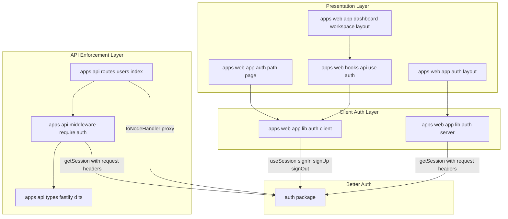
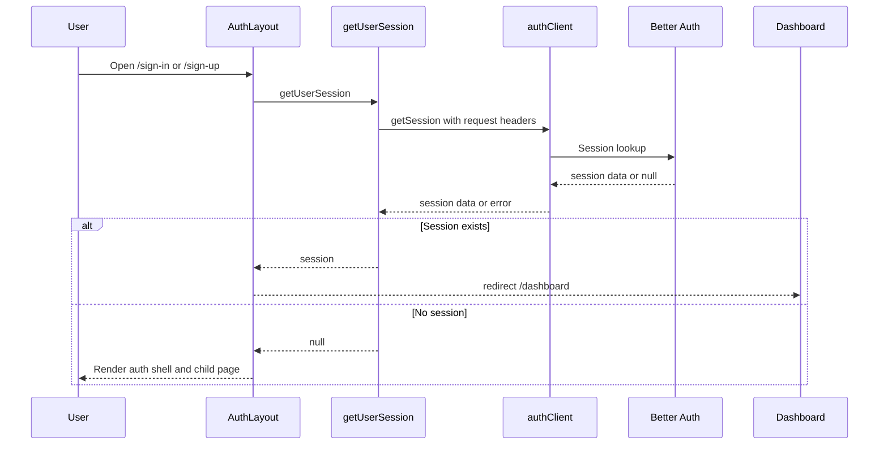
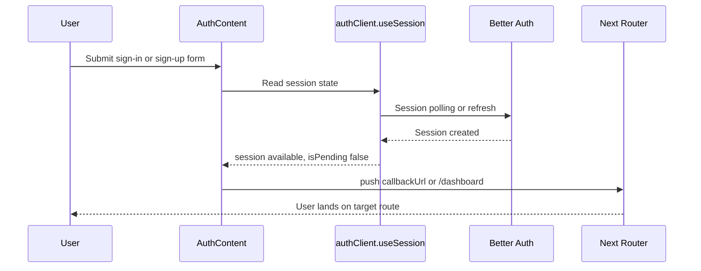
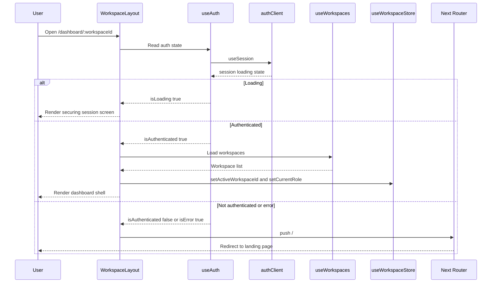
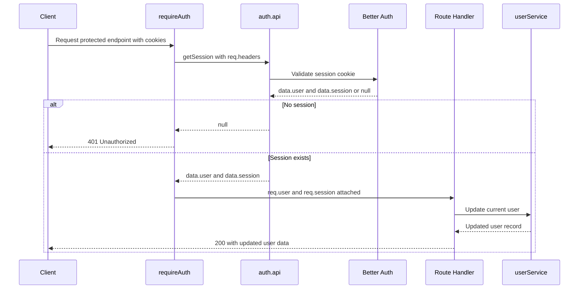

# Authentication and User Management - Session Model, Auth Clients, and Protected Route Enforcement

## Overview

TaskFlow uses Better Auth as the source of truth for user sessions across both the Fastify API and the Next.js app. The API verifies the caller’s session before any protected handler runs, while the web app reads the same session state to decide whether to render auth screens, redirect authenticated users, or lock down dashboard routes.

This section centers on the session lifecycle: browser requests carry Better Auth cookies to the API, `requireAuth` resolves the session and attaches `user` and `session` to the Fastify request, and the web app consumes the same session through `authClient.useSession()` and `getUserSession()`. The result is a single session model that drives login pages, user profile updates, and route protection without duplicating auth logic.

## Architecture Overview



## Session Model and Request Augmentation

TaskFlow treats the Better Auth session as the authoritative identity payload. On the API, `requireAuth` resolves the session and attaches the resulting `user` and `session` objects onto the Fastify request so route handlers can read the authenticated user immediately.

### Request fields attached by authentication middleware

| Property | Type | Description |
|---|---|---|
| `user` | `any` | Attached by `requireAuth` from `data.user` after session lookup. |
| `session` | `any` | Attached by `requireAuth` from `data.session` after session lookup. |

> [!NOTE]
> `apps/api/src/types/fastify.d.ts` imports `Session` and `User` from `auth`, but `FastifyRequest.user` and `FastifyRequest.session` are declared as `any`. That means downstream handlers receive the runtime values, but TypeScript does not enforce the Better Auth session shape.

### Session flow used across the app

| Session Source | What It Returns | Where It Is Used |
|---|---|---|
| `auth.api.getSession({ headers })` | `{ user, session }` payload or nothing | `requireAuth` on the Fastify API |
| `authClient.getSession({ fetchOptions: { headers } })` | Session data for Next.js server rendering | `getUserSession()` in `apps/web/app/lib/auth/server.ts` |
| `authClient.useSession()` | React session state | `useAuth()` and the auth route page |
| `req.user` / `req.session` | Authenticated request identity | Protected API handlers and downstream middleware |

## Component Structure

### 1. API Enforcement Layer

#### `requireAuth` middleware
*File: `apps/api/src/middleware/require-auth.ts`*

`requireAuth` is the gatekeeper for authenticated API routes. It resolves the Better Auth session from the incoming request headers and blocks the request with `401 Unauthorized` when no session is present.

##### Dependencies

| Type | Description |
|---|---|
| `auth` | Better Auth server object used to call `auth.api.getSession`. |
| `FastifyRequest` | Source request whose headers are forwarded to Better Auth. |
| `FastifyReply` | Used to return `401` when the session is missing. |

##### Public methods

| Method | Description |
|---|---|
| `requireAuth` | Resolves the Better Auth session and attaches `user` and `session` to the request. |

##### Behavior

- Calls `auth.api.getSession({ headers: req.headers as any })`.
- Returns `401` with `{ message: "Unauthorized" }` when the session lookup fails.
- Assigns `data.user` to `req.user`.
- Assigns `data.session` to `req.session`.
- Leaves the request in a state that downstream route handlers and role middleware can consume immediately.

#### Fastify request augmentation
*File: `apps/api/src/types/fastify.d.ts`*

This module extends `FastifyRequest` so authentication middleware can attach identity data for later middleware and handlers.

| Property | Type | Description |
|---|---|---|
| `user` | `any` | Runtime user object attached by `requireAuth`. |
| `session` | `any` | Runtime session object attached by `requireAuth`. |

#### `authRoutes`
*File: `apps/api/src/routes/users/index.ts`*

`authRoutes` registers both the raw Better Auth proxy route and the authenticated user profile update route.

##### Dependencies

| Type | Description |
|---|---|
| `auth` | Better Auth backend entry point passed to `toNodeHandler`. |
| `toNodeHandler` | Bridges Fastify raw request and reply objects to Better Auth. |
| `userService` | Updates the current user record after validation. |
| `requireAuth` | Protects `/api/users/me`. |
| `updateUserSchema` | Validates the profile update payload. |

##### Public methods

| Method | Description |
|---|---|
| `authRoutes` | Registers auth proxy and current-user routes on a Fastify instance. |

#### Better Auth proxy route
*File: `apps/api/src/routes/users/index.ts`*

This route is the transport layer for Better Auth endpoints.

#### `ALL /api/auth/*`

```api
{
  "title": "Better Auth Proxy Route",
  "description": "Forwards auth requests to Better Auth and handles preflight requests with shared CORS headers",
  "method": "ALL",
  "baseUrl": "<ApiBaseUrl>",
  "endpoint": "/api/auth/*",
  "headers": [
    { "key": "Cookie", "value": "<browser-session-cookie>", "required": true },
    { "key": "Content-Type", "value": "application/json", "required": true }
  ],
  "queryParams": [],
  "pathParams": [],
  "bodyType": "mixed",
  "requestBody": {},
  "formData": [],
  "rawBody": "",
  "responses": {
    "204": {
      "description": "CORS preflight handled locally",
      "body": {}
    },
    "200": {
      "description": "Proxied Better Auth response",
      "body": {}
    }
  }
}
```

##### Route behavior

- Registers a local JSON content type parser so Better Auth receives the raw payload shape it expects.
- Sets CORS headers on every request:
  - `Access-Control-Allow-Origin` from `FRONTEND_URL` or `http://localhost:3000`
  - `Access-Control-Allow-Credentials: true`
  - `Access-Control-Allow-Methods: GET, POST, PUT, DELETE, OPTIONS`
  - `Access-Control-Allow-Headers: Content-Type, Authorization, Cookie`
- Returns `204` for `OPTIONS` requests.
- Hands the raw request and reply objects to `toNodeHandler(auth)` for all non-`OPTIONS` traffic.

#### Current user update route
*File: `apps/api/src/routes/users/index.ts`*

This route updates the authenticated user’s profile data.

#### `PATCH /api/users/me`

```api
{
  "title": "Update Current User",
  "description": "Validates and saves the authenticated user's profile data",
  "method": "PATCH",
  "baseUrl": "<ApiBaseUrl>",
  "endpoint": "/api/users/me",
  "headers": [
    { "key": "Cookie", "value": "<browser-session-cookie>", "required": true },
    { "key": "Content-Type", "value": "application/json", "required": true }
  ],
  "queryParams": [],
  "pathParams": [],
  "bodyType": "json",
  "requestBody": {
    "name": "Ava Patel",
    "image": "https://cdn.example.com/avatars/ava.png"
  },
  "formData": [],
  "rawBody": "",
  "responses": {
    "200": {
      "description": "Profile saved successfully",
      "body": {
        "data": {
          "id": "user_123",
          "name": "Ava Patel",
          "image": "https://cdn.example.com/avatars/ava.png"
        }
      }
    },
    "400": {
      "description": "Validation failed",
      "body": {
        "error": {
          "_errors": [
            "Invalid profile payload"
          ]
        }
      }
    },
    "401": {
      "description": "Missing or invalid session",
      "body": {
        "message": "Unauthorized"
      }
    }
  }
}
```

##### Route behavior

- Runs `requireAuth` before the handler.
- Uses `updateUserSchema.safeParse(req.body)` for request validation.
- Returns `400` with the Zod error formatting when validation fails.
- Updates the current user via `userService.updateUser(req.user.id, { name, image })`.
- Returns `{ data: user }` on success.

### 2. Web Auth Client Layer

#### `authClient`
*File: `apps/web/app/lib/auth/client.ts`*

This file creates the browser-side Better Auth client and points it at the API auth prefix.

##### Configuration

| Property | Type | Description |
|---|---|---|
| `baseURL` | `string` | Built from `NEXT_PUBLIC_API_URL` plus `/api/auth`. |
| `fetchOptions.credentials` | `"include"` | Ensures browser cookies are sent with auth requests. |

##### Public methods

| Method | Description |
|---|---|
| `useSession` | React hook for reading the current authenticated session. |
| `signIn` | Starts the Better Auth sign-in flow. |
| `signUp` | Starts the Better Auth sign-up flow. |
| `signOut` | Ends the current session through Better Auth. |

#### `getUserSession`
*File: `apps/web/app/lib/auth/server.ts`*

This helper performs server-side session resolution for layouts and server components.

##### Dependencies

| Type | Description |
|---|---|
| `headers` | Next.js headers accessor used to forward request headers server-side. |
| `authClient` | Better Auth client used for `getSession`. |

##### Public methods

| Method | Description |
|---|---|
| `getUserSession` | Fetches the current session on the server and returns `session?.data` or `null`. |

##### Behavior

- Calls `authClient.getSession({ fetchOptions: { headers: headers() } })`.
- Returns the session payload when Better Auth resolves it successfully.
- Catches errors, logs them, and returns `null`.
- Uses the client wrapper rather than a separate backend auth SDK, matching the comment in the source.

#### `useAuth`
*File: `apps/web/hooks/api/use-auth.ts`*

This hook exposes authenticated state to client components like the dashboard shell.

##### Dependencies

| Type | Description |
|---|---|
| `useRouter` | Used to redirect after logout. |
| `useQueryClient` | Used to clear cached queries on sign-out. |
| `authClient` | Supplies `useSession()` and `signOut()`. |

##### Returned properties

| Property | Type | Description |
|---|---|---|
| `user` | `session?.user \| null` | Convenience access to the authenticated user. |
| `session` | `unknown` | Full Better Auth session object returned by `useSession()`. |
| `isAuthenticated` | `boolean` | Derived from whether `session?.user` exists. |
| `isLoading` | `boolean` | Mirrors Better Auth session loading state. |
| `isError` | `boolean` | Derived from the hook error state. |
| `logout` | `() => Promise<void>` | Signs out, clears cached queries, and sends the user to `/`. |

##### Public methods

| Method | Description |
|---|---|
| `useAuth` | Wraps Better Auth session state for dashboard and account UI. |
| `logout` | Calls `authClient.signOut`, clears the query cache, and redirects home. |

##### State management behavior

- Uses `authClient.useSession()` as the session source.
- Converts session presence into a simple `isAuthenticated` flag.
- Clears the entire TanStack Query cache with `queryClient.clear()` on logout so stale data is removed from memory.
- Redirects to `/` after sign-out.

### 3. Protected Route Enforcement in the Web App

#### Auth layout
*File: `apps/web/app/(auth)/layout.tsx`*

This server component blocks authenticated users from seeing sign-in, sign-up, and recovery pages.

##### Props

| Property | Type | Description |
|---|---|---|
| `children` | `React.ReactNode` | Auth page content rendered when no session exists. |

##### Public methods

| Method | Description |
|---|---|
| `AuthLayout` | Resolves the session server-side and redirects authenticated users to `/dashboard`. |

##### Behavior

- Calls `getUserSession()` before rendering.
- Redirects to `/dashboard` when a session is present.
- Renders the shared auth shell only when the user is not authenticated.

> [!IMPORTANT]
> Auth screens are gated twice: `AuthLayout` blocks authenticated users on the server, and `AuthContent` redirects again on the client after the session hook resolves. That keeps logged-in users out of sign-in and sign-up pages even during client-side transitions.

#### Auth route page
*File: `apps/web/app/(auth)/[path]/page.tsx`*

This client component renders the correct Better Auth UI view based on the route segment and sends authenticated users away immediately.

##### Internal route mapping

| URL path segment | Better Auth view |
|---|---|
| `sign-in` | `SIGN_IN` |
| `sign-up` | `SIGN_UP` |
| `forgot-password` | `FORGOT_PASSWORD` |
| `reset-password` | `RESET_PASSWORD` |

##### Public methods

| Method | Description |
|---|---|
| `AuthContent` | Resolves the view from the route, watches session state, and redirects on success. |
| `AuthPage` | Wraps `AuthContent` in `Suspense` for `useSearchParams()`. |

##### Behavior

- Reads the dynamic route segment with `useParams()`.
- Reads `callbackUrl` from `useSearchParams()`.
- Uses `authClient.useSession()` to watch login state.
- Redirects to `callbackUrl` when present, otherwise to `/dashboard`.
- Falls back to `notFound()` when the path segment is not one of the mapped auth views.
- Renders `AuthView` from `@daveyplate/better-auth-ui`.
- Wraps the whole auth content in `Suspense` because `useSearchParams()` needs it.

#### Dashboard workspace layout
*File: `apps/web/app/dashboard/[workspaceId]/layout.tsx`*

This layout is the protected shell for the authenticated workspace area.

##### Props

| Property | Type | Description |
|---|---|---|
| `children` | `React.ReactNode` | Workspace page content rendered after auth checks pass. |
| `params` | `{ workspaceId: string }` | Route parameter used to locate the active workspace. |

##### Public methods

| Method | Description |
|---|---|
| `WorkspaceLayout` | Reads auth state, redirects unauthenticated users, and syncs the active workspace. |

##### Behavior

- Calls `useAuth()` to obtain `isAuthenticated`, `isLoading`, and `isError`.
- Shows a full-screen “Securing session...” loading shield while auth state is unresolved.
- Redirects to `/` when the user is not authenticated or an auth error is reported.
- Uses `useWorkspaces()` to locate the current workspace by `workspaceId`.
- Syncs the active workspace ID and current role into `useWorkspaceStore`.

## Feature Flows

### 1. Server-Side Auth Gate for Auth Pages



### 2. Auth View Redirect After Login or Signup



### 3. Protected Dashboard Gate



### 4. Protected API Request and Request Attachment



## State Management

### Session-driven UI state

| State | Source | Effect |
|---|---|---|
| Loading | `isPending` from `authClient.useSession()` | Auth content waits before redirecting; dashboard shows the securing screen. |
| Authenticated | `session` exists | Auth pages redirect to `/dashboard`; dashboard pages render normally. |
| Unauthenticated | No session | Auth views render; dashboard sends the user to `/`. |
| Error | `error` from `useSession()` | `useAuth()` marks `isError` and dashboard routes redirect home. |

### Derived auth state returned by `useAuth`

| Derived value | How it is computed | Purpose |
|---|---|---|
| `user` | `session?.user || null` | Quick access to the current user object. |
| `isAuthenticated` | `!!session?.user` | Simplifies route guards and conditional rendering. |
| `isLoading` | `isPending` from Better Auth | Drives loading UI before redirects happen. |
| `isError` | `!!error` | Lets protected pages fail closed. |

## API Integration

### Authentication proxy and session retrieval
The browser-side auth client points directly at `<NEXT_PUBLIC_API_URL>/api/auth`, and the Fastify app forwards that traffic to Better Auth through `toNodeHandler(auth)`. Session checks therefore use the same cookie-backed identity state everywhere: in `getUserSession()`, in `authClient.useSession()`, and in `requireAuth`.

### Current user update route
`PATCH /api/users/me` is the only explicit user-management endpoint in this section. It depends on the session attached by `requireAuth`, validates the payload with `updateUserSchema`, and persists the current user record through `userService`.

## Error Handling

- `requireAuth` returns `401 Unauthorized` immediately when Better Auth does not resolve a session.
- `getUserSession()` catches server-side failures, logs `"Failed to fetch session from API:"`, and returns `null`.
- `useAuth().logout()` wraps `authClient.signOut()` in `try/catch` and logs `"Logout failed"` on error.
- `AuthContent` uses `notFound()` when the route path is not one of the known auth views.
- `/api/users/me` returns `400` when `updateUserSchema.safeParse()` fails.
- `WorkspaceLayout` redirects to `/` when auth state is missing or in error.

## Caching Strategy

| Area | Cache Key or Scope | Invalidation Trigger |
|---|---|---|
| TanStack Query cache in `useAuth` | Entire query cache | `queryClient.clear()` during logout |
| Better Auth session state | Session cookie and Better Auth internal state | Sign-out through `authClient.signOut()` |
| Server-side auth check | None | `getUserSession()` resolves per request |
| API auth gate | None | `requireAuth` resolves per request |

## Dependencies

- `better-auth`
- `better-auth/react`
- `better-auth/node`
- `Fastify`
- `@fastify/cors`
- `@fastify/helmet`
- `@fastify/rate-limit`
- `next/navigation`
- `next/headers`
- `@tanstack/react-query`
- `@daveyplate/better-auth-ui`
- `auth` workspace package
- `@repo/validators`
- `userService` from `apps/api/src/services/user.service.js`

## Integration Points

- **Workspace dashboard shell**: `apps/web/app/dashboard/[workspaceId]/layout.tsx` depends on `useAuth()` to block unauthenticated access.
- **Current user profile updates**: `PATCH /api/users/me` uses the session user ID attached by `requireAuth`.
- **Downstream authorization middleware**: request-level `user` data is consumed by role guards elsewhere in the API.
- **Auth UI forms**: `AuthView` from `@daveyplate/better-auth-ui` renders the actual sign-in, sign-up, reset, and forgot-password views.
- **Shared browser auth context**: `authClient.useSession()` powers both the auth pages and the dashboard gate.

## Testing Considerations

- Verify authenticated users are redirected away from `/sign-in`, `/sign-up`, `/forgot-password`, and `/reset-password`.
- Verify unauthenticated requests to protected API routes receive `401 Unauthorized`.
- Verify `req.user` and `req.session` are attached after `requireAuth`.
- Verify `/api/users/me` rejects invalid payloads with `400`.
- Verify logout clears the TanStack Query cache and sends the user to `/`.
- Verify `callbackUrl` is honored after successful auth and that the fallback redirect is `/dashboard`.
- Verify the dashboard layout shows the loading shield until `useAuth()` resolves.

## Key Classes Reference

| Class | Responsibility |
|---|---|
| `require-auth.ts` | Resolves Better Auth sessions for Fastify requests and attaches `user` and `session`. |
| `users/index.ts` | Registers the Better Auth proxy route and the protected current-user update endpoint. |
| `(auth)/layout.tsx` | Redirects authenticated users away from auth pages and renders the auth shell for guests. |
| `(auth)/[path]/page.tsx` | Maps auth route segments to Better Auth views and redirects after authentication. |
| `lib/auth/client.ts` | Creates the browser auth client and exposes Better Auth session and auth actions. |
| `lib/auth/server.ts` | Resolves the current session during server rendering. |
| `use-auth.ts` | Exposes session-derived auth state and logout behavior to client components. |
| `fastify.d.ts` | Extends `FastifyRequest` with attached auth identity fields. |