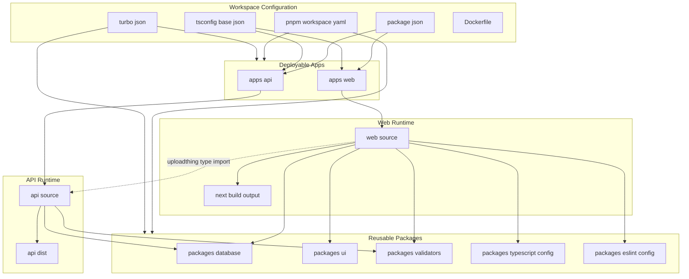
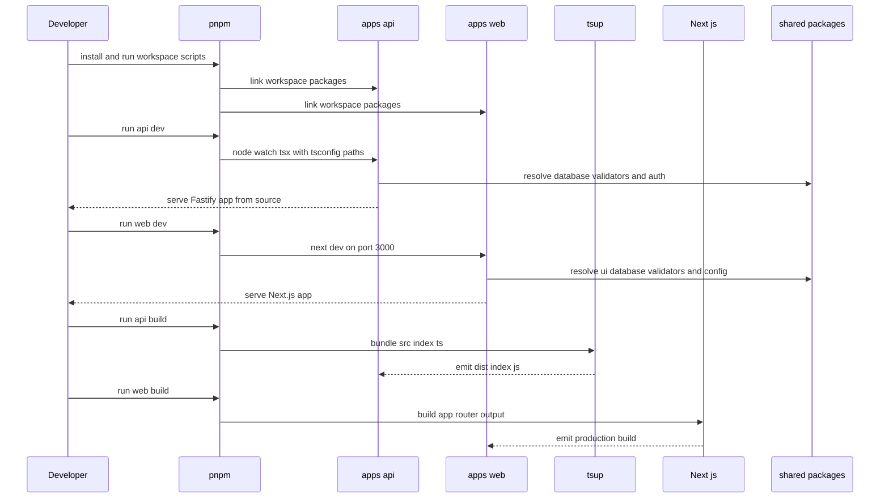

# Monorepo Architecture and Build System

## Overview

TaskFlow is organized as a pnpm workspace with a clear split between deployable applications and reusable internal packages. The live codebase shows two primary runtime targets: `apps/api` for the Fastify backend and `apps/web` for the Next.js client, plus shared workspace packages under `packages/*` for database access, UI primitives, validation schemas, and toolchain presets.

The build system is shaped by workspace linking, TypeScript path mapping, and framework-specific compilation rules. `apps/api` compiles to `dist` with `tsup`, while `apps/web` relies on Next.js with workspace package transpilation and local alias resolution. The repository also contains documentation drift: the web README still describes a default create-next-app scaffold, but the actual app is a TaskFlow monorepo with dashboard routes, shared packages, authentication-aware layouts, and collaboration features.

> [!NOTE]
> `apps/web/README.md` is stale. It still references the default Next.js starter flow (`app/page.tsx`, Inter font, generic Vercel deployment), while the live app uses TaskFlow branding, route groups under `app/(auth)` and `app/dashboard`, shared `@repo/ui` components, `ThemeProvider`, `QueryProvider`, and workspace-aware application layouts. That mismatch affects onboarding and repository navigation.

## Workspace Layout

### Deployable Apps and Shared Packages

| Path | Type | Responsibility |
|---|---|---|
| `apps/api` | Deployable app | Fastify API, route registration, worker runtime, email templates, upload router, and server-side integrations |
| `apps/web` | Deployable app | Next.js client, app router pages, layouts, UI composition, hooks, and browser-side state |
| `packages/database` | Shared package | Prisma client and schema-derived exports such as `WorkspaceRole`, `ProjectRole`, and `NotificationType` |
| `packages/ui` | Shared package | Reusable UI primitives and shared global styles consumed by the web app |
| `packages/validators` | Shared package | Zod schemas and inferred types used by both apps |
| `packages/typescript-config` | Shared package | TypeScript preset files such as `nextjs.json` |
| `packages/eslint-config` | Shared package | Shared ESLint preset consumed by the web app |

### Boundary Model

| Boundary | What lives there | What depends on it |
|---|---|---|
| Application boundary | Runtime code with its own start command and deployment target | `apps/api`, `apps/web` |
| Shared data boundary | Prisma client and schema enums | API services, API routes, API workers, web server components |
| Shared presentation boundary | Design system components and global styles | Web layouts, pages, and reusable UI components |
| Shared validation boundary | Zod input schemas | API route validation and web form validation |
| Shared toolchain boundary | TS and ESLint presets | App-level config files |

## Architecture Overview

## Workspace Manifests

### API Package Manifest

*`apps/api/package.json`*

The API package is a standalone Node application. It has its own dev, build, start, lint, email, and test scripts, and it consumes shared workspace packages through the `workspace:*` protocol.

#### Scripts

| Script | Description |
|---|---|
| `dev` | Runs `src/index.ts` in watch mode with `tsx`, `tsconfig-paths/register`, and `../../.env` |
| `build` | Bundles the API with `tsup` |
| `start` | Starts `dist/index.js` with Node |
| `lint` | Runs `biome lint ./src` |
| `email` | Starts the email preview server on port `3001` |
| `test` | Runs Jest through Node with experimental VM modules |

#### Workspace and Runtime Dependencies

| Dependency | Role in the app |
|---|---|
| `@repo/database` | Shared Prisma access layer |
| `auth` | Shared authentication package |
| `@fastify/*` packages | HTTP, security, websocket, and rate limit plugins |
| `bullmq` | Background worker queue support |
| `ioredis` | Redis connection for queue processing |
| `uploadthing` | File upload routing |
| `@hocuspocus/*` | Collaborative document sync services |
| `livekit-server-sdk` | Realtime call integration |
| `nodemailer` | Email delivery |
| `stripe`, `razorpay` | Billing integrations |
| `zod` | Runtime input validation |
| `@langchain/*`, `ai`, `@ai-sdk/openai` | AI and LLM integration |

#### Build Notes

- `src/index.ts` is the runtime entrypoint.
- `tsup` emits `dist/index.js`.
- `@repo/database` stays external during API bundling, which keeps the Prisma client out of the bundle.
- `auth` and `@repo/validators` are bundled into the API output.

### Web Package Manifest

*`apps/web/package.json`*

The web package is a standalone Next.js application. It is built and served independently from the API, but it links against the shared workspace packages and a shared auth package.

#### Scripts

| Script | Description |
|---|---|
| `dev` | Runs the Next.js dev server on port `3000` |
| `build` | Builds the production Next.js app |
| `start` | Starts the built Next.js app |
| `lint` | Runs ESLint with zero warning tolerance |
| `check-types` | Runs `next typegen` and `tsc --noEmit` |

#### Workspace Dependencies

| Dependency | Role in the app |
|---|---|
| `@repo/ui` | Shared UI components and global styles |
| `@repo/validators` | Shared form and request schemas |
| `@repo/database` | Prisma access in server components |
| `auth` | Shared auth package used by the web client and auth routes |

#### Build Notes

- The app is compiled by Next.js, not by `tsup`.
- The workspace package list is transpiled through Next.js so source packages can be imported directly.
- `check-types` includes Next.js type generation, which matches the App Router setup used across the codebase.

## Compiler and Path Resolution

### API TypeScript Configuration

*`apps/api/tsconfig.json`*

The API config is self-contained and optimized for Node runtime code, testing, and source aliases.

| Option | Value | Effect |
|---|---|---|
| `baseUrl` | `.` | Enables local path mapping from the API package root |
| `module` | `ESNext` | Keeps the API in ESM form |
| `moduleResolution` | `Bundler` | Aligns resolution with modern bundler behavior |
| `target` | `es2022` | Matches the runtime baseline used by the app |
| `outDir` | `dist` | Builds into the distribution folder |
| `rootDir` | `src` | Restricts compilation to source files |
| `jsx` | `react-jsx` | Supports `.tsx` email templates in `src/emails` |
| `types` | `jest`, `node` | Enables Jest and Node globals in API tests |
| `paths` | `@services/*`, `@utils/*`, `@routes/*`, `@/*` | Local aliases for service, utility, route, and root imports |

#### API Alias Map

| Alias | Resolves To |
|---|---|
| `@services/*` | `src/services/*` |
| `@utils/*` | `src/utils/*` |
| `@routes/*` | `src/routes/*` |
| `@/*` | `src/*` |

### Web TypeScript Configuration

*`apps/web/tsconfig.json`*

The web config extends the shared Next.js preset from `@repo/typescript-config` and adds app-specific aliases.

| Option | Value | Effect |
|---|---|---|
| `extends` | `@repo/typescript-config/nextjs.json` | Pulls in the shared web preset |
| `baseUrl` | `.` | Enables local resolution from the web app root |
| `paths` | `@/*`, `~/*`, `@repo/*` | Maps app aliases and workspace packages |
| `plugins` | `next` | Enables Next-aware TypeScript behavior |
| `include` | `next-env.d.ts`, `**/*.ts`, `**/*.tsx`, `.next/types/**/*.ts` | Includes App Router and generated Next types |
| `exclude` | `node_modules` | Standard package exclusion |

#### Web Alias Map

| Alias | Resolves To | Typical Use |
|---|---|---|
| `@/*` | `./*` | App-wide imports |
| `~/*` | `./app/*` | App Router and server utilities |
| `@repo/*` | `../../packages/*` | Shared monorepo packages |

### Web Component Generator Aliases

*`apps/web/components.json`*

This file drives the shared shadcn-style component setup and points the generator at the shared UI package.

| Alias | Target |
|---|---|
| `components` | `@/components` |
| `hooks` | `@/hooks` |
| `lib` | `@/lib` |
| `utils` | `@repo/ui/lib/utils` |
| `ui` | `@repo/ui/components` |

It also points Tailwind’s global stylesheet at `../../packages/ui/src/styles/globals.css`, which makes the UI package the central styling source for the app.

### Next.js Build Configuration

*`apps/web/next.config.js`*

The Next config is the main bridge between the web app and workspace packages.

| Setting | Value | Effect |
|---|---|---|
| `experimental.serverComponentsExternalPackages` | `['ws', '@neondatabase/serverless']` | Allows these packages to be used from server components |
| `transpilePackages` | `['@repo/ui', '@repo/database', 'auth', '@repo/validators']` | Compiles shared workspace packages through Next.js |
| `rewrites` | `/api/:path*` to `${apiUrl}/api/auth/:path*` | Proxies auth-related calls to the Fastify API |

### API Build and Test Configuration

*`apps/api/tsup.config.ts`*  
*`apps/api/jest.config.cjs`*

The API build and test setup is tuned to the workspace package graph.

| File | Setting | Effect |
|---|---|---|
| `apps/api/tsup.config.ts` | `entry: ['src/index.ts']` | Uses the API entrypoint as the build root |
| `apps/api/tsup.config.ts` | `format: ['esm']` | Emits ESM output |
| `apps/api/tsup.config.ts` | `platform: 'node'` | Targets Node runtime semantics |
| `apps/api/tsup.config.ts` | `noExternal: ['auth', '@repo/validators']` | Bundles those workspace packages into the API build |
| `apps/api/tsup.config.ts` | `external: ['@repo/database']` | Leaves Prisma/database access external |
| `apps/api/jest.config.cjs` | `moduleNameMapper` for `@repo/database` | Resolves the workspace database package to source during tests |
| `apps/api/jest.config.cjs` | `@services/*`, `@utils/*`, `@routes/*`, `@/*` | Mirrors the API source aliases inside Jest |

## Shared Package Boundaries

### Database Package

`packages/database` is the central data access package. The live code shows it exports `prisma` and schema-derived enums used by both applications and background workers.

| Observed export | Used by | Responsibility |
|---|---|---|
| `prisma` | API services, API routes, API worker, web server pages | Prisma client access |
| `WorkspaceRole` | Workspace routes | Workspace permission typing |
| `ProjectRole` | Project routes | Project permission typing |
| `NotificationType` | Notification worker | Notification classification |

This package is treated as a shared source dependency, not a separate deployment target.

### UI Package

`packages/ui` is the shared presentation layer. The web app imports component modules from `@repo/ui/components/*`, and the app shell imports `@repo/ui/globals.css`.

| Observed export form | Used by | Responsibility |
|---|---|---|
| `@repo/ui/components/*` | Web layouts, dialogs, forms, sidebar, buttons, cards, and other UI primitives | Reusable component library |
| `@repo/ui/globals.css` | Web root layout | Shared styling foundation |
| `@repo/ui/lib/utils` | Web component generator aliases | Shared helper utilities |

### Validators Package

`packages/validators` is the shared schema layer.

| Observed export | Used by | Responsibility |
|---|---|---|
| `createWorkspaceSchema` | API workspace routes | Validates workspace creation requests |
| `createProjectSchema` | API project routes | Validates project creation requests |
| `CreateWorkspaceInput` | API workspace service | Types workspace creation payloads |
| `CreateProjectInput` | API project service | Types project creation payloads |

The same package is also declared in the web package manifest, which keeps client-side forms aligned with server-side validation.

### TypeScript Config Package

`packages/typescript-config` centralizes TypeScript presets. The web app extends `@repo/typescript-config/nextjs.json`, so the shared preset defines the baseline compiler shape for the Next.js workspace.

### ESLint Config Package

`packages/eslint-config` centralizes lint rules. The web app imports `nextJsConfig` from `@repo/eslint-config/next-js`, so lint behavior is consistent across the web workspace.

## Package Boundaries and Dependency Graph

### Deployable App Separation

| App | How it runs | What it owns |
|---|---|---|
| `apps/api` | Node process started from `dist/index.js` | HTTP API, route wiring, worker runtime, email previews, and server-side integrations |
| `apps/web` | Next.js app | App Router pages, layouts, client state, UI composition, and server components |

### Shared Package Dependency Graph

| Consumer | Workspace dependency | Why it exists |
|---|---|---|
| `apps/api` | `@repo/database` | Query and mutate the database |
| `apps/api` | `@repo/validators` | Validate route payloads and type request bodies |
| `apps/api` | `auth` | Authenticate requests and access session-aware logic |
| `apps/web` | `@repo/ui` | Render shared UI primitives and use shared styles |
| `apps/web` | `@repo/database` | Read Prisma data from server components |
| `apps/web` | `@repo/validators` | Share schema definitions with forms |
| `apps/web` | `auth` | Use the shared auth package in client and auth layouts |
| `apps/web` | `@repo/typescript-config` | Apply the shared Next.js compiler preset |
| `apps/web` | `@repo/eslint-config` | Apply the shared Next.js lint preset |

### Cross-App Coupling

> [!NOTE]
> `apps/web/app/lib/uploadthing.ts` imports `OurFileRouter` from `../../../api/src/lib/uploadthing`. That means the web build depends on the API source tree for its upload type contract. The coupling is direct and file-path based, so moving the API router file changes the frontend import path.

### Client and Server Split Inside the Web App

The web app is not purely client-side. Several pages and layouts are client components, but server components also import `prisma` directly from `@repo/database`, including canvas-related pages. This makes the Next.js app a mixed runtime target: browser UI plus Node-capable server components.

## Build and Dependency Flow

## Build and Packaging Flow

### API Build Path

1. `apps/api/package.json` starts from `src/index.ts`.
2. `tsconfig-paths/register` resolves `@services/*`, `@utils/*`, `@routes/*`, and `@/*` during development.
3. `tsup` emits ESM output into `dist`.
4. `@repo/database` stays external, so Prisma remains a live dependency at runtime.
5. `auth` and `@repo/validators` are bundled into the server artifact.

### Web Build Path

1. `apps/web/package.json` runs `next build` and `next start`.
2. `apps/web/tsconfig.json` resolves app aliases and `@repo/*` workspace imports.
3. `apps/web/next.config.js` transpiles `@repo/ui`, `@repo/database`, `auth`, and `@repo/validators`.
4. `apps/web/components.json` keeps the shared UI package as the source of component aliases and global styles.
5. `check-types` validates both generated Next types and TypeScript source.

## README Drift

> [!NOTE]
> `apps/web/README.md` is a template README, not a description of the live workspace. It still tells readers to edit `app/page.tsx`, references the default Next.js starter image/fonts/deployment flow, and omits the actual TaskFlow monorepo structure, shared workspace packages, dashboard routing, and authentication-aware app shells. The file is out of sync with the current codebase.

## Key Classes Reference

| Class | Responsibility |
|---|---|
| `package.json` | Workspace package manifests that define app scripts and dependency boundaries |
| `apps/api/package.json` | API build, start, lint, email, and test entrypoints |
| `apps/web/package.json` | Web build, dev, lint, and typecheck entrypoints |
| `apps/api/tsconfig.json` | API source aliasing and Node-oriented compiler settings |
| `apps/web/tsconfig.json` | Web source aliasing and Next.js compiler settings |
| `apps/web/components.json` | Shared UI generator aliases and Tailwind stylesheet source |
| `apps/web/next.config.js` | Workspace transpilation rules and auth rewrite routing |
| `apps/api/tsup.config.ts` | API bundling rules and external package boundaries |
| `apps/api/jest.config.cjs` | Test-time workspace module resolution |
| `apps/web/eslint.config.js` | Shared lint preset integration |
| `apps/web/README.md` | Stale starter documentation that no longer matches the live codebase |