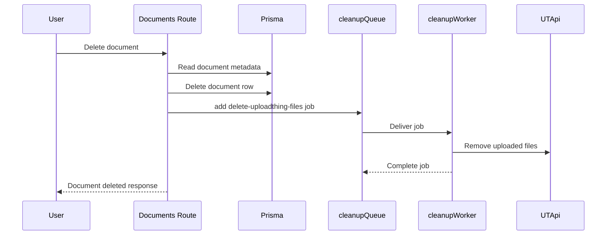
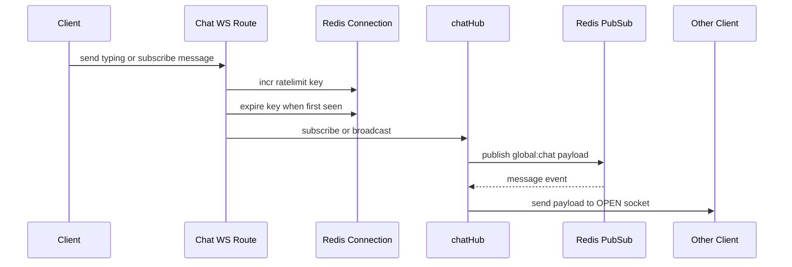
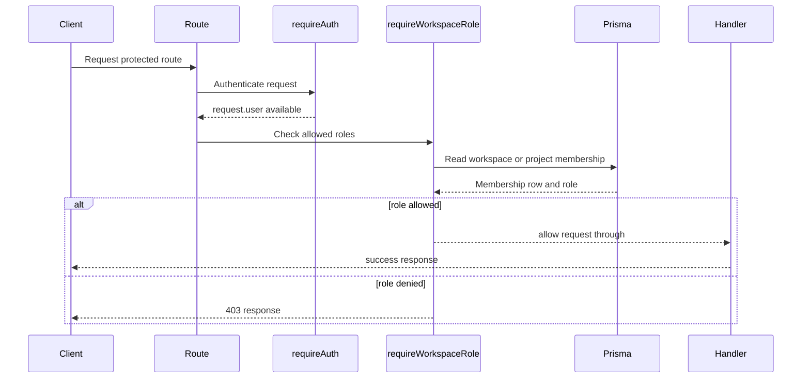

# Shared Infrastructure: Prisma, Queues, Uploads, Realtime Hubs, and RBAC

## Overview

TaskFlow’s shared infrastructure layer is the glue between its Fastify API, Prisma-backed persistence, BullMQ background work, UploadThing uploads, and websocket collaboration features. The same runtime primitives are reused across workspace, project, task, document, chat, and canvas flows so the app can move work from request/response handlers into background jobs, persistent storage, or realtime fan-out when needed.

The code in this section centers on three runtime concerns: database access through `@repo/database`, asynchronous execution through shared Redis and BullMQ queues, and realtime message delivery through websocket hubs and Redis pub/sub. RBAC utilities and request typing keep workspace and project authorization decisions consistent across route handlers and the frontend’s expectations.

## Architecture Overview

```mermaid
flowchart TB
  subgraph APIRuntime[API Runtime]
    ChatRoutes[Chat routes]
    DocumentRoutes[Document routes]
    WorkspaceRoutes[Workspace routes]
    ProjectRoutes[Project routes]
    CanvasRoutes[Canvas routes]
    CollaborationWs[Collaboration websocket]
    UploadThingRoute[UploadThing route handler]
    FastifyRateLimit[Fastify rate limit]
  end

  subgraph SharedInfra[Shared Infrastructure]
    PrismaClient[prisma from repo database]
    QueueModule[queue.ts]
    ChatHub[chat-hub.ts]
    RBAC[require-role.ts]
    UploadThingLib[uploadthing.ts]
    FastifyTypes[fastify d.ts]
    YTypes[y-websocket d.ts]
  end

  subgraph WorkersAndServices[Workers and Service Facades]
    ProjectService[project.service.ts]
    TaskService[task.service.ts]
    OnboardingService[onboarding.service.ts]
    NotificationWorker[notificationWorker.ts]
    EmailWorker[emailWorker.ts]
    CanvasWorker[canvasWorker.ts]
    CleanupWorker[cleanupWorker.ts]
  end

  subgraph ExternalSystems[External Systems]
    Postgres[PostgreSQL]
    Redis[Redis or Upstash Redis]
    UploadThing[UploadThing]
    Liveblocks[Liveblocks]
    BullMQ[BullMQ]
  end

  ChatRoutes --> ChatHub
  ChatRoutes --> QueueModule
  DocumentRoutes --> PrismaClient
  DocumentRoutes --> QueueModule
  WorkspaceRoutes --> PrismaClient
  ProjectRoutes --> PrismaClient
  ProjectRoutes --> RBAC
  CanvasRoutes --> PrismaClient
  CollaborationWs --> PrismaClient
  CollaborationWs --> Liveblocks
  UploadThingRoute --> UploadThingRoute
  FastifyRateLimit --> QueueModule

  ProjectService --> PrismaClient
  TaskService --> PrismaClient
  OnboardingService --> PrismaClient

  QueueModule --> Redis
  ChatHub --> Redis
  NotificationWorker --> BullMQ
  EmailWorker --> BullMQ
  CanvasWorker --> BullMQ
  CleanupWorker --> BullMQ

  PrismaClient --> Postgres
  UploadThingLib --> UploadThing
  CleanupWorker --> UploadThing
  CleanupWorker --> Liveblocks
  CollaborationWs --> YTypes
  RBAC --> PrismaClient
  FastifyTypes --> RBAC
```



## Prisma Backed Data Access

TaskFlow uses the shared Prisma client from `@repo/database` directly inside route handlers, services, and background workers. The visible code relies on a few repeatable patterns: transactional writes for sequence-sensitive records, nested writes for membership creation, selective `include` and `select` projections for UI payloads, and membership lookups for authorization decisions.

### Shared Prisma Access Pattern

| Module | Pattern |
|---|---|
| `apps/api/src/services/project.service.ts` | Creates projects and inserts the creator as a `MANAGER`, then lists projects by `workspaceId` |
| `apps/api/src/services/task.service.ts` | Allocates per-project `sequenceId` values inside a transaction and returns task payloads with relations |
| `apps/api/src/services/onboarding.service.ts` | Seeds workspace, channel, project, and demo tasks inside one Prisma transaction |
| `apps/api/src/routes/chat/index.ts` | Persists messages, reactions, channels, and notifications with relation-aware queries |
| `apps/api/src/routes/documents/index.ts` | Updates, archives, deletes, and lists documents, then schedules cleanup work |
| `apps/api/src/routes/workspaces/index.ts` | Reads and updates workspaces, membership rows, activity logs, API keys, and webhook URLs |
| `apps/api/src/routes/canvas/index.ts` | Creates whiteboards and resolves workspace/project membership for Liveblocks authorization |
| `apps/api/src/routes/webhooks/stripe.ts` | Updates billing fields on `workspace` after verified webhook events |
| `apps/api/src/routes/notification/index.ts` | Reads and mutates notification rows for the current user |

### Project Service

*apps/api/src/services/project.service.ts*

`projectService` is a small Prisma facade for project creation and workspace-scoped listing. It uses a nested member create when a project is created so the creator is immediately stored as a project member with `MANAGER` access.

#### Public Methods

| Method | Description |
|---|---|
| `createProject` | Creates a project from `CreateProjectInput`, assigns it to a workspace, and adds the creator as a `MANAGER` member |
| `getWorkspaceProjects` | Returns all projects for a workspace ordered by `updatedAt` descending |

#### Method Details

- `createProject(data, userId)`
  - Uses `prisma.project.create`.
  - Writes `name`, `identifier`, and `workspaceId` from the validated input.
  - Creates an initial membership row with `{ userId, role: "MANAGER" }`.
- `getWorkspaceProjects(workspaceId)`
  - Uses `prisma.project.findMany`.
  - Filters by `workspaceId`.
  - Orders by `updatedAt: "desc"`.

### Task Service

*apps/api/src/services/task.service.ts*

`taskService` handles task creation and retrieval. Its creation path computes the next `sequenceId` in a transaction so task numbers stay stable within a project.

#### Public Methods

| Method | Description |
|---|---|
| `createTask` | Creates a task with the next project-local `sequenceId` and returns project and assignee projection data |
| `getTasksByProjectId` | Returns all tasks for a project with project, assignee, comment, subtask, and tag projections |

#### Method Details

- `createTask(data, creatorId)`
  - Runs inside `prisma.$transaction`.
  - Reads the highest `sequenceId` for the target project with `findFirst`.
  - Computes `nextSequenceId` as `lastTask.sequenceId + 1` or `1`.
  - Creates the task with fallback values for `status` and `priority`.
  - Includes `project.identifier` and `assignee.name` plus `assignee.image` in the result.
- `getTasksByProjectId(projectId)`
  - Uses `prisma.task.findMany`.
  - Includes `project.identifier`, `assignee.id`, `assignee.name`, `assignee.image`, `comments.id`, `subtasks.id`, `subtasks.status`, and `tags.id` plus `tags.name`.
  - Orders by `createdAt: "desc"`.

### Onboarding Service

*apps/api/src/services/onboarding.service.ts*

`seedOnboardingData` is the initial provisioning flow for a new user with no existing workspace. It uses one Prisma transaction to create the full starter set.

#### Public Methods

| Method | Description |
|---|---|
| `seedOnboardingData` | Seeds a workspace, `#general` channel, demo project, and starter tasks for a new user |

#### Method Details

- `seedOnboardingData(userId, userName)`
  - Generates a unique workspace slug from the user name and random bytes.
  - Uses `prisma.$transaction`.
  - Creates:
    - a `workspace`
    - a `channel` named `general`
    - a `project` named `Welcome to TaskFlow`
    - multiple demo `task` rows through `createMany`
  - Assigns the user as `OWNER` in the workspace and channel, and `MANAGER` in the demo project.

### Prisma Access in Route Middleware

The RBAC middleware imports `prisma`, `WorkspaceRole`, and `ProjectRole` from `@repo/database`. That keeps the authorization checks aligned with the schema enums used in route handlers.

#### Role Sets Used by Routes

- Workspace roles: `OWNER`, `ADMIN`, `MEMBER`, `VIEWER`, `GUEST`
- Project roles: `MANAGER`, `CONTRIBUTOR`, `VIEWER`

## Queue Infrastructure

TaskFlow uses one shared Redis connection for BullMQ queues and rate limiting. The queues are the handoff point for work that should not block the request thread, especially email delivery and file cleanup.

### Queue Module

*apps/api/src/lib/queue.ts*

The queue module is the shared runtime anchor for BullMQ. It throws immediately when `REDIS_URL` is missing, then creates a single Redis connection object that is reused by all queues and the global rate limiter.

#### Exports

| Export | Type | Description |
|---|---|---|
| `redisConnection` | `Redis` | Shared ioredis connection configured with `maxRetriesPerRequest: null` and TLS `rejectUnauthorized: false` |
| `emailQueue` | `Queue` | BullMQ queue named `emails` |
| `notificationQueue` | `Queue` | BullMQ queue named `notifications` |
| `canvasQueue` | `Queue` | BullMQ queue named `canvas` |
| `cleanupQueue` | `Queue` | BullMQ queue named `cleanup` |

#### Runtime Settings

- `redisConnection` reads `process.env.REDIS_URL`.
- The code comments frame the connection as the secure Upstash path.
- TLS validation is disabled with `rejectUnauthorized: false` for the serverless Redis target.
- `maxRetriesPerRequest: null` is set because BullMQ requires it.

### Queue Producers

| Module | Queue | Job Shape Seen in Code |
|---|---|---|
| `apps/api/src/routes/documents/index.ts` | `cleanupQueue` | `{ fileUrls: string[] }` with job name `delete-uploadthing-files` |
| `apps/api/src/routes/documents/index.ts` | `emailQueue` | Invite email payload including `isNewUser` |
| `apps/api/src/routes/task/index.ts` | `notificationQueue` | Imported for task-update notification work |
| `apps/api/src/routes/canvas/index.ts` | `canvasQueue` | Imported for canvas-related async work |

### BullMQ Workers

The server bootstraps all worker modules by importing them from `apps/api/src/server.ts`. That means queue consumers start as soon as the API process loads.

| Worker File | Shared Dependencies | Runtime Role |
|---|---|---|
| `apps/api/src/workers/notificationWorker.ts` | `Worker`, `redisConnection`, `NotificationType`, `prisma` | Consumes notification jobs and persists notification-related records |
| `apps/api/src/workers/emailWorker.ts` | Imported by the server bootstrap | Processes queued email work |
| `apps/api/src/workers/canvasWorker.ts` | `Worker`, `redisConnection`, `prisma` | Consumes canvas jobs with shared Redis and Prisma access |
| `apps/api/src/workers/cleanupWorker.ts` | `Worker`, `redisConnection`, `UTApi`, `Liveblocks` | Consumes cleanup jobs and has access to file deletion and collaboration cleanup APIs |

### Queue Backed Cleanup Flow



### Queue Driven Runtime Control

The API runtime also registers `@fastify/rate-limit` globally using `redisConnection`:

- `max: 150`
- `timeWindow: "1 minute"`
- custom `errorResponseBuilder` that returns a friendly `message`

That shared Redis usage means the same backend store is coordinating request throttling, queued work, and websocket fan-out support.

## UploadThing Integration

UploadThing is wired through both the API runtime and the web client helper. The server exposes the upload route through `createRouteHandler`, and the client helper points at `/api/uploadthing` on the API host.

### Backend Wiring

*apps/api/src/lib/uploadthing.ts*

This module imports `createUploadthing` and `FileRouter` from `uploadthing/fastify`. The router object itself is consumed by `createRouteHandler` in `apps/api/src/server.ts`.

#### Runtime Wiring

| Piece | File | Purpose |
|---|---|---|
| `createRouteHandler` | `apps/api/src/server.ts` | Mounts the UploadThing Fastify handler |
| `ourFileRouter` | `apps/api/src/lib/uploadthing.ts` | Route definition consumed by the handler |
| CORS headers | `apps/api/src/server.ts` | Includes `x-uploadthing-package` and `x-uploadthing-version` in the allowlist |

### Client Helper

*apps/web/app/lib/uploadthing.ts*

The web client uses:

- `useUploadThing`
- `uploadFiles`

The helper resolves the API base URL from `NEXT_PUBLIC_API_URL` and falls back to `http://localhost:4000`, then points UploadThing requests at `api/uploadthing`.

### Upload Flow

1. The client uses `useUploadThing` or `uploadFiles`.
2. Requests are sent to the API host at `/api/uploadthing`.
3. Fastify routes the request into `createRouteHandler`.
4. The router logic from `ourFileRouter` handles the upload lifecycle.

## Realtime Hubs

TaskFlow has two realtime patterns in the code shown: a Redis-backed chat broadcast hub and in-memory websocket room sets for project boards. Collaboration editing is wired through Hocuspocus with Prisma-backed document persistence.

### Chat Hub

*apps/api/src/lib/chat-hub.ts*

`ChatHub` is a singleton broadcast manager. It keeps per-channel socket sets in memory for the local server process and uses Redis pub/sub to fan messages across all API instances.

#### Properties

| Property | Type | Description |
|---|---|---|
| `localSubscriptions` | `Map<string, Set<WebSocket>>` | Local socket registry keyed by channel id |

#### Public Methods

| Method | Description |
|---|---|
| `subscribe` | Adds a socket to a channel’s local subscription set and removes it automatically on socket close |
| `unsubscribe` | Removes a socket from a channel and deletes the channel entry when it becomes empty |
| `broadcast` | Publishes a message to Redis channel `global:chat` |
| `localBroadcast` | Delivers payloads to connected local sockets after Redis message receipt |

#### Module Runtime Resources

| Resource | Type | Description |
|---|---|---|
| `redisUrl` | `string` | Reads from `REDIS_URL`, then `UPSTASH_REDIS_URL`, then `""` |
| `pubClient` | `Redis` | Redis publisher connection |
| `subClient` | `Redis` | Redis subscriber connection |
| `chatHub` | `ChatHub` | Exported singleton instance |

#### Message Flow

- `broadcast(channelId, payload)` serializes `{ channelId, payload }`.
- The message is published to `global:chat`.
- `subClient.on("message")` parses the JSON payload.
- `localBroadcast(channelId, payload)` sends the message to sockets in the local `Map`.

#### Message Types Seen in Routes

- `NEW_MESSAGE`
- `REACTION_TOGGLED`
- `USER_TYPING`

### Chat Broadcast Flow



#### Chat WebSocket Channel

```api
{
  "title": "Chat WebSocket Channel",
  "description": "Opens the chat websocket, applies per-socket Redis rate limiting, and routes subscribe, unsubscribe, and typing messages through chatHub",
  "method": "GET",
  "baseUrl": "<ApiBaseUrl>",
  "endpoint": "/api/chat/ws",
  "headers": [
    { "key": "Upgrade", "value": "websocket", "required": true },
    { "key": "Connection", "value": "Upgrade", "required": true },
    { "key": "Sec-WebSocket-Key", "value": "<key>", "required": true },
    { "key": "Sec-WebSocket-Version", "value": "13", "required": true }
  ],
  "queryParams": [
    {
      "key": "userId",
      "required": false,
      "description": "Fallback identity when request.user is unavailable"
    }
  ],
  "pathParams": [],
  "bodyType": "none",
  "requestBody": "",
  "formData": [],
  "rawBody": "",
  "responses": {
    "101": {
      "description": "Switching Protocols",
      "body": {}
    }
  }
}
```

### Project Board Websocket Room Registry

*apps/api/src/routes/projects/index.ts*

The project routes file creates a local `Map<string, Set<any>>` named `projectRooms`. It is used to join sockets to a project room, rebroadcast received messages to every other socket in that room, and delete the room when the last socket disconnects.

#### Runtime Properties

| Property | Type | Description |
|---|---|---|
| `projectRooms` | `Map<string, Set<any>>` | In-memory room registry keyed by project id |

#### Flow

- The socket handler extracts the `projectId`.
- It adds the websocket connection into the room set.
- Any incoming message is sent to every other ready socket in the same room.
- On close, the socket is removed and the room entry is cleaned up when empty.

> [!NOTE]
> The HTTP fallback branch in `/:projectId/board/ws` uses `request.status(400).send(...)` inside a websocket handler. That branch is written against a reply-style API, so a plain request object can fail before the intended JSON error response is returned.

#### Project Board WebSocket

```api
{
  "title": "Project Board WebSocket Room",
  "description": "Opens a websocket room for a project board and rebroadcasts messages to other sockets connected to the same in-memory room",
  "method": "GET",
  "baseUrl": "<ApiBaseUrl>",
  "endpoint": "/api/projects/:projectId/board/ws",
  "headers": [
    { "key": "Upgrade", "value": "websocket", "required": true },
    { "key": "Connection", "value": "Upgrade", "required": true },
    { "key": "Sec-WebSocket-Key", "value": "<key>", "required": true },
    { "key": "Sec-WebSocket-Version", "value": "13", "required": true }
  ],
  "queryParams": [],
  "pathParams": [
    { "key": "projectId", "required": true, "description": "Project room identifier" }
  ],
  "bodyType": "none",
  "requestBody": "",
  "formData": [],
  "rawBody": "",
  "responses": {
    "101": {
      "description": "Switching Protocols",
      "body": {}
    }
  }
}
```

### Collaboration Websocket Runtime

*apps/api/src/server.ts*

TaskFlow also mounts a collaboration websocket at `/api/collaboration`. The route passes the websocket socket and raw Node request directly into `hocuspocusServer.handleConnection(...)`. The Hocuspocus server uses Prisma-backed document storage through `@hocuspocus/extension-database`.

#### Collaboration Persistence

- `fetch` reads `prisma.document.findUnique({ where: { id: documentName }, select: { yjsState: true } })`
- `store` writes the binary state back to `prisma.document.update(...)`
- `updatedAt` is refreshed on every save

#### Collaboration Websocket

```api
{
  "title": "Collaboration Websocket",
  "description": "Forwards websocket connections into the Hocuspocus server and persists Yjs document state through Prisma",
  "method": "GET",
  "baseUrl": "<ApiBaseUrl>",
  "endpoint": "/api/collaboration",
  "headers": [
    { "key": "Upgrade", "value": "websocket", "required": true },
    { "key": "Connection", "value": "Upgrade", "required": true },
    { "key": "Sec-WebSocket-Key", "value": "<key>", "required": true },
    { "key": "Sec-WebSocket-Version", "value": "13", "required": true }
  ],
  "queryParams": [],
  "pathParams": [],
  "bodyType": "none",
  "requestBody": "",
  "formData": [],
  "rawBody": "",
  "responses": {
    "101": {
      "description": "Switching Protocols",
      "body": {}
    }
  }
}
```

### Y WebSocket Type Support

*apps/api/src/types/y-websocket.d.ts*

This declaration file supplies the project-local `WSSharedDoc` type used by the collaboration stack.

#### Properties

| Property | Type | Description |
|---|---|---|
| `name` | `string` | Shared document name |
| `conns` | `Map<any, Set<number>>` | Connection registry for the shared document |
| `awareness` | `any` | Awareness state used by the collaboration runtime |

#### Constructor

| Constructor | Description |
|---|---|
| `WSSharedDoc(name: string)` | Declares the Yjs shared document instance used by the websocket runtime |

#### Declared Modules

- `@y/protocols/sync`
- `@y/protocols/awareness`
- `lib0/encoding`
- `lib0/decoding`

## RBAC Utilities

The role guard layer is built around middleware factories that routes pass into `preHandler`. The route code shows `requireAuth` first, then `requireWorkspaceRole(...)` or `requireProjectRole(...)` where authorization is role-sensitive.

### Role Guard Middleware

*apps/api/src/middleware/require-role.ts*

This file imports `prisma`, `WorkspaceRole`, and `ProjectRole`, and the code comment identifies it as a higher-order function that returns middleware. The visible route usage confirms that the factories accept role arrays.

#### Public Methods

| Method | Description |
|---|---|
| `requireWorkspaceRole` | Returns a workspace-level guard used to enforce membership and role access before a handler runs |
| `requireProjectRole` | Returns a project-level guard used to enforce project membership and role access before a handler runs |

#### Route Usage Pattern

- `preHandler: [requireAuth, requireWorkspaceRole([...])]`
- `preHandler: [requireAuth, requireProjectRole([...])]`
- Used in workspace, project, document, canvas, and channel-management routes

#### Roles Observed in Code

- Workspace: `OWNER`, `ADMIN`, `MEMBER`, `VIEWER`, `GUEST`
- Project: `MANAGER`, `CONTRIBUTOR`, `VIEWER`

### RBAC Decision Flow



### Fastify Request Type Support

*apps/api/src/types/fastify.d.ts*

This declaration extends the Fastify request object with the auth context used by role guards and downstream handlers.

#### Properties

| Property | Type | Description |
|---|---|---|
| `user` | `any` | Authenticated user context consumed by route handlers and RBAC guards |
| `session` | `any` | Auth session context available on the request |

## Runtime and Shared Service Dependencies

### Shared Runtime Packages

- `@repo/database`
- `bullmq`
- `ioredis`
- `uploadthing/fastify`
- `uploadthing/server`
- `@fastify/websocket`
- `@fastify/rate-limit`
- `@hocuspocus/server`
- `@hocuspocus/extension-database`
- `@liveblocks/node`
- `ws`
- `yjs`
- `lib0`

### Module to Infrastructure Map

| Module | Infrastructure Used |
|---|---|
| `apps/api/src/server.ts` | Fastify websocket, rate limiting, CORS, UploadThing route handler, Hocuspocus server, worker bootstrap |
| `apps/api/src/lib/chat-hub.ts` | Redis pub/sub and in-memory socket fan-out |
| `apps/api/src/lib/queue.ts` | Redis connection and BullMQ queues |
| `apps/api/src/lib/uploadthing.ts` | UploadThing Fastify router |
| `apps/api/src/middleware/require-role.ts` | Prisma-backed RBAC checks |
| `apps/api/src/services/project.service.ts` | Prisma client |
| `apps/api/src/services/task.service.ts` | Prisma client |
| `apps/api/src/services/onboarding.service.ts` | Prisma client and transactional writes |
| `apps/api/src/workers/cleanupWorker.ts` | BullMQ, UploadThing server SDK, Liveblocks |
| `apps/api/src/workers/canvasWorker.ts` | BullMQ, Redis, Prisma |
| `apps/api/src/workers/notificationWorker.ts` | BullMQ, Redis, Prisma |

## Integration Points

- Workspace and project creation use `@repo/database` for membership writes.
- Chat and collaboration features reuse websocket transport plus Redis fan-out or document persistence.
- File uploads are routed through UploadThing and later cleaned up by `cleanupQueue`.
- RBAC utilities are applied to document, canvas, project, and workspace routes to keep access decisions consistent.
- BullMQ workers are loaded during API startup so queued jobs begin processing without an extra process manager step.

## Testing Considerations

- Confirm `queue.ts` throws when `REDIS_URL` is missing.
- Verify `projectService.createProject` inserts the creator as `MANAGER`.
- Verify `taskService.createTask` increments `sequenceId` per project.
- Verify `cleanupQueue` receives `delete-uploadthing-files` after a document delete.
- Verify websocket messages on `/api/chat/ws` are rate limited through `ratelimit:ws_messages:${userId}`.
- Verify `/api/collaboration` persists and reloads `yjsState` via Prisma.
- Verify workspace and project role guards return `403` when the user lacks the required role.

## Key Classes Reference

| Class | Responsibility |
|---|---|
| `queue.ts` | Creates the shared Redis connection and BullMQ queues used by background jobs and rate limiting |
| `chat-hub.ts` | Redis-backed singleton that fans websocket payloads to local subscribers |
| `uploadthing.ts` | Defines the UploadThing Fastify router used by the API server |
| `require-role.ts` | Produces workspace and project RBAC middleware from allowed role sets |
| `project.service.ts` | Prisma facade for project creation and workspace-scoped listing |
| `task.service.ts` | Prisma facade for task creation and project-scoped retrieval |
| `onboarding.service.ts` | Seeds a new workspace, channel, demo project, and starter tasks |
| `notificationWorker.ts` | Processes notification queue jobs against Prisma |
| `emailWorker.ts` | Processes queued email jobs |
| `canvasWorker.ts` | Processes canvas queue jobs with Redis and Prisma |
| `cleanupWorker.ts` | Removes uploaded files and handles cleanup jobs |
| `fastify.d.ts` | Extends request context with `user` and `session` |
| `y-websocket.d.ts` | Declares collaboration websocket types for Yjs integration |