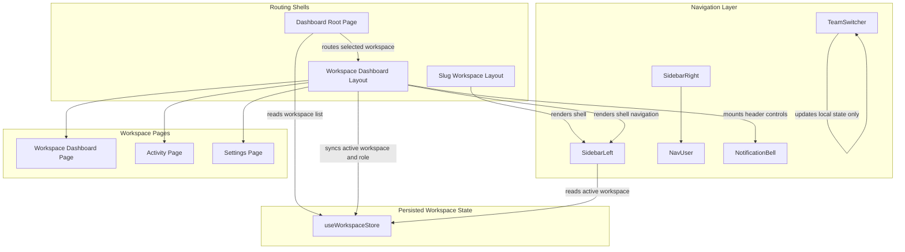
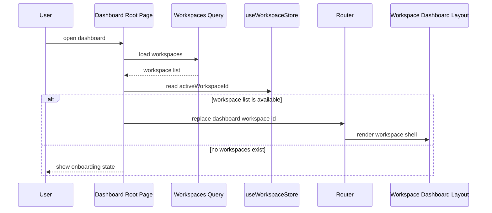
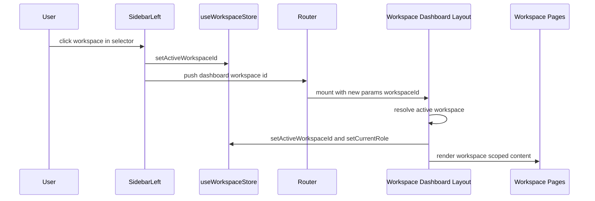

# Workspace and Team Management Domain

## Overview

This domain defines the workspace-scoped shell that TaskFlow uses after sign-in: it resolves the active workspace, keeps the selected workspace stable across refreshes, and routes users into the correct dashboard, activity, and settings pages. The same context also drives the left navigation, workspace switcher, notification badge state, and role-aware settings controls.

The implementation is split between a lightweight slug-based shell and the authenticated dashboard shell. The dashboard shell is the one that owns active workspace resolution, persisted workspace selection, and role sync through `useWorkspaceStore`, so downstream pages and hooks always receive a consistent workspace context.

## Architecture Overview



## Workspace Shell and Routing

### Route Resolution Matrix

| Surface | Workspace source | Fallback | Effect |
|---|---|---|---|
| `app/dashboard/page.tsx` | `useWorkspaceStore.activeWorkspaceId` | first workspace from `useWorkspaces` | redirects into the chosen workspace |
| `app/dashboard/[workspaceId]/layout.tsx` | `params.workspaceId` | none | resolves the active workspace object and syncs role into the store |
| `components/layout/sidebar-left.tsx` | `useWorkspaceStore.activeWorkspaceId` | first workspace from `useWorkspaces` | scopes nav links, projects, and documents |
| `app/dashboard/[workspaceId]/page.tsx` | `params.workspaceId` | none | scopes the overview dashboard queries |
| `app/dashboard/[workspaceId]/activity/page.tsx` | `useParams().workspaceId` | none | scopes the activity feed |
| `app/dashboard/[workspaceId]/settings/page.tsx` | `params.workspaceId` + current session user | none | scopes role-gated workspace settings |

### `app/(app)/[workspaceSlug]/layout.tsx`

*apps/web/app/(app)/[workspaceSlug]/layout.tsx*

This layout provides the app shell for the slug-based route tree. It wraps children in `SidebarProvider`, renders `SidebarLeft`, and adds a header with breadcrumbs and a sidebar trigger. The breadcrumb trail is static in the visible code: `TaskFlow / Dashboard`.

| Property | Type | Description |
|---|---|---|
| `children` | `React.ReactNode` | Nested route content rendered inside the shell |

**Shell composition**
- Renders `SidebarLeft` as the primary navigation rail.
- Uses `SidebarInset` for the page surface.
- Shows a breadcrumb header with `TaskFlow` and `Dashboard`.
- Keeps `SidebarRight` commented out, so the right rail is not mounted here.

### `app/dashboard/page.tsx`

*apps/web/app/dashboard/page.tsx*

This is the root dashboard entry point. It does not render a workspace itself; it resolves the target workspace and routes the user into `/dashboard/{workspaceId}`. If no workspaces exist yet, it shows the onboarding state with a build button.

| Property | Type | Description |
|---|---|---|
| `router` | `NextRouter` | Used to replace the current route with the selected workspace |
| `workspaces` | workspace array | Loaded from `useWorkspaces` |
| `activeWorkspaceId` | `string \| null` | Persisted workspace choice from `useWorkspaceStore` |
| `isInitializing` | `boolean` | Controls the onboarding progress UI |
| `loadingText` | `string` | Cycles through the onboarding copy |

**Routing behavior**
- Waits for the workspaces query to succeed.
- Chooses the workspace matching `activeWorkspaceId` if it exists.
- Falls back to the first workspace in the returned list.
- Rejects literal `"null"` and `"undefined"` strings before routing.
- Uses `router.replace` to avoid creating an extra history entry.

**Onboarding flow**
- `handleBuildWorkspace` sets `isInitializing` to `true`.
- Loading text cycles through:
  - `Preparing your workspace...`
  - `Creating demo tasks...`
  - `Setting up real-time chat...`
  - `Ready! Taking you there...`
- The button triggers the onboarding request and then refetches the workspace list so the redirect effect can fire.

**UI states**
| State | Rendered UI |
|---|---|
| Loading or routing | Full-screen spinner with `Routing to your workspace...` |
| No workspaces | Welcome screen with `Build My Workspace` |
| Initializing | Spinner plus rotating onboarding text |

### `app/dashboard/[workspaceId]/layout.tsx`

*apps/web/app/dashboard/[workspaceId]/layout.tsx*

This is the authenticated workspace shell. It resolves the active workspace from the route parameter, syncs the workspace id and role into `useWorkspaceStore`, gates the entire shell behind auth, and mounts global workspace-wide overlays.

| Property | Type | Description |
|---|---|---|
| `children` | `React.ReactNode` | Workspace page content |
| `params.workspaceId` | `string` | Workspace route id used to resolve the active workspace |

**Dependency table**

| Type | Description |
|---|---|
| `useAuth` | Loads auth state and drives the shell gate |
| `useWorkspaces` | Supplies the workspace list used to resolve `params.workspaceId` |
| `useWorkspaceStore` | Stores `activeWorkspaceId` and `currentRole` |
| `useRouter` | Redirects unauthenticated users to `/` |
| `useUIStore` | Opens global search from the header |
| `NotificationBell` | Header dropdown bound to the current workspace |
| `CreateProjectDialog` | Global workspace-wide dialog mounted once |
| `TaskDetailsDialog` | Global task modal mounted once |
| `GlobalSearch` | Global search overlay mounted once |
| `ThemeToggle` | Header theme switcher |

**Workspace resolution**
- `activeWorkspace` is found by matching `params.workspaceId` against the fetched workspace list.
- When a match exists, the effect writes:
  - `activeWorkspace.id` into `useWorkspaceStore`
  - `activeWorkspace.role` into `useWorkspaceStore.currentRole`
- The role write only happens when `activeWorkspace.role` is present.

**Auth gating**
- While auth is loading, the layout shows a full-screen shield with `Securing session...`.
- If auth fails or reports an error after loading, the shell redirects to `/`.
- If the user is not authenticated, the layout returns `null` so the sidebar never flashes.

**Shell composition**
- `SidebarProvider defaultOpen={true}` keeps the sidebar open on first render.
- `SidebarLeft` renders the primary workspace navigation.
- The header includes:
  - sidebar trigger
  - workspace name text
  - `ThemeToggle`
  - search button that opens `GlobalSearch`
  - `NotificationBell` for the current workspace
- The main content area renders nested route pages.

**UI states**
| State | Rendered UI |
|---|---|
| Auth loading | Full-screen `Securing session...` loader |
| Auth error or unauthenticated | Redirect to `/` and render nothing |
| Authenticated | Sidebar, header, nested workspace routes, and global dialogs |

### `app/dashboard/[workspaceId]/page.tsx`

*apps/web/app/dashboard/[workspaceId]/page.tsx*

This page is the workspace overview dashboard. It composes workspace analytics, priority tasks, recent documents, and charts into a single scrollable page.

| Property | Type | Description |
|---|---|---|
| `params.workspaceId` | `string` | Scope for all workspace dashboard queries |

**Dependency table**

| Type | Description |
|---|---|
| `useWorkspace` | Loads the workspace record for the header copy |
| `useWorkspaceAnalytics` | Provides KPI data and chart series |
| `useProjects` | Provides project context for the workspace |
| `useMyPriorityTasks` | Provides the task list in the right-hand column |
| `useRecentDocuments` | Provides recent docs for the dashboard |

**Dashboard composition**
- Header with quick actions:
  - `New Doc`
  - `New Task`
- KPI cards:
  - `Active Projects`
  - `Tasks in Progress`
  - `Issues Resolved`
- Right-hand work lists:
  - priority tasks
  - recent documents
- Charts:
  - `Sprint Velocity` bar chart
  - `Issue Breakdown` pie chart

**Data flow**
- `workspace?.name` drives the greeting copy.
- `analytics?.kpis` populates the KPI cards.
- `analytics?.sprintVelocityData` feeds the bar chart.
- `analytics?.issueTypeData` feeds the pie chart.
- `myTasks` and `recentDocs` back the two list panels.

**UI states**
| State | Rendered UI |
|---|---|
| Analytics loading | `Loading dashboard...` placeholder |
| Ready | Full dashboard with cards, lists, and charts |
| Empty task or doc lists | Empty state copy inside the relevant card |

### `app/dashboard/[workspaceId]/activity/page.tsx`

*apps/web/app/dashboard/[workspaceId]/activity/page.tsx*

This page renders the workspace activity timeline. It uses the route workspace id to fetch feed items and translates backend action codes into user-facing text.

| Property | Type | Description |
|---|---|---|
| `workspaceId` | `string` | Read from `useParams()` and used to scope the feed |

**Action translation table**

| `log.action` | UI text |
|---|---|
| `TASK_CREATED` | `created task` |
| `STATUS_CHANGED` | `changed status from {oldValue} to {newValue}` |
| `ASSIGNEE_CHANGED` | `assigned this task to {newValue}` |
| `TITLE_CHANGED` | `renamed the task to {newValue}` |
| default | `updated the task` |

**Dependency table**

| Type | Description |
|---|---|
| `useWorkspaceActivity` | Loads the workspace feed |
| `useParams` | Reads `workspaceId` from the URL |
| `Link` | Routes each activity row to the related task |

**UI states**
| State | Rendered UI |
|---|---|
| Loading | Centered spinner |
| Empty | Empty feed card with `No activity recorded yet.` |
| Data present | Vertical timeline with avatars, action text, task links, and timestamps |

### `app/dashboard/[workspaceId]/settings/page.tsx`

*apps/web/app/dashboard/[workspaceId]/settings/page.tsx*

This page is the role-gated workspace management surface. It lets admins rename the workspace, invite members, edit member roles, remove members, delete the workspace, and access integration links.

| Property | Type | Description |
|---|---|---|
| `params.workspaceId` | `string` | Current workspace id |
| `workspaceName` | `string` | Local editable name field |
| `inviteEmail` | `string` | Local invite input |
| `currentUserId` | `string \| undefined` | Derived from the session |
| `canManageInvites` | `boolean` | `true` for `OWNER` and `ADMIN` |

**Dependency table**

| Type | Description |
|---|---|
| `useSession` | Supplies the current user id |
| `useWorkspace` | Loads the workspace and membership list |
| `useUpdateWorkspace` | Updates the workspace name |
| `useInviteMember` | Sends workspace invites |
| `useMutation` | Wraps role updates, member removal, and delete actions |
| `useQueryClient` | Invalidates workspace caches after mutations |
| `apiClient` | Sends direct patch and delete requests |
| `useRouter` | Returns to `/dashboard` after delete |
| `useSearchParams` | Reads the `slack` query flag |
| `ZapierIntegration` | Embedded integration panel |

**Role gating**
- `myWorkspaceMemberData` is found by matching `currentUserId` against `workspace.members`.
- `canManageInvites` is `true` only when the member role is `OWNER` or `ADMIN`.
- The workspace name input is disabled when the user cannot manage invites.
- The save button is replaced with a read-only warning for non-admin users.
- The member invite form uses the same role gate.

**Actions**
| Action | Effect |
|---|---|
| `updateWorkspace` | Saves the workspace name |
| `updateRoleMutation` | Sends a member role patch and refreshes `["workspace", workspaceId]` |
| `removeMemberMutation` | Deletes a workspace member and refreshes `["workspace", workspaceId]` |
| `deleteWorkspaceMutation` | Deletes the workspace, refreshes `["workspaces"]`, and routes to `/dashboard` |
| Slack status toast | Shows success or error toast when `slack` is present in the query string |

**UI states**
| State | Rendered UI |
|---|---|
| Loading and no workspace | `Loading settings...` |
| Admin or owner | Editable name, invite controls, member list, danger zone |
| Non-admin | Disabled input and explanatory warnings |

## Sidebar and Team Switching UX

### `components/layout/sidebar-left.tsx`

*apps/web/components/layout/sidebar-left.tsx*

This is the primary workspace navigation rail. It resolves the active workspace from the persisted store and the fetched workspace list, then uses that context to build every link, list, and badge in the shell.

| Property | Type | Description |
|---|---|---|
| `currentWorkspaceId` | `string` | Route param workspace id used for some links |
| `activeWorkspaceId` | `string \| null` | Persisted selected workspace id |
| `activeWorkspace` | workspace object | Resolved from `activeWorkspaceId` or the first workspace in the list |
| `unreadCount` | `number` | Count of unread notifications |
| `isPro` | `boolean` | Plan badge state derived from the active workspace |
| `planName` | `string` | `Pro Plan` or `Free Plan` |
| `isRootDragOver` | `boolean` | Highlights the root document drop zone |

**Dependency table**

| Type | Description |
|---|---|
| `useWorkspaces` | Fetches the workspace list for the switcher and fallback workspace |
| `useProjects` | Loads projects for the active workspace |
| `useDocuments` | Loads the recursive document tree |
| `useNotifications` | Supplies unread notification count |
| `useWorkspaceStore` | Supplies and updates the active workspace id |
| `useUIStore` | Opens the create project dialog |
| `useAuth` | Supplies the user for document creation and logout |
| `useRouter` | Routes on workspace switch and footer actions |
| `usePathname` | Drives active-link highlighting |
| `useParams` | Reads the current workspace id from the route |

**Workspace selection behavior**
- The top dropdown shows:
  - workspace initial
  - workspace name
  - plan badge
- Clicking a workspace item:
  - writes the id into `useWorkspaceStore`
  - routes to `/dashboard/{workspace.id}`
- The selector supports an Add workspace row in the dropdown.

**Navigation structure**
| Group | Entries |
|---|---|
| Global views | Dashboard, Settings, Inbox, Chat, Billing & Plans, Trash |
| Projects | Workspace project list with create button |
| Documents | Recursive tree with root drop zone |
| Visuals | Whiteboards |
| Footer | Profile Settings, Log out |

**Active-link rules**
| Entry | Rule |
|---|---|
| Dashboard | exact path match |
| Settings, Inbox, Chat, Billing, Trash | `pathname.includes(...)` |
| Project items | `pathname.includes('/projects/{project.id}')` |
| Whiteboards | `pathname.includes('/canvas')` |

**Documents tree behavior**
- Creates a root document from the sidebar button.
- Renders the recursive tree with `DocumentItem`.
- Supports drag and drop reparenting.
- Shows a root drop zone to move a document back to the top level.

**UI states**
| State | Rendered UI |
|---|---|
| Projects loading | `Loading...` placeholder in the Projects group |
| No projects | `No projects yet` |
| Documents loading | `Loading Tree...` placeholder |
| No documents | `No documents yet` |
| Unread notifications | Red badge on the Inbox item |

### `components/layout/team-switcher.tsx`

*apps/web/components/layout/team-switcher.tsx*

This component is a reusable dropdown switcher pattern. It keeps its own local selection in component state and is not wired to the global workspace store or route changes.

| Property | Type | Description |
|---|---|---|
| `teams` | Array of team objects | Input list of selectable teams |
| `name` | `string` | Team label |
| `logo` | `React.ElementType` | Icon component rendered for the team |
| `plan` | `string` | Plan label passed in the team object |

**Behavior**
- Initializes `activeTeam` from `teams[0]`.
- Returns `null` when there is no active team.
- Renders a dropdown with:
  - current team button
  - a menu of all teams
  - keyboard shortcuts shown as `⌘1`, `⌘2`, and so on
  - an Add team row

**Important distinction**
- This component only updates its local `activeTeam`.
- The app-wide workspace switcher that persists the selection and changes the URL lives in `sidebar-left.tsx`.

### `components/layout/nav-user.tsx`

*apps/web/components/layout/nav-user.tsx*

This is the user account dropdown used by the sidebar rail. It renders the current user identity and a compact account menu.

| Property | Type | Description |
|---|---|---|
| `user` | object | Current user profile data |
| `name` | `string` | Display name |
| `email` | `string` | Email address |
| `avatar` | `string` | Avatar image URL |

**Dependency table**

| Type | Description |
|---|---|
| `useSidebar` | Chooses dropdown placement based on mobile state |
| `DropdownMenu` | Hosts the account menu |
| `Avatar` | Renders user identity |

**Menu items**
- Upgrade to Pro
- Account
- Billing
- Notifications
- Log out

**Behavior**
- Uses `side="bottom"` on mobile and `side="right"` on desktop.
- Shows the user avatar plus name and email in both the trigger and the menu header.
- Uses `AvatarFallback` with `CN` as the placeholder text in the visible code.

### `components/layout/sidebar-right.tsx`

*apps/web/components/layout/sidebar-right.tsx*

This is a secondary right rail component that renders a user card, calendars, and a new calendar button. The active workspace shell leaves this component commented out, so it is currently a standalone layout option rather than part of the mounted dashboard shell.

| Property | Type | Description |
|---|---|---|
| `...props` | `React.ComponentProps<typeof Sidebar>` | Forwarded directly into `Sidebar` |

**Composition**
- Header: `NavUser`
- Content: `DatePicker`, separator, `Calendars`
- Footer: `New Calendar` button

**Data source**
- Uses the local `data` constant for the user and calendar groups.

## Persisted Workspace State

### `app/lib/stores/use-workspace-store.ts`

*apps/web/app/lib/stores/use-workspace-store.ts*

This Zustand store keeps the selected workspace and the derived workspace role in persistent storage so the shell can survive reloads and maintain a stable workspace context.

| Property | Type | Description |
|---|---|---|
| `activeWorkspaceId` | `string \| null` | Persisted selected workspace id |
| `currentRole` | `WorkspaceRole` | Persisted role for the active workspace |
| `setActiveWorkspaceId` | `(id: string) => void` | Stores the active workspace id |
| `setCurrentRole` | `(role: WorkspaceRole) => void` | Stores the role for the active workspace |

**WorkspaceRole values**
- `OWNER`
- `ADMIN`
- `MEMBER`
- `GUEST`
- `null`

**Persistence**
- Storage key: `taskflow-workspace-storage`
- The store is wrapped with `persist`, so the active workspace survives page reloads.

### `hooks/api/use-workspace.ts`

*apps/web/hooks/api/use-workspace.ts*

This query hook is the direct workspace fetch used by workspace-aware pages. It is a small but important bridge between route context and workspace data.

| Property | Type | Description |
|---|---|---|
| `slug` | `string` | Workspace slug or id passed into the hook |
| `queryKey` | `["workspace", slug]` | Cache key for the workspace record |
| `placeholderData` | `keepPreviousData` | Preserves the previous workspace while the next one loads |

**Behavior**
- Calls `GET /workspaces/${slug}` through `apiClient`.
- Only runs when `slug` is truthy.
- Returns `data.data`, which is the workspace object returned by the API.

## Workspace Context Flow

| Source | Consumer | Result |
|---|---|---|
| `useWorkspaceStore.activeWorkspaceId` | `app/dashboard/page.tsx`, `sidebar-left.tsx` | Preferred workspace selection |
| `params.workspaceId` | `app/dashboard/[workspaceId]/layout.tsx`, `page.tsx`, `activity/page.tsx`, `settings/page.tsx` | Route-scoped workspace context |
| `activeWorkspace.role` | `useWorkspaceStore.currentRole` | Shell-level role sync for permission-aware UI |
| `useWorkspace` | dashboard overview and settings page | Workspace name, membership, and role-sensitive details |
| `useWorkspaces` | root dashboard and workspace shell | Workspace list for fallback selection and navigation |

## API Integration

### Workspace Endpoints

#### Create Workspace
```api
{
  "title": "Create Workspace",
  "description": "Creates a workspace for the authenticated user and adds them as the owner.",
  "method": "POST",
  "baseUrl": "<TaskFlowApiBaseUrl>",
  "endpoint": "/api/workspaces",
  "headers": [
    { "key": "Authorization", "value": "Bearer <token>", "required": true },
    { "key": "Content-Type", "value": "application/json", "required": true }
  ],
  "queryParams": [],
  "pathParams": [],
  "bodyType": "json",
  "requestBody": {
    "name": "Acme Corp",
    "slug": "acme-corp"
  },
  "formData": [],
  "rawBody": "",
  "responses": {
    "201": {
      "description": "Workspace created",
      "body": {
        "data": {
          "id": "ws_01",
          "name": "Acme Corp",
          "slug": "acme-corp",
          "createdAt": "2026-04-05T10:00:00.000Z",
          "updatedAt": "2026-04-05T10:00:00.000Z"
        }
      }
    }
  }
}
```

#### List Workspaces
```api
{
  "title": "List Workspaces",
  "description": "Returns the authenticated user's workspaces with membership data and the current user's role flattened onto each workspace object.",
  "method": "GET",
  "baseUrl": "<TaskFlowApiBaseUrl>",
  "endpoint": "/api/workspaces",
  "headers": [
    { "key": "Authorization", "value": "Bearer <token>", "required": true }
  ],
  "queryParams": [],
  "pathParams": [],
  "bodyType": "none",
  "requestBody": "",
  "formData": [],
  "rawBody": "",
  "responses": {
    "200": {
      "description": "Success",
      "body": {
        "data": [
          {
            "id": "ws_01",
            "name": "Acme Product",
            "slug": "acme-product",
            "role": "OWNER",
            "members": [
              {
                "id": "wm_01",
                "userId": "usr_01",
                "workspaceId": "ws_01",
                "role": "OWNER",
                "user": {
                  "id": "usr_01",
                  "name": "Ava Chen",
                  "image": "https://example.com/avatar.png"
                }
              }
            ]
          }
        ]
      }
    }
  }
}
```

#### Get Workspace by Slug
```api
{
  "title": "Get Workspace by Slug",
  "description": "Fetches a workspace the authenticated user belongs to by slug or id and returns the current user's role plus project count metadata.",
  "method": "GET",
  "baseUrl": "<TaskFlowApiBaseUrl>",
  "endpoint": "/api/workspaces/:slug",
  "headers": [
    { "key": "Authorization", "value": "Bearer <token>", "required": true }
  ],
  "queryParams": [],
  "pathParams": [
    { "key": "slug", "value": "acme-product", "required": true }
  ],
  "bodyType": "none",
  "requestBody": "",
  "formData": [],
  "rawBody": "",
  "responses": {
    "200": {
      "description": "Success",
      "body": {
        "data": {
          "id": "ws_01",
          "name": "Acme Product",
          "slug": "acme-product",
          "role": "OWNER",
          "members": [
            {
              "id": "wm_01",
              "userId": "usr_01",
              "workspaceId": "ws_01",
              "role": "OWNER",
              "user": {
                "id": "usr_01",
                "name": "Ava Chen",
                "image": "https://example.com/avatar.png"
              }
            }
          ],
          "_count": {
            "projects": 3
          }
        }
      }
    }
  }
}
```

### Notification Shell Endpoints

#### Get Notifications
```api
{
  "title": "Get Notifications",
  "description": "Returns the most recent notifications for the authenticated user with task metadata for direct routing from the shell dropdown.",
  "method": "GET",
  "baseUrl": "<TaskFlowApiBaseUrl>",
  "endpoint": "/api/notifications",
  "headers": [
    { "key": "Authorization", "value": "Bearer <token>", "required": true }
  ],
  "queryParams": [],
  "pathParams": [],
  "bodyType": "none",
  "requestBody": "",
  "formData": [],
  "rawBody": "",
  "responses": {
    "200": {
      "description": "Success",
      "body": {
        "data": [
          {
            "id": "ntf_01",
            "type": "ASSIGNED",
            "content": "Ava assigned you to \"Launch checklist\"",
            "isRead": false,
            "createdAt": "2026-04-05T10:00:00.000Z",
            "task": {
              "id": "task_01",
              "title": "Launch checklist",
              "projectId": "proj_01"
            }
          }
        ]
      }
    }
  }
}
```

#### Mark Notification as Read
```api
{
  "title": "Mark Notification as Read",
  "description": "Marks a single notification as read for the authenticated user.",
  "method": "PATCH",
  "baseUrl": "<TaskFlowApiBaseUrl>",
  "endpoint": "/api/notifications/:id/read",
  "headers": [
    { "key": "Authorization", "value": "Bearer <token>", "required": true }
  ],
  "queryParams": [],
  "pathParams": [
    { "key": "id", "value": "ntf_01", "required": true }
  ],
  "bodyType": "none",
  "requestBody": "",
  "formData": [],
  "rawBody": "",
  "responses": {
    "200": {
      "description": "Success",
      "body": {
        "success": true
      }
    }
  }
}
```

#### Mark All Notifications as Read
```api
{
  "title": "Mark All Notifications as Read",
  "description": "Marks every unread notification for the authenticated user as read.",
  "method": "PATCH",
  "baseUrl": "<TaskFlowApiBaseUrl>",
  "endpoint": "/api/notifications/read-all",
  "headers": [
    { "key": "Authorization", "value": "Bearer <token>", "required": true }
  ],
  "queryParams": [],
  "pathParams": [],
  "bodyType": "none",
  "requestBody": "",
  "formData": [],
  "rawBody": "",
  "responses": {
    "200": {
      "description": "Success",
      "body": {
        "success": true
      }
    }
  }
}
```

#### Clear All Notifications
```api
{
  "title": "Clear All Notifications",
  "description": "Deletes all notifications that belong to the authenticated user.",
  "method": "DELETE",
  "baseUrl": "<TaskFlowApiBaseUrl>",
  "endpoint": "/api/notifications/clear-all",
  "headers": [
    { "key": "Authorization", "value": "Bearer <token>", "required": true }
  ],
  "queryParams": [],
  "pathParams": [],
  "bodyType": "none",
  "requestBody": "",
  "formData": [],
  "rawBody": "",
  "responses": {
    "200": {
      "description": "Success",
      "body": {
        "success": true
      }
    }
  }
}
```

## Feature Flows

### Root Dashboard Redirect and Workspace Handoff



### Workspace Switch From Sidebar



## Error Handling and UI States

### `app/dashboard/page.tsx`
- Logs onboarding failures to the console.
- Clears the initializing state on error.
- Shows an alert when the onboarding request fails.

### `app/dashboard/[workspaceId]/layout.tsx`
- Redirects to `/` when auth fails or returns an error.
- Returns `null` while redirecting so protected UI does not flash.
- Shows `Securing session...` while auth is loading.

### `app/dashboard/[workspaceId]/settings/page.tsx`
- Reads `slack` from the query string and shows a success or error toast.
- Confirms workspace deletion with `window.confirm` before mutating.
- Disables role-sensitive controls when the user is not an admin or owner.

### `components/layout/sidebar-left.tsx`
- Guards root document creation unless both `user` and `activeWorkspace` exist.
- Shows loading and empty states for projects and documents.
- Highlights the root drop zone while a document is dragged over it.

### `app/dashboard/[workspaceId]/activity/page.tsx`
- Shows a centered spinner while the feed loads.
- Shows an empty state card when no logs exist.

## Caching Strategy

| Cache Key | Written by | Invalidated by |
|---|---|---|
| `["workspaces"]` | workspace list query | workspace creation, onboarding refetch, workspace deletion |
| `["workspace", workspaceId]` | `useWorkspace` | workspace rename, member role change, member removal |
| `["notifications"]` | shell notification query | mark one read, mark all read, clear all |
| `["projects", workspaceId]` | workspace project query | project creation and deletion |

**Persistence**
- `useWorkspaceStore` persists `activeWorkspaceId` and `currentRole` in `taskflow-workspace-storage`.
- The root dashboard prefers the persisted selection before falling back to the first workspace in the fetched list.

## Dependencies

- `next/navigation` for route params, router transitions, and redirects
- `@tanstack/react-query` for workspace, notification, and settings mutations
- `zustand` with `persist` for workspace selection state
- `@repo/ui` sidebar, breadcrumb, dialog, card, button, separator, input, and dropdown primitives
- `lucide-react` for shell icons and status indicators
- `sonner` for settings toasts
- `date-fns` for notification timestamps
- `recharts` for dashboard charts

## Key Classes Reference

| Class | Responsibility |
|---|---|
| `app/(app)/[workspaceSlug]/layout.tsx` | Slug-based workspace shell with sidebar and breadcrumbs |
| `dashboard/page.tsx` | Routes users into the selected or first workspace and runs onboarding |
| `dashboard/[workspaceId]/layout.tsx` | Auth-gated workspace shell that syncs workspace id and role |
| `dashboard/[workspaceId]/page.tsx` | Workspace overview dashboard with analytics, tasks, docs, and charts |
| `dashboard/[workspaceId]/activity/page.tsx` | Workspace activity timeline and action translation |
| `dashboard/[workspaceId]/settings/page.tsx` | Workspace settings, member management, and destructive actions |
| `sidebar-left.tsx` | Primary workspace navigation and workspace switcher |
| `team-switcher.tsx` | Standalone local team dropdown pattern |
| `nav-user.tsx` | User account dropdown in the sidebar rail |
| `sidebar-right.tsx` | Secondary rail template with user, calendars, and quick actions |
| `use-workspace-store.ts` | Persisted selected workspace id and role state |
| `use-workspace.ts` | Workspace query hook for route-scoped workspace data |