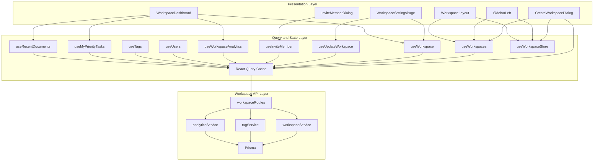
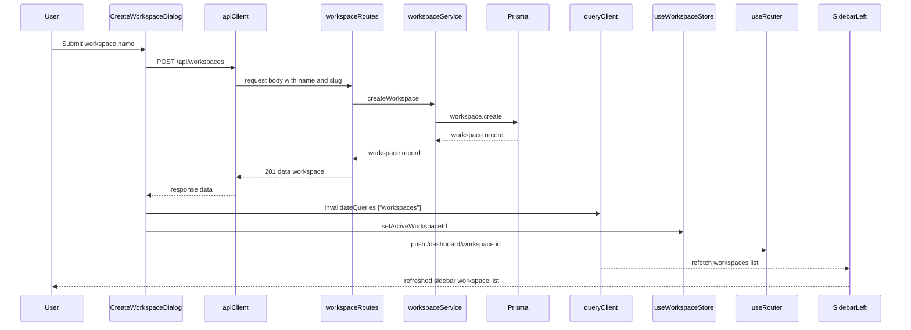
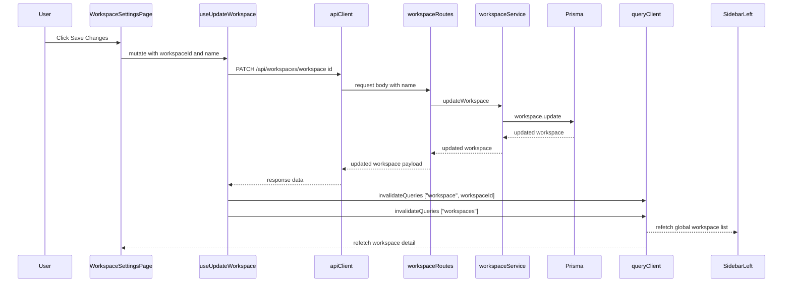
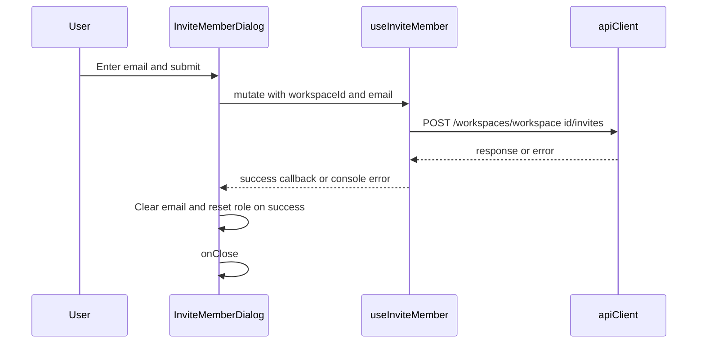
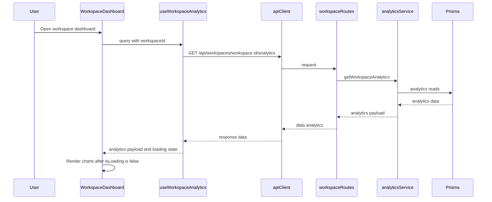

# Workspace and Team Management Domain

## Overview

This domain covers the user-facing workspace lifecycle inside TaskFlow: creating a workspace, renaming it, inviting teammates, and loading workspace-scoped analytics and supporting lists. The feature is split between client-side dialogs and query hooks that keep the workspace sidebar, dashboard, and settings screens in sync with the Fastify workspace routes.

The key pattern is React Query cache coordination around `["workspaces"]`, `["workspace", ...]`, and workspace-scoped keys such as `["users", activeWorkspaceId]` and `["tags", activeWorkspaceId]`. A successful mutation immediately invalidates the relevant cache buckets so the sidebar, header, and workspace pages re-render from fresh server state instead of waiting for a full page reload.

## Architecture Overview



## Component Structure

### Presentation Layer

#### Create Workspace Dialog
*File: `apps/web/components/workspace/create-workspace-dialog.tsx`*

This dialog creates a new workspace from the shell or onboarding entry point. It validates the workspace name with `zod`, auto-generates a slug from the submitted name, posts both values to the workspace API, and then refreshes the workspace list before routing the user into the new workspace dashboard.

**Props**

| Property | Type | Description |
|---|---|---|
| `isFirstWorkspace` | `boolean` | Switches the trigger label and button sizing for the first-workspace onboarding case. |

**Local state and control values**

| Property | Type | Description |
|---|---|---|
| `isOpen` | `boolean` | Controls whether the dialog is visible. |
| `form` | `useForm<FormData>` | Manages `name` input state and validation errors. |
| `workspaceSchema` | `z.object` | Requires `name` to be at least 2 characters long. |
| `FormData` | `z.infer<typeof workspaceSchema>` | Form payload shape with `name`. |

**Behavior**

- Generates a slug by lowercasing the name, stripping special characters, and replacing whitespace with hyphens.
- Sends `{ name, slug }` to `apiClient.post("/workspaces", ...)`.
- Invalidates `["workspaces"]` on success so the sidebar workspace list refreshes immediately.
- Sets the new workspace as active in `useWorkspaceStore`.
- Closes the dialog, resets the form, and routes to `/dashboard/${newWorkspace.id}`.
- Stores API failures in the root form error slot with a user-facing message.

#### Invite Member Dialog
*File: `apps/web/components/workspace/invite-member-dialog.tsx`*

This dialog collects an email address and a role for a new teammate invitation. It delegates the actual invite request to the workspace mutation hook and closes itself after a successful send.

**Props**

| Property | Type | Description |
|---|---|---|
| `workspaceId` | `string` | The workspace that will receive the invitation. |
| `isOpen` | `boolean` | Controls dialog visibility from the parent. |
| `onClose` | `() => void` | Called when the dialog should close. |

**Local state and control values**

| Property | Type | Description |
|---|---|---|
| `email` | `string` | The invitee email address. |
| `role` | `string` | Selected workspace role shown in the UI selector. |
| `isPending` | `boolean` | Mutation loading flag returned by `useInviteMember`. |

**Behavior**

- Sends the trimmed email and current workspace ID through `useInviteMember`.
- Clears `email`, resets `role` to `"MEMBER"`, and closes the dialog on success.
- Disables the input and action buttons while the mutation is pending.
- Opens and closes through the `Dialog` component’s controlled `open` prop.

> [!NOTE]
> The role selector is not connected to the request payload. `InviteMemberDialog` stores a local `role` value, but `useInviteMember` always posts `role: "MEMBER"`. The visible role choice in the dialog is reset after success, but it does not affect the API request.

> [!NOTE]
> The frontend mutation posts to `/workspaces/${workspaceId}/invites`, while the workspace route file shown in this repository defines the invite endpoint at `POST /api/workspaces/:workspaceId/members`. The dialog and backend route path do not match in the provided code.

### Business Layer

#### Workspace Service
*File: `apps/api/src/services/workspace.service.ts`*

`workspaceService` is the server-side facade used by the workspace routes for creating, reading, updating, listing, and inviting members. It translates workspace operations into Prisma calls and centralizes the membership checks used by the route handlers.

**Public methods**

| Method | Description |
|---|---|
| `createWorkspace` | Creates a workspace and adds the requesting user as `OWNER`. |
| `getWorkspaceBySlug` | Fetches a workspace by slug or ID for a user already listed as a member, then injects the user’s `role` at the top level. |
| `getUserWorkspaces` | Fetches all workspaces for a user and adds their workspace-specific `role` to each returned record. |
| `updateWorkspace` | Updates the workspace name by workspace ID. |
| `inviteMember` | Adds a user to a workspace after checking that the email exists and the membership does not already exist. |

**Method details**

| Method | Inputs | Output behavior |
|---|---|---|
| `createWorkspace` | `data`, `userId` | Creates the workspace and nested owner membership. |
| `getWorkspaceBySlug` | `slug`, `userId` | Returns `null` when the user is not a member or the workspace is missing. |
| `getUserWorkspaces` | `userId` | Returns a list of workspace objects with the current user’s `role` merged in. |
| `updateWorkspace` | `workspaceId`, `name` | Persists the new workspace name. |
| `inviteMember` | `workspaceId`, `email` | Throws string errors for missing user or duplicate membership, then creates a `workspaceMember` record with `role: "MEMBER"`. |

### Query Hooks and Cache Coordination

#### Workspace Hooks
*File: `apps/web/hooks/api/use-workspace.ts`*

This file contains the hooks that power the workspace detail view, rename mutation, invite flow, and analytics loading state. The cache strategy is centered on workspace identity and uses explicit invalidation to refresh both the current workspace record and the global workspace list.

**Public hooks**

| Method | Description |
|---|---|
| `useWorkspace` | Fetches a single workspace by slug or ID and keeps the previous result visible while the next one loads. |
| `useUpdateWorkspace` | Renames a workspace and invalidates the detail and list caches on success. |
| `useInviteMember` | Sends an invite request for a workspace member. |
| `useWorkspaceAnalytics` | Loads analytics for a workspace and exposes the query loading state for dashboard rendering. |

**Query key strategy and mutation effects**

| Method | Query key | Cache behavior |
|---|---|---|
| `useWorkspace` | `["workspace", slug]` | Reads a workspace record by the exact identifier string passed into the hook. Uses `keepPreviousData` to avoid empty states during identifier changes. |
| `useUpdateWorkspace` | invalidates `["workspace", workspaceId]` and `["workspaces"]` | Refreshes the workspace detail view and the sidebar list after a rename. |
| `useInviteMember` | none | Performs the POST request and logs success or failure; no React Query invalidation is triggered in the shown code. |
| `useWorkspaceAnalytics` | `["workspace-analytics", workspaceId]` | Loads analytics data when `workspaceId` exists. |

**Hook behavior**

- `useWorkspace` uses `enabled: !!slug`, so it only runs when the route param is present.
- `useUpdateWorkspace` posts `{ name }` to the workspace update route and refreshes both the detail cache and the workspace list cache.
- `useInviteMember` hardcodes `role: "MEMBER"` in the request body.
- `useWorkspaceAnalytics` is a plain query with no refetch interval; the dashboard page uses its `isLoading` flag as the main loading gate.

#### Workspaces List Hook
*File: `apps/web/hooks/api/use-workspaces.ts`*

This hook drives the global workspace list used by the sidebar, dashboard root redirect logic, and workspace layout synchronization.

**Public hooks**

| Method | Description |
|---|---|
| `useWorkspaces` | Fetches all workspaces for the current user. |

**Query key strategy**

| Method | Query key | Cache behavior |
|---|---|---|
| `useWorkspaces` | `["workspaces"]` | Shared list cache used by the sidebar, dashboard redirect logic, and workspace creation refresh. |

#### Users Hook
*File: `apps/web/hooks/api/use-users.ts`*

This hook fetches the members of the current workspace so other workspace-local features can resolve user lists from the active workspace context.

**Public hooks**

| Method | Description |
|---|---|
| `useUsers` | Fetches users belonging to the active workspace from `useWorkspaceStore`. |

**Query key strategy**

| Method | Query key | Cache behavior |
|---|---|---|
| `useUsers` | `["users", activeWorkspaceId]` | Re-keys automatically when the persisted active workspace changes. |

#### Tags Hook
*File: `apps/web/hooks/api/use-tags.ts`*

This hook fetches and creates tags in the active workspace. It reads the current workspace ID from the persisted store and invalidates the tag cache after creation so tag pickers update immediately.

**Public hooks**

| Method | Description |
|---|---|
| `useTags` | Fetches the current workspace tag list and returns a `createTag` mutation wrapper. |

**Returned API**

| Property | Type | Description |
|---|---|---|
| `tags` | `any[]` | Current tag list, defaulting to an empty array. |
| `isLoadingTags` | `boolean` | Loading state for the tag query. |
| `createTag` | `mutate` | Mutation function that creates a tag. |
| `isCreatingTag` | `boolean` | Loading state for tag creation. |

**Query key strategy**

| Method | Query key | Cache behavior |
|---|---|---|
| `useTags` | `["tags", activeWorkspaceId]` | Invalidated on successful tag creation so the tag list refreshes immediately. |

#### Dashboard Data Hooks
*File: `apps/web/hooks/api/use-dashboard.ts`*

These hooks feed the workspace dashboard with user-specific task and document data. They are workspace-scoped and use query keys that are isolated from the main workspace and document caches.

**Public hooks**

| Method | Description |
|---|---|
| `useMyPriorityTasks` | Loads the current user’s priority tasks for a workspace. |
| `useRecentDocuments` | Loads recent documents for a workspace. |

**Query key strategy**

| Method | Query key | Cache behavior |
|---|---|---|
| `useMyPriorityTasks` | `["priority-tasks", workspaceId]` | Workspace-specific task cache for the dashboard. |
| `useRecentDocuments` | `["recent-documents", workspaceId]` | Workspace-specific recent-document cache for the dashboard. |

### Workspace Store

#### use-workspace-store.ts
*File: `apps/web/app/lib/stores/use-workspace-store.ts`*

The workspace store is the small persisted state layer that keeps the current workspace and role available across the shell, sidebar, and workspace-scoped hooks. It is the bridge between the workspace list query and downstream queries like users and tags.

**State shape**

| Property | Type | Description |
|---|---|---|
| `activeWorkspaceId` | `string | null` | Persisted active workspace identifier used by workspace-scoped hooks and shell navigation. |
| `currentRole` | `WorkspaceRole` | The current user’s role in the active workspace. |

**Actions**

| Property | Type | Description |
|---|---|---|
| `setActiveWorkspaceId` | `(id: string) => void` | Updates the active workspace identifier. |
| `setCurrentRole` | `(role: WorkspaceRole) => void` | Updates the current role in the active workspace. |

**WorkspaceRole values**

`OWNER`, `ADMIN`, `MEMBER`, `GUEST`, `null`

### Workspace API Routes

#### Create Workspace
*File: `apps/api/src/routes/workspaces/index.ts`*

```api
{
  "title": "Create Workspace",
  "description": "Creates a new workspace and adds the authenticated user as OWNER",
  "method": "POST",
  "baseUrl": "<TaskFlowApiBaseUrl>",
  "endpoint": "/api/workspaces",
  "headers": [
    {
      "key": "Content-Type",
      "value": "application/json",
      "required": true
    }
  ],
  "queryParams": [],
  "pathParams": [],
  "bodyType": "json",
  "requestBody": {
    "name": "Acme Team",
    "slug": "acme-team"
  },
  "formData": [],
  "rawBody": "",
  "responses": {
    "201": {
      "description": "Workspace created successfully",
      "body": {
        "data": {
          "id": "cm8x3d2k90001p0v2y8h2ab12",
          "name": "Acme Team",
          "slug": "acme-team"
        }
      }
    },
    "400": {
      "description": "Validation error",
      "body": {
        "error": {
          "name": {
            "_errors": [
              "Workspace name is required"
            ]
          }
        }
      }
    }
  }
}
```

#### List User Workspaces
*File: `apps/api/src/routes/workspaces/index.ts`*

```api
{
  "title": "List User Workspaces",
  "description": "Returns all workspaces the authenticated user belongs to, with their role merged into each record",
  "method": "GET",
  "baseUrl": "<TaskFlowApiBaseUrl>",
  "endpoint": "/api/workspaces",
  "headers": [],
  "queryParams": [],
  "pathParams": [],
  "bodyType": "none",
  "requestBody": "",
  "formData": [],
  "rawBody": "",
  "responses": {
    "200": {
      "description": "Workspace list",
      "body": {
        "data": [
          {
            "id": "cm8x3d2k90001p0v2y8h2ab12",
            "name": "Acme Team",
            "slug": "acme-team",
            "role": "OWNER",
            "members": [
              {
                "id": "cm8x3d2kf0002p0v2l7nqk9x1",
                "userId": "user_123",
                "workspaceId": "cm8x3d2k90001p0v2y8h2ab12",
                "role": "OWNER",
                "user": {
                  "id": "user_123",
                  "name": "Jordan Lee",
                  "email": "jordan@example.com",
                  "image": "https://cdn.example.com/avatar.png"
                }
              }
            ]
          }
        ]
      }
    },
    "500": {
      "description": "Failed to fetch workspaces",
      "body": {
        "message": "Failed to fetch workspaces"
      }
    }
  }
}
```

#### Get Workspace by Slug or ID
*File: `apps/api/src/routes/workspaces/index.ts`*

```api
{
  "title": "Get Workspace by Slug or ID",
  "description": "Returns a workspace only when the authenticated user is a member of it",
  "method": "GET",
  "baseUrl": "<TaskFlowApiBaseUrl>",
  "endpoint": "/api/workspaces/:slug",
  "headers": [],
  "queryParams": [],
  "pathParams": [
    {
      "key": "slug",
      "value": "acme-team",
      "required": true
    }
  ],
  "bodyType": "none",
  "requestBody": "",
  "formData": [],
  "rawBody": "",
  "responses": {
    "200": {
      "description": "Workspace details",
      "body": {
        "data": {
          "id": "cm8x3d2k90001p0v2y8h2ab12",
          "name": "Acme Team",
          "slug": "acme-team",
          "role": "ADMIN",
          "members": [
            {
              "id": "cm8x3d2kf0002p0v2l7nqk9x1",
              "userId": "user_123",
              "workspaceId": "cm8x3d2k90001p0v2y8h2ab12",
              "role": "ADMIN",
              "user": {
                "id": "user_123",
                "name": "Jordan Lee",
                "email": "jordan@example.com",
                "image": "https://cdn.example.com/avatar.png"
              }
            }
          ],
          "_count": {
            "projects": 4
          }
        }
      }
    },
    "404": {
      "description": "Workspace not found",
      "body": {
        "message": "Workspace not found"
      }
    }
  }
}
```

#### Update Workspace Name
*File: `apps/api/src/routes/workspaces/index.ts`*

```api
{
  "title": "Update Workspace Name",
  "description": "Updates a workspace name for an authenticated user",
  "method": "PATCH",
  "baseUrl": "<TaskFlowApiBaseUrl>",
  "endpoint": "/api/workspaces/:workspaceId",
  "headers": [
    {
      "key": "Content-Type",
      "value": "application/json",
      "required": true
    }
  ],
  "queryParams": [],
  "pathParams": [
    {
      "key": "workspaceId",
      "value": "cm8x3d2k90001p0v2y8h2ab12",
      "required": true
    }
  ],
  "bodyType": "json",
  "requestBody": {
    "name": "Acme Design Team"
  },
  "formData": [],
  "rawBody": "",
  "responses": {
    "200": {
      "description": "Workspace updated successfully",
      "body": {
        "data": {
          "id": "cm8x3d2k90001p0v2y8h2ab12",
          "name": "Acme Design Team",
          "slug": "acme-team"
        }
      }
    },
    "400": {
      "description": "Workspace name validation error",
      "body": {
        "message": "Workspace name is required"
      }
    }
  }
}
```

#### Invite Workspace Member
*File: `apps/api/src/routes/workspaces/index.ts`*

```api
{
  "title": "Invite Workspace Member",
  "description": "Adds a user to a workspace after auth and workspace role checks",
  "method": "POST",
  "baseUrl": "<TaskFlowApiBaseUrl>",
  "endpoint": "/api/workspaces/:workspaceId/members",
  "headers": [
    {
      "key": "Content-Type",
      "value": "application/json",
      "required": true
    }
  ],
  "queryParams": [],
  "pathParams": [
    {
      "key": "workspaceId",
      "value": "cm8x3d2k90001p0v2y8h2ab12",
      "required": true
    }
  ],
  "bodyType": "json",
  "requestBody": {
    "email": "colleague@company.com"
  },
  "formData": [],
  "rawBody": "",
  "responses": {
    "201": {
      "description": "Member added successfully",
      "body": {
        "data": {
          "id": "cm8x3d2kf0002p0v2l7nqk9x1",
          "workspaceId": "cm8x3d2k90001p0v2y8h2ab12",
          "userId": "user_456",
          "role": "MEMBER"
        }
      }
    },
    "400": {
      "description": "Invite failure",
      "body": {
        "message": "User with this email does not exist."
      }
    },
    "403": {
      "description": "Permission denied",
      "body": {
        "message": "Forbidden: You do not have permission to invite members."
      }
    }
  }
}
```

#### Get Workspace Users
*File: `apps/api/src/routes/workspaces/index.ts`*

```api
{
  "title": "Get Workspace Users",
  "description": "Returns the user objects for every membership in a workspace",
  "method": "GET",
  "baseUrl": "<TaskFlowApiBaseUrl>",
  "endpoint": "/api/workspaces/:workspaceId/users",
  "headers": [],
  "queryParams": [],
  "pathParams": [
    {
      "key": "workspaceId",
      "value": "cm8x3d2k90001p0v2y8h2ab12",
      "required": true
    }
  ],
  "bodyType": "none",
  "requestBody": "",
  "formData": [],
  "rawBody": "",
  "responses": {
    "200": {
      "description": "Workspace users",
      "body": {
        "data": [
          {
            "id": "user_123",
            "name": "Jordan Lee",
            "email": "jordan@example.com",
            "image": "https://cdn.example.com/avatar.png"
          }
        ]
      }
    },
    "500": {
      "description": "Failed to fetch workspace users",
      "body": {
        "message": "Failed to fetch workspace users"
      }
    }
  }
}
```

#### Get Workspace Tags
*File: `apps/api/src/routes/workspaces/index.ts`*

```api
{
  "title": "Get Workspace Tags",
  "description": "Returns the tag list for a workspace",
  "method": "GET",
  "baseUrl": "<TaskFlowApiBaseUrl>",
  "endpoint": "/api/workspaces/:workspaceId/tags",
  "headers": [],
  "queryParams": [],
  "pathParams": [
    {
      "key": "workspaceId",
      "value": "cm8x3d2k90001p0v2y8h2ab12",
      "required": true
    }
  ],
  "bodyType": "none",
  "requestBody": "",
  "formData": [],
  "rawBody": "",
  "responses": {
    "200": {
      "description": "Tag list",
      "body": {
        "data": [
          {
            "id": "tag_001",
            "name": "Urgent",
            "color": "#ef4444",
            "workspaceId": "cm8x3d2k90001p0v2y8h2ab12"
          }
        ]
      }
    },
    "500": {
      "description": "Failed to fetch tags",
      "body": {
        "message": "Failed to fetch tags"
      }
    }
  }
}
```

#### Create Workspace Tag
*File: `apps/api/src/routes/workspaces/index.ts`*

```api
{
  "title": "Create Workspace Tag",
  "description": "Creates a new tag in the selected workspace",
  "method": "POST",
  "baseUrl": "<TaskFlowApiBaseUrl>",
  "endpoint": "/api/workspaces/:workspaceId/tags",
  "headers": [
    {
      "key": "Content-Type",
      "value": "application/json",
      "required": true
    }
  ],
  "queryParams": [],
  "pathParams": [
    {
      "key": "workspaceId",
      "value": "cm8x3d2k90001p0v2y8h2ab12",
      "required": true
    }
  ],
  "bodyType": "json",
  "requestBody": {
    "name": "Blocked",
    "color": "#f97316"
  },
  "formData": [],
  "rawBody": "",
  "responses": {
    "200": {
      "description": "Tag created successfully",
      "body": {
        "data": {
          "id": "tag_002",
          "name": "Blocked",
          "color": "#f97316",
          "workspaceId": "cm8x3d2k90001p0v2y8h2ab12"
        }
      }
    },
    "500": {
      "description": "Failed to create tag",
      "body": {
        "message": "Failed to create tag"
      }
    }
  }
}
```

#### Get Workspace Analytics
*File: `apps/api/src/routes/workspaces/index.ts`*

```api
{
  "title": "Get Workspace Analytics",
  "description": "Returns analytics for a workspace",
  "method": "GET",
  "baseUrl": "<TaskFlowApiBaseUrl>",
  "endpoint": "/api/workspaces/:workspaceId/analytics",
  "headers": [],
  "queryParams": [],
  "pathParams": [
    {
      "key": "workspaceId",
      "value": "cm8x3d2k90001p0v2y8h2ab12",
      "required": true
    }
  ],
  "bodyType": "none",
  "requestBody": "",
  "formData": [],
  "rawBody": "",
  "responses": {
    "200": {
      "description": "Analytics payload",
      "body": {
        "data": {}
      }
    },
    "500": {
      "description": "Failed to load analytics",
      "body": {
        "message": "Failed to load analytics"
      }
    }
  }
}
```

#### Get Recent Workspace Documents
*File: `apps/web/hooks/api/use-dashboard.ts`*

```api
{
  "title": "Get Recent Workspace Documents",
  "description": "Fetches recent documents for a workspace dashboard widget",
  "method": "GET",
  "baseUrl": "<TaskFlowApiBaseUrl>",
  "endpoint": "/api/workspaces/:workspaceId/documents/recent",
  "headers": [],
  "queryParams": [],
  "pathParams": [
    {
      "key": "workspaceId",
      "value": "cm8x3d2k90001p0v2y8h2ab12",
      "required": true
    }
  ],
  "bodyType": "none",
  "requestBody": "",
  "formData": [],
  "rawBody": "",
  "responses": {
    "200": {
      "description": "Recent document list",
      "body": {
        "data": [
          {
            "id": "doc_001",
            "title": "Sprint Notes",
            "updatedAt": "2026-04-05T10:15:30.000Z"
          }
        ]
      }
    }
  }
}
```

#### Get My Priority Tasks for Workspace
*File: `apps/web/hooks/api/use-dashboard.ts`*

```api
{
  "title": "Get My Priority Tasks for Workspace",
  "description": "Fetches the current user's priority tasks for a workspace dashboard widget",
  "method": "GET",
  "baseUrl": "<TaskFlowApiBaseUrl>",
  "endpoint": "/api/tasks/workspaces/:workspaceId/tasks/me",
  "headers": [],
  "queryParams": [],
  "pathParams": [
    {
      "key": "workspaceId",
      "value": "cm8x3d2k90001p0v2y8h2ab12",
      "required": true
    }
  ],
  "bodyType": "none",
  "requestBody": "",
  "formData": [],
  "rawBody": "",
  "responses": {
    "200": {
      "description": "Priority task list",
      "body": [
        {
          "id": "task_001",
          "title": "Review launch checklist",
          "status": "TODO",
          "priority": "HIGH",
          "sequenceId": 1,
          "projectId": "proj_001",
          "creatorId": "user_123",
          "assigneeId": "user_123"
        }
      ]
    }
  }
}
```

## Feature Flows

### Create Workspace and Refresh the Sidebar



The dialog performs three side effects after success: the global workspace list is invalidated, the active workspace ID is persisted, and the app routes directly into the new workspace dashboard. That makes the sidebar, layout breadcrumbs, and dashboard entry point converge on the newly created workspace without a manual refresh.

### Rename Workspace and Refresh Detail and List Caches



The rename path is cache-driven. The detail query is refreshed with the exact workspace ID key, while the sidebar list is refreshed through `["workspaces"]`, so both the workspace header and the menu update from the same mutation result.

### Invite Teammate from the Dialog



The dialog closes itself and clears its fields after a successful request. The selected role is visibly reset, but the request body is still fixed to `MEMBER` in the hook.

> [!NOTE]
> The backend workspace route shown in this repository uses `POST /api/workspaces/:workspaceId/members`, while the hook posts to `/workspaces/:workspaceId/invites`. The UI flow and the server route path do not align in the provided code.

### Load Workspace Analytics and Dashboard Widgets



The dashboard page gates its main render on `useWorkspaceAnalytics(params.workspaceId).isLoading`. The hook is workspace-scoped and keyed by `["workspace-analytics", workspaceId]`, so the chart area waits for the analytics payload before it renders the dashboard body.

## State Management

### Persisted Workspace Context

- `activeWorkspaceId` persists the current workspace selection across reloads.
- `currentRole` persists the user’s role in the selected workspace.
- `WorkspaceLayout` copies `activeWorkspace.id` and `activeWorkspace.role` into the store when the workspaces query resolves.
- `useUsers` and `useTags` both read the current workspace from the store rather than taking it as a prop.

### Query Key Strategy

| Query key | Used by | Purpose |
|---|---|---|
| `["workspaces"]` | `useWorkspaces`, `CreateWorkspaceDialog`, `useUpdateWorkspace`, workspace layout consumers | Global workspace list and sidebar refresh. |
| `["workspace", identifier]` | `useWorkspace`, `useUpdateWorkspace` | Single workspace detail, using either slug or ID as the identifier string. |
| `["workspace-analytics", workspaceId]` | `useWorkspaceAnalytics`, `WorkspaceDashboard` | Dashboard analytics payload. |
| `["users", activeWorkspaceId]` | `useUsers` | Workspace member lookup for mentions and member-aware UI. |
| `["tags", activeWorkspaceId]` | `useTags` | Workspace tag list and tag picker data. |
| `["priority-tasks", workspaceId]` | `useMyPriorityTasks` | User-specific dashboard tasks. |
| `["recent-documents", workspaceId]` | `useRecentDocuments` | Dashboard recent documents. |

## Error Handling

### Client-side patterns

- `CreateWorkspaceDialog` captures request failures in the form root error slot and shows a destructive banner inline.
- `InviteMemberDialog` disables controls during submission and logs failures through the hook’s `onError`.
- `useWorkspace` is guarded with `enabled: !!slug`, preventing premature fetches when the route param is missing.
- `useUsers` and `useTags` both return empty arrays when `activeWorkspaceId` is not set.

### Server-side patterns

- `createWorkspace` validates the request body before the service call.
- `getWorkspaceBySlug` returns `null` when the current user is not a workspace member.
- `inviteMember` throws explicit string errors for missing user and duplicate membership.
- `updateWorkspace` rejects empty names with a 400 response before touching Prisma.
- `requireWorkspaceRole([WorkspaceRole.OWNER, WorkspaceRole.ADMIN])` protects invite and delete operations in the workspace routes.

## Caching Strategy

### Refresh rules

| Trigger | Invalidated keys | Effect |
|---|---|---|
| Successful workspace creation | `["workspaces"]` | Sidebar list refreshes; new workspace becomes available immediately. |
| Successful workspace rename | `["workspace", workspaceId]`, `["workspaces"]` | Detail view and sidebar both refresh. |
| Successful tag creation | `["tags", activeWorkspaceId]` | Tag lists refresh in workspace-scoped UIs. |
| Workspace selection changes | query key changes | `useUsers` and `useTags` fetch data for the new workspace automatically. |
| Workspace analytics load | none | Analytics is fetched by query key and displayed when `isLoading` becomes false. |

### Cache behavior details

- `useWorkspace` uses `keepPreviousData` so the previous workspace detail remains visible while the next identifier is loading.
- `useWorkspaces` provides the shared list cache that the sidebar, root dashboard redirect, and workspace shell all consume.
- `useInviteMember` does not invalidate any query key in the shown code, so invite-related UI refresh depends on a parent refetch or remount.

## Dependencies

### Frontend

- `@tanstack/react-query` for fetching, mutations, invalidation, and loading state.
- `react-hook-form` and `@hookform/resolvers/zod` for the create-workspace form.
- `zod` for workspace name validation.
- `next/navigation` for routing after workspace creation.
- `sonner` for toast feedback in related pages and hooks.
- `zustand` persist middleware for workspace selection state.

### Backend

- `Fastify` workspace routes.
- `Prisma` workspace, workspace member, user, tag, and analytics data access.
- `requireAuth` and `requireWorkspaceRole` middleware for route protection.
- `workspaceService` for workspace lifecycle operations.

## Testing Considerations

- Create workspace success should invalidate `["workspaces"]`, set the active workspace ID, and navigate to `/dashboard/:id`.
- Update workspace success should refresh both the selected workspace query and the global workspace list.
- Invite member submission should close the dialog on success and should not rely on the selected role in the current code path.
- Workspace analytics should keep the dashboard in a loading state until `useWorkspaceAnalytics` resolves.
- Tag creation should refresh the tag list for the active workspace immediately.
- Switching the active workspace should re-key `useUsers` and `useTags` automatically.

## Key Classes Reference

| Class | Responsibility |
|---|---|
| `create-workspace-dialog.tsx — CreateWorkspaceDialog` | Creates a workspace, seeds the slug, refreshes the workspace list, and routes into the new workspace. |
| `invite-member-dialog.tsx — InviteMemberDialog` | Collects invite data and submits the workspace member invite mutation. |
| `use-workspace.ts — useWorkspace` | Fetches a single workspace by slug or ID. |
| `use-workspace.ts — useUpdateWorkspace` | Renames a workspace and invalidates workspace caches. |
| `use-workspace.ts — useInviteMember` | Sends the invite request for a workspace member. |
| `use-workspace.ts — useWorkspaceAnalytics` | Loads analytics for a workspace dashboard. |
| `use-workspaces.ts — useWorkspaces` | Fetches the authenticated user’s workspace list. |
| `use-users.ts — useUsers` | Fetches users for the active workspace. |
| `use-tags.ts — useTags` | Fetches and creates tags for the active workspace. |
| `use-dashboard.ts — useMyPriorityTasks` | Loads the current user’s priority tasks for a workspace. |
| `use-dashboard.ts — useRecentDocuments` | Loads recent workspace documents for the dashboard. |
| `use-workspace-store.ts — useWorkspaceStore` | Persists the active workspace ID and current role across the shell. |
| `workspace.service.ts — workspaceService` | Implements workspace creation, listing, lookup, rename, and membership insertion. |
| `routes/workspaces/index.ts — workspaceRoutes` | Exposes the workspace HTTP API used by the hooks and dialogs. |