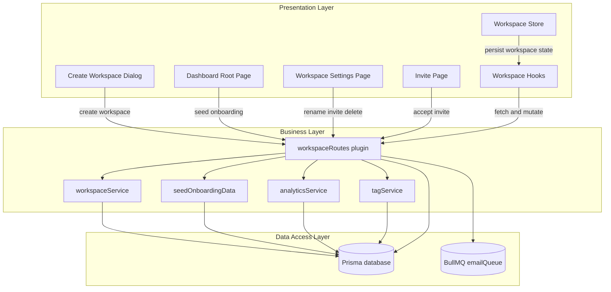
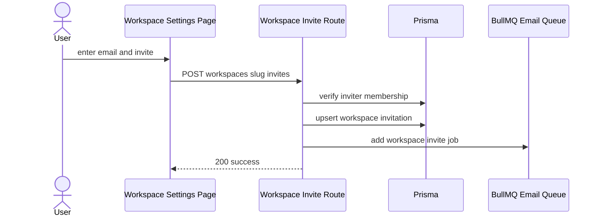
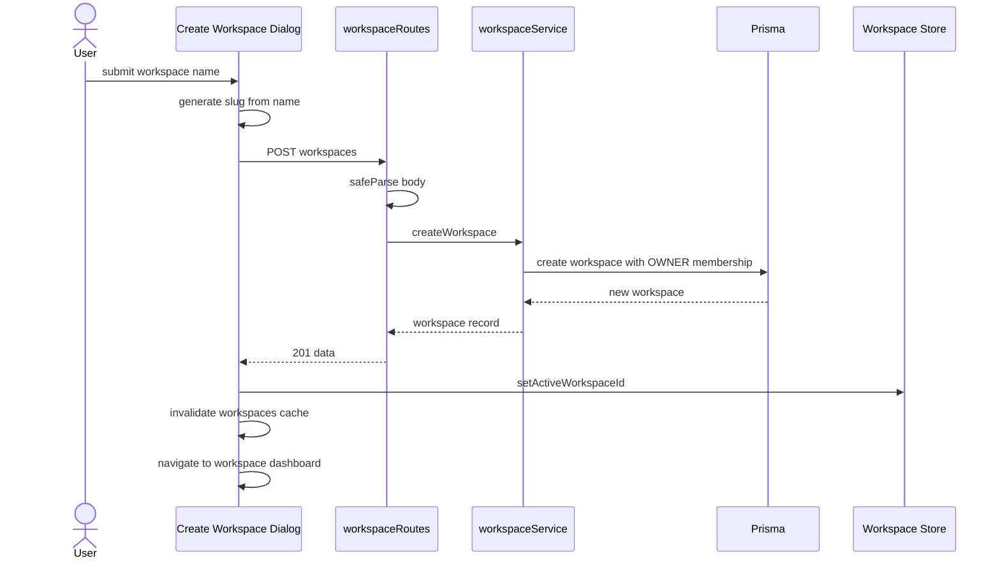
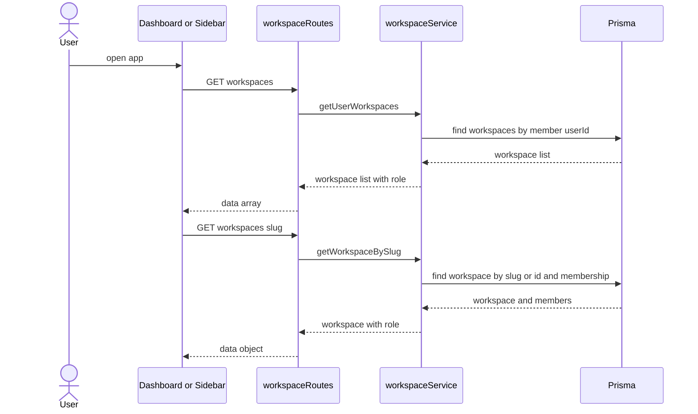
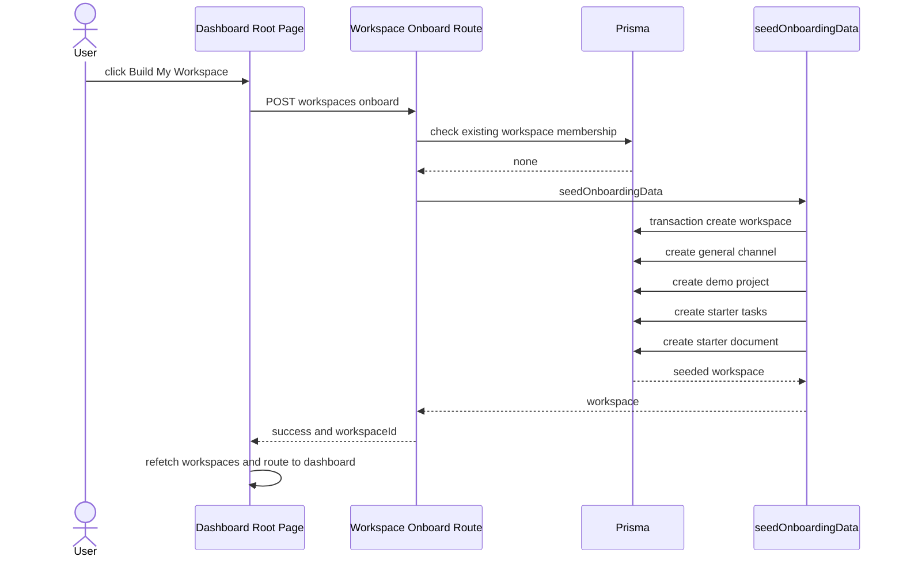
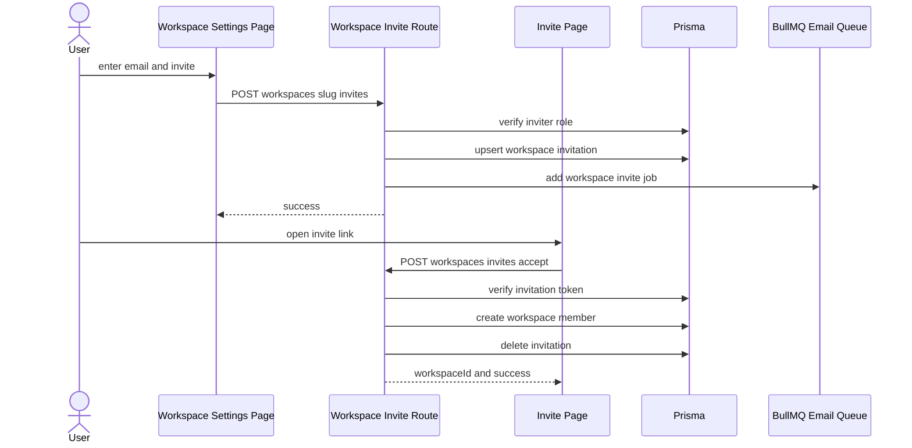
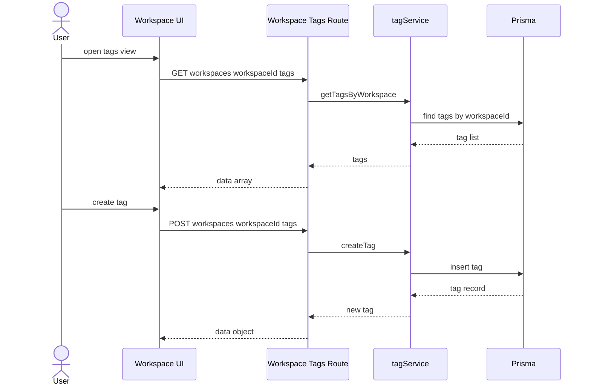
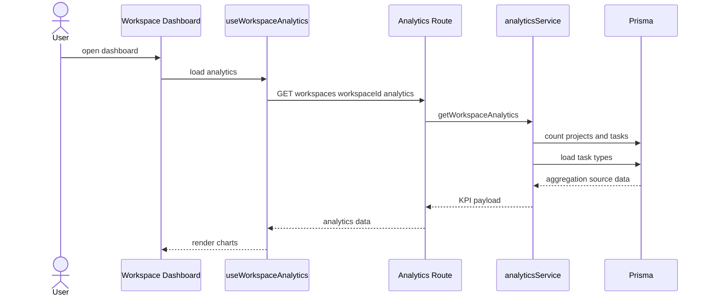
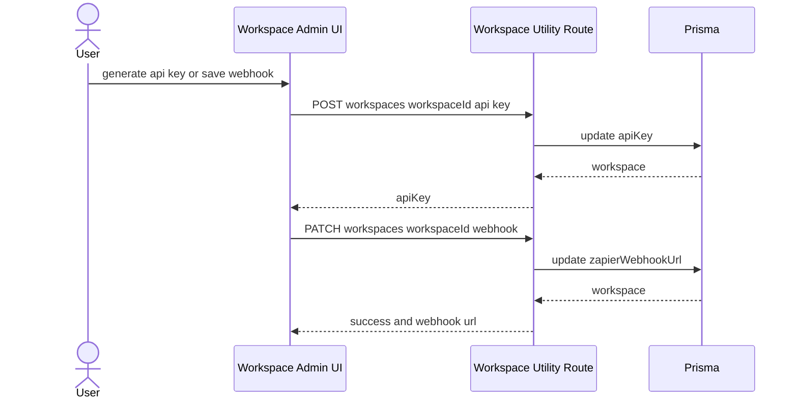

# Workspace and Team Management Domain

## Overview

This domain covers the lifecycle of a workspace from first creation through collaboration, onboarding, invitation management, tagging, analytics, and administrative cleanup. It is the part of TaskFlow that turns a signed-in user into a workspace owner, gives that workspace a slug, default collaboration resources, and then keeps membership, roles, and workspace-level reporting in sync with the rest of the app.

The feature is split across Fastify routes and Prisma-backed services in `apps/api`, with React Query hooks and workspace settings pages in `apps/web` consuming those endpoints. Workspace creation can happen in two distinct ways: a normal workspace created from the create dialog, and a seeded onboarding workspace created from the dashboard empty state that includes a channel, demo project, starter tasks, and a starter document.

## Architecture Overview



## Component Structure

### 1. Presentation Layer

#### Create Workspace Dialog
*`apps/web/components/workspace/create-workspace-dialog.tsx`*

Creates a new workspace from the dashboard UI. It generates a slug client-side from the entered workspace name, posts both `name` and `slug` to the API, then refreshes the workspace list, stores the new active workspace ID, and routes the user into the new workspace.

**Key Properties**

| Property | Type | Description |
|---|---|---|
| `isFirstWorkspace` | `boolean` | Switches the trigger text between `Create Your First Workspace` and `New Workspace`. |

**Key Methods**

| Method | Description |
|---|---|
| `onSubmit` | Builds the slug, calls `POST /workspaces`, invalidates `["workspaces"]`, updates `useWorkspaceStore`, and navigates to the new dashboard. |
| `handleOpenChange` | Resets the form when the dialog closes. |

#### Dashboard Root Page
*`apps/web/app/dashboard/page.tsx`*

Acts as the empty-state onboarding entrypoint. If the user has no workspaces, it shows a “Build My Workspace” action that calls the onboarding endpoint and then refetches the workspace list so the redirect effect can move the user into the new workspace.

**Key Methods**

| Method | Description |
|---|---|
| `handleBuildWorkspace` | Calls `POST /workspaces/onboard`, updates loading copy, and refetches workspaces. |

#### Workspace Settings Page
*`apps/web/app/dashboard/[workspaceId]/settings/page.tsx`*

Drives workspace administration from the web client. It reads the current workspace, derives the signed-in user’s role from `workspace.members`, and gates rename, invite, member removal, and workspace deletion actions to `OWNER` or `ADMIN`.

**Key State Dependencies**

| State | Type | Description |
|---|---|---|
| `workspaceName` | `string` | Local copy of the workspace name used by the rename form. |
| `inviteEmail` | `string` | Email input for member invitation. |
| `myRole` | `string | undefined` | Current user’s role inside the workspace. |
| `canManageInvites` | `boolean` | True when the role is `OWNER` or `ADMIN`. |

#### Invite Page
*`apps/web/app/invite/page.tsx`*

Accepts a workspace invitation token. It checks for a logged-in session before calling the accept-invite endpoint; if the user is not signed in, it redirects to sign-in with a callback URL that returns them to the invite page.

**Key Methods**

| Method | Description |
|---|---|
| `handleAccept` | Validates the invite token and either redirects to sign-in or calls the accept-invite mutation. |

#### Workspace Data Hooks
*`apps/web/hooks/api/use-workspace.ts`, `apps/web/hooks/api/use-workspaces.ts`, `apps/web/hooks/api/use-dashboard.ts`*

These hooks keep the UI aligned with the workspace API and define the cache keys used throughout the feature.

| Hook | Responsibility |
|---|---|
| `useWorkspaces` | Loads the signed-in user’s workspace list from `GET /workspaces`. |
| `useWorkspace` | Loads a single workspace from `GET /workspaces/:slug`. |
| `useUpdateWorkspace` | Sends workspace rename mutations and invalidates the single-workspace and global workspace caches. |
| `useInviteMember` | Sends invite requests to the workspace invite endpoint. |
| `useWorkspaceAnalytics` | Loads analytics from `GET /workspaces/:workspaceId/analytics`. |
| `useRecentDocuments` | Loads recent docs for the workspace dashboard. |

---

### 2. State Management

#### Workspace Store
*`apps/web/app/lib/stores/use-workspace-store.ts`*

The workspace store keeps the active workspace ID and the user’s role for the current workspace in persisted client state. The store is hydrated from the fetched workspace list in the dashboard layout and updated after onboarding and invite acceptance.

| Property | Type | Description |
|---|---|---|
| `activeWorkspaceId` | `string | null` | The workspace currently active in the UI. |
| `currentRole` | `WorkspaceRole` | The current user’s role in the active workspace. |

| Action | Description |
|---|---|
| `setActiveWorkspaceId` | Persists the active workspace ID. |
| `setCurrentRole` | Persists the current workspace role. |

The store is persisted under the key `taskflow-workspace-storage`.

> [!NOTE]
> `WorkspaceRole` in this store is defined as `OWNER`, `ADMIN`, `MEMBER`, `GUEST`, or `null`, which matches the workspace role values used by the API and Prisma-backed membership records.

### 3. Business Layer

#### workspaceService
*`apps/api/src/services/workspace.service.ts`*

This service owns workspace CRUD and membership operations that are shared by the route handlers.

| Method | Description |
|---|---|
| `createWorkspace` | Creates a workspace and immediately inserts the creator as an `OWNER` member. |
| `getWorkspaceBySlug` | Loads a workspace by slug or ID, restricts it to workspaces the user belongs to, and returns the current user’s top-level role. |
| `getUserWorkspaces` | Loads all workspaces for a user, ordered by newest first, and attaches the current user’s role to each item. |
| `updateWorkspace` | Renames a workspace by ID. |
| `inviteMember` | Adds a workspace member by email after verifying the user exists and is not already in the workspace. |

> [!NOTE]
> `getWorkspaceBySlug` does not only match `slug`; it also matches `id`. The hook still calls it as a “slug” fetch, but the service accepts either value.

#### seedOnboardingData
*`apps/api/src/services/onboarding.service.ts`*

This service seeds the demo workspace built from the dashboard empty state. It uses a Prisma transaction so the workspace, channel, project, tasks, and starter document are created together.

| Method | Description |
|---|---|
| `seedOnboardingData` | Generates a unique slug, creates a workspace, seeds a `general` channel, creates a demo project, inserts starter tasks, and adds a starter document. |

**Seeded Data**

- Workspace name: `${userName}'s Workspace`
- Channel:
  - `name`: `general`
  - `type`: `GROUP`
  - `description`: `General discussion and announcements.`
- Demo project:
  - `name`: `Welcome to TaskFlow`
  - `identifier`: `DEMO`
  - `description`: `A sandbox project to help you learn the ropes.`
- Starter tasks:
  - `👋 Welcome to TaskFlow! Click me.`
  - `Drag this task to 'In Progress'`
  - `Invite a teammate to collaborate`
- Starter document:
  - `title`: `🚀 Getting Started`
  - `emoji`: `🚀`
  - `visibility`: `PUBLIC`

#### analyticsService
*`apps/api/src/services/analytics.service.ts`*

This service aggregates workspace metrics directly from Prisma and prepares chart-friendly task type data.

| Method | Description |
|---|---|
| `getWorkspaceAnalytics` | Computes workspace KPIs and formats task-type counts for chart rendering. |

**Aggregation Logic**

- Counts active projects with `prisma.project.count`.
- Counts tasks in progress with `status: "IN_PROGRESS"`.
- Counts recently resolved tasks with `status: "DONE"` and an `updatedAt` window covering the last 30 days.
- Counts total tasks in the workspace.
- Derives `completionRate` with a zero guard.
- Loads task types with `findMany` and aggregates them in memory.
- Maps task types to chart colors using:
  - `FEATURE`
  - `BUG`
  - `TASK`
  - `EPIC`
  - `STORY`
  - `SUBTASK`

#### tagService
*`apps/api/src/services/tag.service.ts`*

This service exposes workspace-scoped tag CRUD.

| Method | Description |
|---|---|
| `getTagsByWorkspace` | Loads all tags for a workspace ordered by name ascending. |
| `createTag` | Creates a new workspace tag with a name and color. |

### 4. Infrastructure Services

#### BullMQ Email Queue
This feature uses a BullMQ queue through `emailQueue` in the workspace route plugin to send workspace invitation emails asynchronously.

**Observed Usage**

- Injected into the workspace invite route.
- Job name: `workspace-invite`
- Payload fields:
  - `toEmail`
  - `inviterName`
  - `workspaceName`
  - `token`
- Job options:
  - `attempts: 3`
  - exponential backoff with `delay: 5000`
  - `removeOnComplete: true`

**Data Flow**

1. The invite route stores or updates a `workspaceInvitation`.
2. The route pushes a `workspace-invite` job to `emailQueue`.
3. The HTTP request returns immediately.
4. The queue worker sends the actual email outside the request lifecycle.



### 5. Access Control and Middleware

The workspace routes use two middleware patterns:

- `requireAuth` for authenticated access.
- `requireWorkspaceRole([...])` for workspace mutations that need owner or admin privileges.

The visible route definitions also include several handlers without `preHandler` middleware, which means no auth or role guard runs before those handlers in the shown code.

> [!NOTE]
> The visible route definitions for `POST /:workspaceId/api-key`, `PATCH /:workspaceId/webhook`, `GET /:workspaceId/tags`, and `POST /:workspaceId/tags` do not declare `preHandler` middleware in the provided code, so those handlers run without an explicit auth guard in the shown implementation.

---

## Feature Flows

### Workspace Creation



1. The client sanitizes the name into a slug.
2. The route validates the body with `createWorkspaceSchema.safeParse`.
3. `workspaceService.createWorkspace` writes the workspace and owner membership.
4. The client stores the new workspace ID and navigates to the workspace dashboard.

#### Create Workspace

```api
{
  "title": "Create Workspace",
  "description": "Creates a workspace and adds the authenticated user as OWNER through workspaceService.createWorkspace.",
  "method": "POST",
  "baseUrl": "<TaskFlowApiBaseUrl>",
  "endpoint": "/workspaces",
  "headers": [
    {
      "key": "Authorization",
      "value": "Bearer <token>",
      "required": true
    },
    {
      "key": "Content-Type",
      "value": "application/json",
      "required": true
    }
  ],
  "queryParams": [],
  "pathParams": [],
  "bodyType": "json",
  "requestBody": {
    "name": "Acme Design",
    "slug": "acme-design"
  },
  "formData": [],
  "rawBody": "",
  "responses": {
    "201": {
      "description": "Workspace created",
      "body": {
        "data": {
          "id": "ws_01J8X1",
          "name": "Acme Design",
          "slug": "acme-design"
        }
      }
    },
    "400": {
      "description": "Validation failed",
      "body": {
        "error": {}
      }
    }
  }
}
```

### Workspace List and Lookup



#### List My Workspaces

```api
{
  "title": "List My Workspaces",
  "description": "Returns all workspaces that include the authenticated user as a member.",
  "method": "GET",
  "baseUrl": "<TaskFlowApiBaseUrl>",
  "endpoint": "/workspaces",
  "headers": [
    {
      "key": "Authorization",
      "value": "Bearer <token>",
      "required": true
    }
  ],
  "queryParams": [],
  "pathParams": [],
  "bodyType": "none",
  "requestBody": "",
  "formData": [],
  "rawBody": "",
  "responses": {
    "200": {
      "description": "Workspace list",
      "body": {
        "data": [
          {
            "id": "ws_01J8X1",
            "name": "Acme Design",
            "slug": "acme-design",
            "role": "OWNER",
            "members": [
              {
                "id": "wm_01",
                "workspaceId": "ws_01J8X1",
                "userId": "user_01",
                "role": "OWNER",
                "user": {
                  "id": "user_01",
                  "name": "Ava Chen",
                  "email": "ava@example.com",
                  "image": "https://example.com/avatar.png"
                }
              }
            ]
          }
        ]
      }
    },
    "500": {
      "description": "Fetch failure",
      "body": {
        "message": "Failed to fetch workspaces"
      }
    }
  }
}
```

#### Get Workspace By Slug Or Id

```api
{
  "title": "Get Workspace By Slug Or Id",
  "description": "Fetches a single workspace the authenticated user belongs to, matching either slug or id.",
  "method": "GET",
  "baseUrl": "<TaskFlowApiBaseUrl>",
  "endpoint": "/workspaces/:slug",
  "headers": [
    {
      "key": "Authorization",
      "value": "Bearer <token>",
      "required": true
    }
  ],
  "queryParams": [],
  "pathParams": [
    {
      "key": "slug",
      "value": "acme-design",
      "required": true
    }
  ],
  "bodyType": "none",
  "requestBody": "",
  "formData": [],
  "rawBody": "",
  "responses": {
    "200": {
      "description": "Workspace found",
      "body": {
        "data": {
          "id": "ws_01J8X1",
          "name": "Acme Design",
          "slug": "acme-design",
          "role": "ADMIN",
          "members": [
            {
              "id": "wm_01",
              "workspaceId": "ws_01J8X1",
              "userId": "user_01",
              "role": "ADMIN",
              "user": {
                "id": "user_01",
                "name": "Ava Chen",
                "email": "ava@example.com",
                "image": "https://example.com/avatar.png"
              }
            }
          ],
          "_count": {
            "projects": 4
          }
        }
      }
    },
    "404": {
      "description": "Workspace not found",
      "body": {
        "message": "Workspace not found"
      }
    }
  }
}
```

#### Update Workspace

```api
{
  "title": "Update Workspace",
  "description": "Renames a workspace by id.",
  "method": "PATCH",
  "baseUrl": "<TaskFlowApiBaseUrl>",
  "endpoint": "/workspaces/:workspaceId",
  "headers": [
    {
      "key": "Authorization",
      "value": "Bearer <token>",
      "required": true
    },
    {
      "key": "Content-Type",
      "value": "application/json",
      "required": true
    }
  ],
  "queryParams": [],
  "pathParams": [
    {
      "key": "workspaceId",
      "value": "ws_01J8X1",
      "required": true
    }
  ],
  "bodyType": "json",
  "requestBody": {
    "name": "Acme Product Team"
  },
  "formData": [],
  "rawBody": "",
  "responses": {
    "200": {
      "description": "Workspace updated",
      "body": {
        "data": {
          "id": "ws_01J8X1",
          "name": "Acme Product Team"
        }
      }
    },
    "400": {
      "description": "Missing name",
      "body": {
        "message": "Workspace name is required"
      }
    }
  }
}
```

#### Delete Workspace

```api
{
  "title": "Delete Workspace",
  "description": "Deletes a workspace after OWNER or ADMIN role checks pass.",
  "method": "DELETE",
  "baseUrl": "<TaskFlowApiBaseUrl>",
  "endpoint": "/workspaces/:workspaceId",
  "headers": [
    {
      "key": "Authorization",
      "value": "Bearer <token>",
      "required": true
    }
  ],
  "queryParams": [],
  "pathParams": [
    {
      "key": "workspaceId",
      "value": "ws_01J8X1",
      "required": true
    }
  ],
  "bodyType": "none",
  "requestBody": "",
  "formData": [],
  "rawBody": "",
  "responses": {
    "200": {
      "description": "Workspace deleted",
      "body": {
        "message": "Workspace deleted successfully",
        "deletedWorkspaceId": "ws_01J8X1"
      }
    },
    "500": {
      "description": "Delete failure",
      "body": {
        "message": "Failed to delete workspace."
      }
    }
  }
}
```

### Onboarding and Seed Data



#### Onboard Workspace

```api
{
  "title": "Onboard Workspace",
  "description": "Seeds a new demo workspace for a signed-in user after confirming they do not already belong to a workspace.",
  "method": "POST",
  "baseUrl": "<TaskFlowApiBaseUrl>",
  "endpoint": "/workspaces/onboard",
  "headers": [
    {
      "key": "Authorization",
      "value": "Bearer <token>",
      "required": true
    }
  ],
  "queryParams": [],
  "pathParams": [],
  "bodyType": "none",
  "requestBody": "",
  "formData": [],
  "rawBody": "",
  "responses": {
    "200": {
      "description": "Workspace seeded",
      "body": {
        "success": true,
        "workspaceId": "ws_01J8X1"
      }
    },
    "400": {
      "description": "User already has a workspace",
      "body": {
        "message": "You already belong to a workspace."
      }
    },
    "500": {
      "description": "Initialization failure",
      "body": {
        "message": "Failed to initialize workspace."
      }
    }
  }
}
```

### Membership and Invite Flows



#### Add Member Directly

```api
{
  "title": "Add Member Directly",
  "description": "Adds an existing user to a workspace by email and assigns the default MEMBER role.",
  "method": "POST",
  "baseUrl": "<TaskFlowApiBaseUrl>",
  "endpoint": "/workspaces/:workspaceId/members",
  "headers": [
    {
      "key": "Authorization",
      "value": "Bearer <token>",
      "required": true
    },
    {
      "key": "Content-Type",
      "value": "application/json",
      "required": true
    }
  ],
  "queryParams": [],
  "pathParams": [
    {
      "key": "workspaceId",
      "value": "ws_01J8X1",
      "required": true
    }
  ],
  "bodyType": "json",
  "requestBody": {
    "email": "teammate@example.com"
  },
  "formData": [],
  "rawBody": "",
  "responses": {
    "201": {
      "description": "Member added",
      "body": {
        "data": {
          "id": "wm_02",
          "workspaceId": "ws_01J8X1",
          "userId": "user_02",
          "role": "MEMBER"
        }
      }
    },
    "400": {
      "description": "Invite failure",
      "body": {
        "message": "User is already a member of this workspace."
      }
    }
  }
}
```

#### Change Member Role

```api
{
  "title": "Change Member Role",
  "description": "Updates a workspace member role after preventing OWNER demotion.",
  "method": "PATCH",
  "baseUrl": "<TaskFlowApiBaseUrl>",
  "endpoint": "/workspaces/:workspaceId/members/:memberId",
  "headers": [
    {
      "key": "Authorization",
      "value": "Bearer <token>",
      "required": true
    },
    {
      "key": "Content-Type",
      "value": "application/json",
      "required": true
    }
  ],
  "queryParams": [],
  "pathParams": [
    {
      "key": "workspaceId",
      "value": "ws_01J8X1",
      "required": true
    },
    {
      "key": "memberId",
      "value": "wm_02",
      "required": true
    }
  ],
  "bodyType": "json",
  "requestBody": {
    "role": "ADMIN"
  },
  "formData": [],
  "rawBody": "",
  "responses": {
    "200": {
      "description": "Member updated",
      "body": {
        "data": {
          "id": "wm_02",
          "workspaceId": "ws_01J8X1",
          "userId": "user_02",
          "role": "ADMIN"
        }
      }
    },
    "403": {
      "description": "Protected owner role",
      "body": {
        "error": "Cannot change the role of the Workspace Owner."
      }
    }
  }
}
```

#### Remove Member

```api
{
  "title": "Remove Member",
  "description": "Removes a workspace member after preventing OWNER removal.",
  "method": "DELETE",
  "baseUrl": "<TaskFlowApiBaseUrl>",
  "endpoint": "/workspaces/:workspaceId/members/:memberId",
  "headers": [
    {
      "key": "Authorization",
      "value": "Bearer <token>",
      "required": true
    }
  ],
  "queryParams": [],
  "pathParams": [
    {
      "key": "workspaceId",
      "value": "ws_01J8X1",
      "required": true
    },
    {
      "key": "memberId",
      "value": "wm_02",
      "required": true
    }
  ],
  "bodyType": "none",
  "requestBody": "",
  "formData": [],
  "rawBody": "",
  "responses": {
    "200": {
      "description": "Member removed",
      "body": {
        "success": true
      }
    },
    "403": {
      "description": "Protected owner removal",
      "body": {
        "error": "Cannot remove the Workspace Owner."
      }
    }
  }
}
```

#### Get Workspace Users

```api
{
  "title": "Get Workspace Users",
  "description": "Returns user objects for every member in a workspace.",
  "method": "GET",
  "baseUrl": "<TaskFlowApiBaseUrl>",
  "endpoint": "/workspaces/:workspaceId/users",
  "headers": [
    {
      "key": "Authorization",
      "value": "Bearer <token>",
      "required": true
    }
  ],
  "queryParams": [],
  "pathParams": [
    {
      "key": "workspaceId",
      "value": "ws_01J8X1",
      "required": true
    }
  ],
  "bodyType": "none",
  "requestBody": "",
  "formData": [],
  "rawBody": "",
  "responses": {
    "200": {
      "description": "Workspace users",
      "body": {
        "data": [
          {
            "id": "user_01",
            "name": "Ava Chen",
            "email": "ava@example.com",
            "image": "https://example.com/avatar.png"
          }
        ]
      }
    },
    "500": {
      "description": "Fetch failure",
      "body": {
        "message": "Failed to fetch workspace users"
      }
    }
  }
}
```

#### Send Workspace Invite

```api
{
  "title": "Send Workspace Invite",
  "description": "Creates or updates a workspace invitation, then queues an email job for delivery.",
  "method": "POST",
  "baseUrl": "<TaskFlowApiBaseUrl>",
  "endpoint": "/workspaces/:slug/invites",
  "headers": [
    {
      "key": "Authorization",
      "value": "Bearer <token>",
      "required": true
    },
    {
      "key": "Content-Type",
      "value": "application/json",
      "required": true
    }
  ],
  "queryParams": [],
  "pathParams": [
    {
      "key": "slug",
      "value": "ws_01J8X1",
      "required": true
    }
  ],
  "bodyType": "json",
  "requestBody": {
    "email": "teammate@example.com",
    "role": "MEMBER"
  },
  "formData": [],
  "rawBody": "",
  "responses": {
    "200": {
      "description": "Invite queued",
      "body": {
        "success": true
      }
    },
    "403": {
      "description": "Forbidden",
      "body": {
        "success": false,
        "message": "Forbidden: You do not have permission to invite members."
      }
    }
  }
}
```

#### Accept Workspace Invite

```api
{
  "title": "Accept Workspace Invite",
  "description": "Consumes an invitation token, creates workspace membership if needed, deletes the invitation, and returns the workspace id.",
  "method": "POST",
  "baseUrl": "<TaskFlowApiBaseUrl>",
  "endpoint": "/workspaces/invites/accept",
  "headers": [
    {
      "key": "Authorization",
      "value": "Bearer <token>",
      "required": true
    },
    {
      "key": "Content-Type",
      "value": "application/json",
      "required": true
    }
  ],
  "queryParams": [],
  "pathParams": [],
  "bodyType": "json",
  "requestBody": {
    "token": "invite_token_example_1234567890"
  },
  "formData": [],
  "rawBody": "",
  "responses": {
    "200": {
      "description": "Invite accepted",
      "body": {
        "success": true,
        "workspaceId": "ws_01J8X1",
        "message": "Welcome to the workspace!"
      }
    },
    "500": {
      "description": "Acceptance failure",
      "body": {
        "success": false,
        "message": "Internal Server Error"
      }
    }
  }
}
```

### Tag Management



#### List Workspace Tags

```api
{
  "title": "List Workspace Tags",
  "description": "Returns all tags for a workspace ordered by name ascending.",
  "method": "GET",
  "baseUrl": "<TaskFlowApiBaseUrl>",
  "endpoint": "/workspaces/:workspaceId/tags",
  "headers": [],
  "queryParams": [],
  "pathParams": [
    {
      "key": "workspaceId",
      "value": "ws_01J8X1",
      "required": true
    }
  ],
  "bodyType": "none",
  "requestBody": "",
  "formData": [],
  "rawBody": "",
  "responses": {
    "200": {
      "description": "Tag list",
      "body": {
        "data": [
          {
            "id": "tag_01",
            "workspaceId": "ws_01J8X1",
            "name": "Urgent",
            "color": "#ef4444"
          }
        ]
      }
    },
    "500": {
      "description": "Fetch failure",
      "body": {
        "message": "Failed to fetch tags"
      }
    }
  }
}
```

#### Create Workspace Tag

```api
{
  "title": "Create Workspace Tag",
  "description": "Creates a new tag in a workspace with a name and color.",
  "method": "POST",
  "baseUrl": "<TaskFlowApiBaseUrl>",
  "endpoint": "/workspaces/:workspaceId/tags",
  "headers": [
    {
      "key": "Content-Type",
      "value": "application/json",
      "required": true
    }
  ],
  "queryParams": [],
  "pathParams": [
    {
      "key": "workspaceId",
      "value": "ws_01J8X1",
      "required": true
    }
  ],
  "bodyType": "json",
  "requestBody": {
    "name": "Blocked",
    "color": "#f97316"
  },
  "formData": [],
  "rawBody": "",
  "responses": {
    "200": {
      "description": "Tag created",
      "body": {
        "data": {
          "id": "tag_02",
          "workspaceId": "ws_01J8X1",
          "name": "Blocked",
          "color": "#f97316"
        }
      }
    },
    "500": {
      "description": "Create failure",
      "body": {
        "message": "Failed to create tag"
      }
    }
  }
}
```

### Analytics and Activity



#### Get Workspace Analytics

```api
{
  "title": "Get Workspace Analytics",
  "description": "Returns workspace KPI aggregation and task-type chart data.",
  "method": "GET",
  "baseUrl": "<TaskFlowApiBaseUrl>",
  "endpoint": "/workspaces/:workspaceId/analytics",
  "headers": [
    {
      "key": "Authorization",
      "value": "Bearer <token>",
      "required": true
    }
  ],
  "queryParams": [],
  "pathParams": [
    {
      "key": "workspaceId",
      "value": "ws_01J8X1",
      "required": true
    }
  ],
  "bodyType": "none",
  "requestBody": "",
  "formData": [],
  "rawBody": "",
  "responses": {
    "200": {
      "description": "Analytics payload",
      "body": {
        "data": {
          "kpis": {
            "activeProjects": 4,
            "tasksInProgress": 12,
            "issuesResolved": 8,
            "completionRate": 67
          },
          "issueTypeData": [
            {
              "name": "Feature",
              "value": 6,
              "color": "#3b82f6"
            },
            {
              "name": "Bug",
              "value": 2,
              "color": "#ef4444"
            }
          ]
        }
      }
    },
    "500": {
      "description": "Analytics failure",
      "body": {
        "message": "Failed to load analytics"
      }
    }
  }
}
```

#### Get Workspace Activity

```api
{
  "title": "Get Workspace Activity",
  "description": "Returns the 50 most recent task activity records for a workspace, including actor and task details.",
  "method": "GET",
  "baseUrl": "<TaskFlowApiBaseUrl>",
  "endpoint": "/workspaces/:workspaceId/activity",
  "headers": [
    {
      "key": "Authorization",
      "value": "Bearer <token>",
      "required": true
    }
  ],
  "queryParams": [],
  "pathParams": [
    {
      "key": "workspaceId",
      "value": "ws_01J8X1",
      "required": true
    }
  ],
  "bodyType": "none",
  "requestBody": "",
  "formData": [],
  "rawBody": "",
  "responses": {
    "200": {
      "description": "Activity log list",
      "body": {
        "data": [
          {
            "id": "log_01",
            "action": "TASK_CREATED",
            "oldValue": null,
            "newValue": "Draft project brief",
            "createdAt": "2026-04-05T10:00:00.000Z",
            "actor": {
              "id": "user_01",
              "name": "Ava Chen",
              "image": "https://example.com/avatar.png"
            },
            "task": {
              "id": "task_01",
              "title": "Draft project brief"
            }
          }
        ]
      }
    },
    "500": {
      "description": "Log fetch failure",
      "body": {
        "error": "Failed to fetch activity logs"
      }
    }
  }
}
```

### Workspace Utilities



#### Generate Workspace API Key

```api
{
  "title": "Generate Workspace API Key",
  "description": "Generates a new workspace API key with a tf_ prefix and stores it on the workspace.",
  "method": "POST",
  "baseUrl": "<TaskFlowApiBaseUrl>",
  "endpoint": "/workspaces/:workspaceId/api-key",
  "headers": [],
  "queryParams": [],
  "pathParams": [
    {
      "key": "workspaceId",
      "value": "ws_01J8X1",
      "required": true
    }
  ],
  "bodyType": "none",
  "requestBody": "",
  "formData": [],
  "rawBody": "",
  "responses": {
    "200": {
      "description": "API key created",
      "body": {
        "apiKey": "tf_8f2c1d0d9f3a4b7c8d9e0f1234567890abcdef1234567890"
      }
    }
  }
}
```

#### Save Zapier Webhook URL

```api
{
  "title": "Save Zapier Webhook URL",
  "description": "Stores the outbound Zapier webhook URL on the workspace.",
  "method": "PATCH",
  "baseUrl": "<TaskFlowApiBaseUrl>",
  "endpoint": "/workspaces/:workspaceId/webhook",
  "headers": [
    {
      "key": "Content-Type",
      "value": "application/json",
      "required": true
    }
  ],
  "queryParams": [],
  "pathParams": [
    {
      "key": "workspaceId",
      "value": "ws_01J8X1",
      "required": true
    }
  ],
  "bodyType": "json",
  "requestBody": {
    "webhookUrl": "https://hooks.zapier.com/hooks/catch/123456/abcdef/"
  },
  "formData": [],
  "rawBody": "",
  "responses": {
    "200": {
      "description": "Webhook saved",
      "body": {
        "success": true,
        "url": "https://hooks.zapier.com/hooks/catch/123456/abcdef/"
      }
    }
  }
}
```

#### Search Workspace

```api
{
  "title": "Search Workspace",
  "description": "Searches tasks and projects inside a workspace. Empty queries return empty task and project arrays.",
  "method": "GET",
  "baseUrl": "<TaskFlowApiBaseUrl>",
  "endpoint": "/workspaces/:workspaceId/search",
  "headers": [
    {
      "key": "Authorization",
      "value": "Bearer <token>",
      "required": true
    }
  ],
  "queryParams": [
    {
      "key": "q",
      "value": "brief",
      "required": false
    }
  ],
  "pathParams": [
    {
      "key": "workspaceId",
      "value": "ws_01J8X1",
      "required": true
    }
  ],
  "bodyType": "none",
  "requestBody": "",
  "formData": [],
  "rawBody": "",
  "responses": {
    "200": {
      "description": "Search results",
      "body": {
        "data": {
          "tasks": [
            {
              "id": "task_01",
              "title": "Draft project brief",
              "sequenceId": 12,
              "project": {
                "id": "proj_01",
                "name": "Launch Plan",
                "identifier": "LAUNCH"
              }
            }
          ],
          "projects": [
            {
              "id": "proj_01",
              "name": "Launch Plan",
              "identifier": "LAUNCH"
            }
          ]
        }
      }
    },
    "500": {
      "description": "Search failure",
      "body": {
        "message": "Search failed"
      }
    }
  }
}
```

#### List Workspace Documents

```api
{
  "title": "List Workspace Documents",
  "description": "Returns lightweight document metadata for a workspace dashboard view.",
  "method": "GET",
  "baseUrl": "<TaskFlowApiBaseUrl>",
  "endpoint": "/workspaces/:workspaceId/docs",
  "headers": [
    {
      "key": "Authorization",
      "value": "Bearer <token>",
      "required": true
    }
  ],
  "queryParams": [],
  "pathParams": [
    {
      "key": "workspaceId",
      "value": "ws_01J8X1",
      "required": true
    }
  ],
  "bodyType": "none",
  "requestBody": "",
  "formData": [],
  "rawBody": "",
  "responses": {
    "200": {
      "description": "Document list",
      "body": {
        "data": [
          {
            "id": "doc_01",
            "title": "Getting Started",
            "updatedAt": "2026-04-05T12:30:00.000Z"
          }
        ]
      }
    }
  }
}
```

---

## Error Handling

The workspace routes use a small number of consistent patterns:

- `safeParse` on workspace creation returns a 400 with a formatted Zod error object.
- Missing rename payloads return `Workspace name is required`.
- Workspace invite validation returns:
  - `Email is required`
  - `User with this email does not exist.`
  - `User is already a member of this workspace.`
- Owner protection is enforced before changing or removing a member.
- The onboarding route returns `You already belong to a workspace.` before seeding.
- The invite accept flow returns `Workspace not found` when lookup fails.
- Analytics and activity routes log and return a 500 on failure.
- The Zapier API key route returns `Missing API Key` or `Invalid API Key` in the Zapier integration route file.

## Caching Strategy

| Source | Cache Key | Behavior |
|---|---|---|
| `useWorkspaces` | `["workspaces"]` | Loaded once and invalidated after workspace creation, rename, delete, and onboarding. |
| `useWorkspace` | `["workspace", slug]` | Uses `keepPreviousData` and is invalidated after workspace rename. |
| `useWorkspaceAnalytics` | `["workspace-analytics", workspaceId]` | Loaded on dashboard open and re-read when the workspace dashboard remounts. |
| `useWorkspaceActivity` | `["workspace-activity", workspaceId]` | Refetches every 10 seconds. |
| `useDocuments` | `["documents", "tree", workspaceId]` | Keeps the tree cached for 5 minutes. |
| `useDocument` | `["document", docId]` | Optimistically updates the document and invalidates both the single document and workspace tree after save. |

Invalidation points visible in the code:

- Create workspace dialog invalidates `["workspaces"]`.
- `useUpdateWorkspace` invalidates `["workspace", workspaceId]` and `["workspaces"]`.
- Delete workspace mutation invalidates `["workspaces"]`.
- Document edits invalidate document and tree caches.
- Invite acceptance updates the active workspace store and redirects without explicit React Query invalidation in the visible code.

## Dependencies

- `@repo/database`
  - `prisma`
  - `WorkspaceRole`
  - Prisma models used by this domain: `workspace`, `workspaceMember`, `workspaceInvitation`, `channel`, `project`, `task`, `document`, `tag`, `activityLog`
- `@repo/validators`
  - `createWorkspaceSchema`
  - `CreateWorkspaceInput`
- Fastify middleware
  - `requireAuth`
  - `requireWorkspaceRole`
- Node `crypto`
  - Used for workspace slugs, API keys, and invite tokens
- BullMQ
  - Used through `emailQueue` for invite delivery
- React Query
  - Used for workspace list, workspace detail, analytics, and invitation mutations
- Zustand
  - Used for active workspace and role persistence
- `apiClient`
  - Used by web hooks and pages to call the Fastify API

## Testing Considerations

- Validate workspace creation with a generated slug and confirm the owner membership is created.
- Verify `getWorkspaceBySlug` resolves both slug and ID values for a member of the workspace.
- Confirm onboarding creates:
  - the workspace,
  - `general` channel,
  - demo project,
  - three starter tasks,
  - starter document.
- Test invite flows separately:
  - direct membership creation by email,
  - token-based invitation generation,
  - invite acceptance and token deletion.
- Verify owner protection on member role changes and removal.
- Confirm analytics uses the 30-day resolved-task window and counts tasks by workspace.
- Verify tag ordering is alphabetical by name.
- Confirm empty search queries return empty arrays.
- Confirm workspace state in `useWorkspaceStore` is updated after onboarding and invite acceptance.
- Confirm the visible route definitions without `preHandler` remain accessible exactly as implemented.

## Key Classes Reference

| Class | Responsibility |
|---|---|
| `index.ts` | Fastify workspace route plugin for lifecycle, membership, analytics, tags, search, and utility endpoints. |
| `workspace.service.ts` | Workspace CRUD, slug lookup, membership listing, and direct member invitations. |
| `onboarding.service.ts` | Demo workspace transaction that seeds the default collaboration environment. |
| `analytics.service.ts` | Aggregates workspace KPI and task-type analytics. |
| `tag.service.ts` | Workspace tag retrieval and creation. |
| `create-workspace-dialog.tsx` | Workspace creation form and slug submission UI. |
| `page.tsx` | Empty-state onboarding launcher for workspace seeding. |
| `settings/page.tsx` | Workspace membership administration, rename, delete, and integration entrypoint. |
| `invite/page.tsx` | Invitation token acceptance flow. |
| `use-workspace-store.ts` | Persisted active workspace and role state. |
| `use-workspace.ts` | Workspace fetch, update, invite, and analytics hooks. |
| `use-workspaces.ts` | Current user’s workspace list hook. |
| `use-dashboard.ts` | Recent documents hook used by the workspace dashboard. |